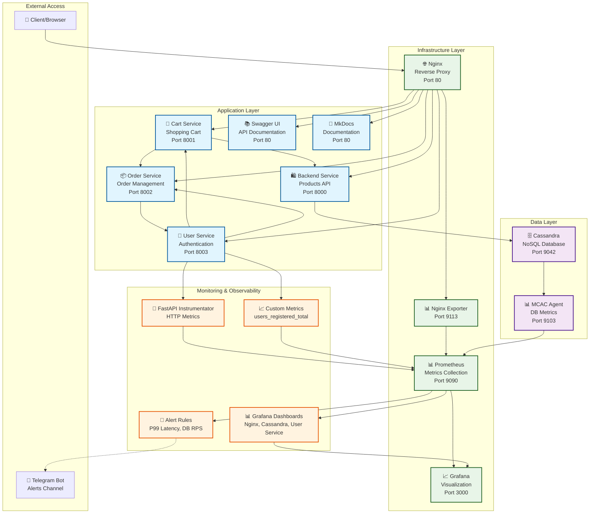

# Архитектура проекта

Система построена на микросервисной архитектуре и полностью контейнеризирована с помощью Docker. Оркестрация для локальной разработки осуществляется через Docker Compose.

## Схема взаимодействия сервисов



## Компоненты системы

### Backend (FastAPI)

**🔐 Основной сервис с JWT-аутентификацией и контролем доступа по ролям**

Основной сервис, реализующий бизнес-логику и предоставляющий REST API для работы с товарами. Написан на Python с использованием фреймворка FastAPI.

Ключевые особенности:
- **JWT-аутентификация**: интеграция с user-service для валидации токенов
- **Ролевая модель**: различение администраторов и обычных пользователей
- **Контроль доступа**: ограничения для неадминистраторов при просмотре товаров
- Асинхронная обработка запросов
- Автоматическая валидация данных с помощью Pydantic
- Автоматическая генерация OpenAPI-документации (Swagger)
- Интеграция с базой данных Cassandra

**🎯 Новая функциональность - Фильтрация по категориям:**
- Обычные пользователи обязаны указывать параметр `category`
- Администраторы могут получать все товары без ограничений
- Административные операции (CRUD) только для администраторов

### User Service (Сервис пользователей)

Микросервис для управления пользователями. Позволяет регистрировать новых пользователей, аутентифицировать их, хранить и обновлять их профили.

Ключевые особенности:
- Регистрация и аутентификация пользователей через JWT токены
- Хранение профилей пользователей
- Отслеживание истории заказов пользователей
- Подсчет общей суммы потраченных средств
- Интеграция с сервисами корзины и заказов через HTTP клиент HTTPX
- Передача аутентификационных заголовков при межсервисном взаимодействии
- Поддержка как заголовка Authorization, так и X-User-ID для идентификации пользователя

**🚀 Новая функциональность - Мониторинг и Observability:**
- **Prometheus Instrumentator**: автоматический сбор HTTP метрик (latency, RPS, статусы ответов)
- **Кастомные метрики**: счетчик зарегистрированных пользователей (`users_registered_total`)
- **Эндпоинт метрик**: `/metrics` для сбора Prometheus
- **Автоматическое логирование**: информация о созданных пользователях с токенами доступа
- **Health check**: эндпоинт `/health` для проверки состояния сервиса

**📊 Собираемые метрики:**
- `http_requests_total` - общее количество HTTP запросов
- `http_request_duration_seconds` - время выполнения HTTP запросов (включая P99)
- `http_requests_in_progress` - количество запросов в обработке
- `users_registered_total` - кастомная метрика количества зарегистрированных пользователей

### Cart Service (Сервис корзины)

Микросервис для управления корзиной пользователя. Позволяет добавлять товары в корзину, изменять их количество, просматривать содержимое корзины и оформлять заказ.

Ключевые особенности:
- Хранение корзин пользователей в памяти
- Взаимодействие с основным API для проверки наличия товаров
- Взаимодействие с сервисом заказов для оформления заказа
- Передача JWT токена при взаимодействии с сервисом заказов
- Поддержка как заголовка Authorization, так и X-User-ID для идентификации пользователя
- Использование фоновых задач для асинхронной обработки операций

### Order Service (Сервис заказов)

Микросервис для управления заказами пользователей. Позволяет создавать заказы, отслеживать их статус, отменять заказы и просматривать историю заказов.

Ключевые особенности:
- Автоматическое изменение статуса заказа с течением времени
- Случайное время доставки (от 1 до 5 минут в демо-режиме)
- Возможность отмены заказа пользователем
- Автоматическое удаление доставленных заказов через некоторое время
- Интеграция с сервисом пользователей для уведомлений о статусе заказа
- Поддержка JWT аутентификации и извлечение username из токена
- Поддержка как заголовка Authorization, так и X-User-ID для идентификации пользователя

### База данных (Cassandra)

Распределенная NoSQL база данных, используемая для хранения информации о товарах.

Схема данных:
- **Keyspace**: store
- **Таблицы**:
  - `products`: хранение информации о товарах (id, name, category, price, quantity)

**🚀 Новая функциональность - Мониторинг:**
- **MCAC Agent**: DataStax Metric Collector for Apache Cassandra
- **Экспорт метрик**: на порту 9103 для Prometheus
- **Comprehensive monitoring**: JVM, системные метрики, Cassandra-специфичные метрики
- **Автоматическая конфигурация**: преобразование метрик collectd в формат Prometheus

**📊 Собираемые метрики:**
- `mcac_client_request_*` - метрики клиентских запросов (READ/WRITE)
- `mcac_jvm_memory_*` - использование памяти JVM (heap/non-heap)
- `mcac_jvm_gc_*` - метрики сборщика мусора
- `mcac_table_*` - метрики таблиц (количество SSTables, размер данных)
- `mcac_compaction_*` - метрики компакции
- `collectd_cpu_*` - метрики CPU
- `collectd_memory` - метрики памяти системы
- `collectd_disk_*` - метрики дисков
- `collectd_interface_*` - сетевые метрики

### Nginx

Веб-сервер, выполняющий роль обратного прокси. Перенаправляет запросы к соответствующим сервисам:
- `/api/*` → Backend
- `/cart-api/*` → Cart Service
- `/order-api/*` → Order Service
- `/user-api/*` → User Service
- `/docs/*` → Documentation
- `/swagger/*` → Swagger UI

Ключевые особенности:
- Передача заголовков аутентификации между клиентом и сервисами
- Передача заголовков X-Forwarded-For и X-Forwarded-Proto для правильной обработки запросов
- Настройка таймаутов для обеспечения стабильной работы при высокой нагрузке

**🚀 Новая функциональность - Мониторинг:**
- **Nginx Exporter**: экспорт метрик Nginx для Prometheus на порту 9113
- **Stub Status**: специальный эндпоинт `/stub_status` на порту 8080 для метрик
- **Метрики производительности**: connections, requests, upstream latency
- **Ограничения доступа**: доступ к метрикам только из Docker сети

**📊 Собираемые метрики:**
- `nginx_connections_active` - активные соединения
- `nginx_connections_accepted` - принятые соединения
- `nginx_connections_handled` - обработанные соединения
- `nginx_http_requests_total` - общее количество HTTP запросов
- `nginx_connections_reading/writing/waiting` - состояние соединений

### Documentation (MkDocs)

Сервис, предоставляющий документацию проекта в удобном для чтения формате.

## Мониторинг и Observability

Система включает в себя комплексную платформу мониторинга и observability для обеспечения надежности и производительности.

### Prometheus (Сбор метрик)

Центральная система сбора и хранения метрик с конфигурацией для мониторинга всех компонентов системы.

**Конфигурация сбора:**
- **Интервал сбора**: 10 секунд
- **Интервал оценки правил**: 10 секунд
- **Таргеты мониторинга**:
  - Prometheus (self-monitoring)
  - Nginx Exporter
  - User Service (/metrics)
  - Cassandra MCAC Agent

**Преобразование метрик Cassandra:**
- Автоматическое преобразование collectd метрик в формат Prometheus
- Нормализация имен метрик для совместимости
- Добавление лейблов для группировки (keyspace, table, request_type)

### Grafana (Визуализация)

Платформа визуализации с предустановленными дашбордами для мониторинга всех компонентов системы.

**Предустановленные дашборды:**
- **Nginx Dashboard**: мониторинг веб-сервера и reverse proxy
  - Активные соединения и throughput
  - Статистика запросов и ответов
  - Производительность upstream сервисов

- **Cassandra Dashboards**:
  - **System Metrics**: CPU, память, диск, сеть
  - **Overview**: состояние кластера, метрики JVM, компакция
  - Производительность запросов и latency

- **User Service Dashboard**: мониторинг микросервиса
  - HTTP метрики (RPS, latency, error rate)
  - P99 latency по эндпоинтам
  - Кастомные бизнес-метрики (регистрации пользователей)
  - Использование ресурсов (CPU, память)

**Настройки доступа:**
- **Логин**: admin / admin
- **Анонимный доступ**: включен для демонстрации
- **Автоматическая конфигурация**: datasources и dashboards через provisioning

### Алертинг (планируется)

Система алертинга для проактивного мониторинга критических метрик:

**Планируемые алерты:**
1. **API Latency Alert**: P99 > 500ms для бизнес-эндпоинтов
2. **Database RPS Alert**: количество запросов в БД > 100 RPS
3. **Service Availability**: недоступность сервисов
4. **Resource Usage**: высокое использование CPU/памяти

**Каналы уведомлений:**
- Telegram канал для команды разработки
- Email уведомления для критических алертов

### Трейсинг (планируется)

Распределенный трейсинг для анализа производительности межсервисного взаимодействия:
- Jaeger или Zipkin интеграция
- Трейсинг HTTP запросов между сервисами
- Анализ bottlenecks в цепочке вызовов

## Модель данных

### Product (Товар)

```python
class Product:
    id: UUID            # Уникальный идентификатор товара
    name: str           # Название товара
    category: str       # Категория товара
    price: Decimal      # Цена товара
    quantity: int       # Количество товара на складе
```

### CartItem (Элемент корзины)

```python
class CartItem:
    id: UUID            # Уникальный идентификатор элемента корзины
    product_id: UUID    # Идентификатор товара
    quantity: int       # Количество товара в корзине
    price: float        # Цена товара
    product_name: str   # Название товара
```

### Cart (Корзина)

```python
class Cart:
    id: UUID            # Уникальный идентификатор корзины
    user_id: str        # Идентификатор пользователя
    items: List[CartItem] # Список товаров в корзине
    total_price: float  # Общая стоимость корзины
```

### OrderItem (Элемент заказа)

```python
class OrderItem:
    product_id: str     # Идентификатор товара
    quantity: int       # Количество товара
    price: float        # Цена товара
    product_name: str   # Название товара
```

### Order (Заказ)

```python
class Order:
    id: UUID            # Уникальный идентификатор заказа
    user_id: str        # Идентификатор пользователя (username)
    items: List[OrderItem] # Список товаров в заказе
    total_price: float  # Общая стоимость заказа
    status: str         # Статус заказа (new, processing, preparing, shipping, delivered, cancelled)
    created_at: datetime # Дата и время создания заказа
    updated_at: Optional[datetime] # Дата и время последнего обновления заказа
    estimated_delivery: Optional[datetime] # Ожидаемое время доставки
```

### User (Пользователь)

```python
class User:
    id: UUID            # Уникальный идентификатор пользователя
    username: str       # Имя пользователя (логин)
    full_name: str      # Полное имя пользователя
    phone: str          # Номер телефона пользователя
    created_at: datetime # Дата и время регистрации
    total_spent: float  # Общая сумма потраченных средств
```

### UserProfile (Профиль пользователя)

```python
class UserProfile(User):
    orders: List[OrderSummary] # Список заказов пользователя
    current_cart_total: float  # Общая стоимость текущей корзины
```

## Схема взаимодействия микросервисов

### Бизнес-логика (межсервисные вызовы)
1. **User Service** → **Cart Service**: Получение корзины пользователя (передача JWT токена)
2. **User Service** → **Order Service**: Получение списка заказов пользователя (передача JWT токена и X-User-ID)
3. **Cart Service** → **Backend**: Проверка наличия товаров
4. **Cart Service** → **Order Service**: Создание заказа (передача JWT токена и X-User-ID)
5. **Order Service** → **User Service**: Уведомление об изменении статуса заказа

### Мониторинг и метрики (новое)
1. **User Service** → **Prometheus**: экспорт HTTP метрик через `/metrics` эндпоинт
2. **Nginx** → **Nginx Exporter**: экспорт метрик через `/stub_status`
3. **Nginx Exporter** → **Prometheus**: метрики веб-сервера
4. **Cassandra** → **MCAC Agent**: сбор метрик БД
5. **MCAC Agent** → **Prometheus**: экспорт метрик Cassandra
6. **Prometheus** → **Grafana**: источник данных для дашбордов
7. **Grafana** → **Dashboards**: визуализация метрик всех компонентов

### Потоки данных мониторинга
- **HTTP метрики**: latency, RPS, error rate для всех API эндпоинтов
- **Системные метрики**: CPU, память, диск, сеть для Cassandra хоста
- **Бизнес-метрики**: количество зарегистрированных пользователей
- **Инфраструктурные метрики**: состояние Nginx, upstream сервисов

## Аутентификация и авторизация

Система использует JWT (JSON Web Tokens) для аутентификации и авторизации пользователей:

1. Пользователь регистрируется или входит в систему через User Service
2. User Service генерирует JWT токен с именем пользователя в поле "sub"
3. Клиент использует этот токен в заголовке Authorization при запросах к API
4. Сервисы проверяют токен и извлекают имя пользователя для идентификации
5. При межсервисном взаимодействии токен передается в заголовке Authorization
6. Для обеспечения совместимости также используется заголовок X-User-ID с именем пользователя

Такой подход обеспечивает безопасное взаимодействие между сервисами и гарантирует, что пользователь имеет доступ только к своим данным.

## Технологический стек

### Backend и Микросервисы
- **Python 3.11+**: основной язык программирования
- **FastAPI**: асинхронный веб-фреймворк для API
- **Pydantic**: валидация данных и сериализация
- **HTTPX**: HTTP клиент для межсервисного взаимодействия
- **Passlib + Bcrypt**: хеширование паролей
- **PyJWT**: работа с JWT токенами

### База данных
- **Apache Cassandra 4.1**: NoSQL база данных
- **DataStax Python Driver**: драйвер для работы с Cassandra

### Мониторинг и Observability
- **Prometheus**: сбор и хранение метрик
- **Grafana**: визуализация метрик и дашборды
- **Prometheus FastAPI Instrumentator**: автоматические HTTP метрики
- **Prometheus Client**: кастомные метрики Python
- **DataStax MCAC Agent**: мониторинг Cassandra
- **Nginx Prometheus Exporter**: метрики веб-сервера

### Инфраструктура
- **Docker**: контейнеризация всех сервисов
- **Docker Compose**: оркестрация для локальной разработки
- **Nginx**: reverse proxy и load balancer
- **MkDocs**: генератор документации

### Документация и API
- **OpenAPI/Swagger**: автоматическая документация API
- **Swagger UI**: интерактивная документация
- **MkDocs Material**: современная документация проекта

## Порты и эндпоинты

### Внешние порты
- **80**: Nginx (main entry point)
- **3000**: Grafana
- **9090**: Prometheus

### Внутренние порты сервисов
- **8000**: Backend Service
- **8001**: Cart Service  
- **8002**: Order Service
- **8003**: User Service
- **9042**: Cassandra
- **9103**: MCAC Agent (Cassandra metrics)
- **9113**: Nginx Exporter

### Ключевые эндпоинты
- **API Documentation**: `/swagger/`
- **Project Documentation**: `/docs/`
- **Prometheus Metrics**: `/metrics` (User Service)
- **Health Checks**: `/health` (все сервисы)
- **Nginx Metrics**: `:8080/stub_status`