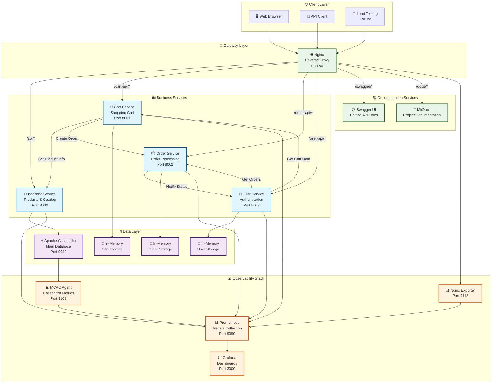
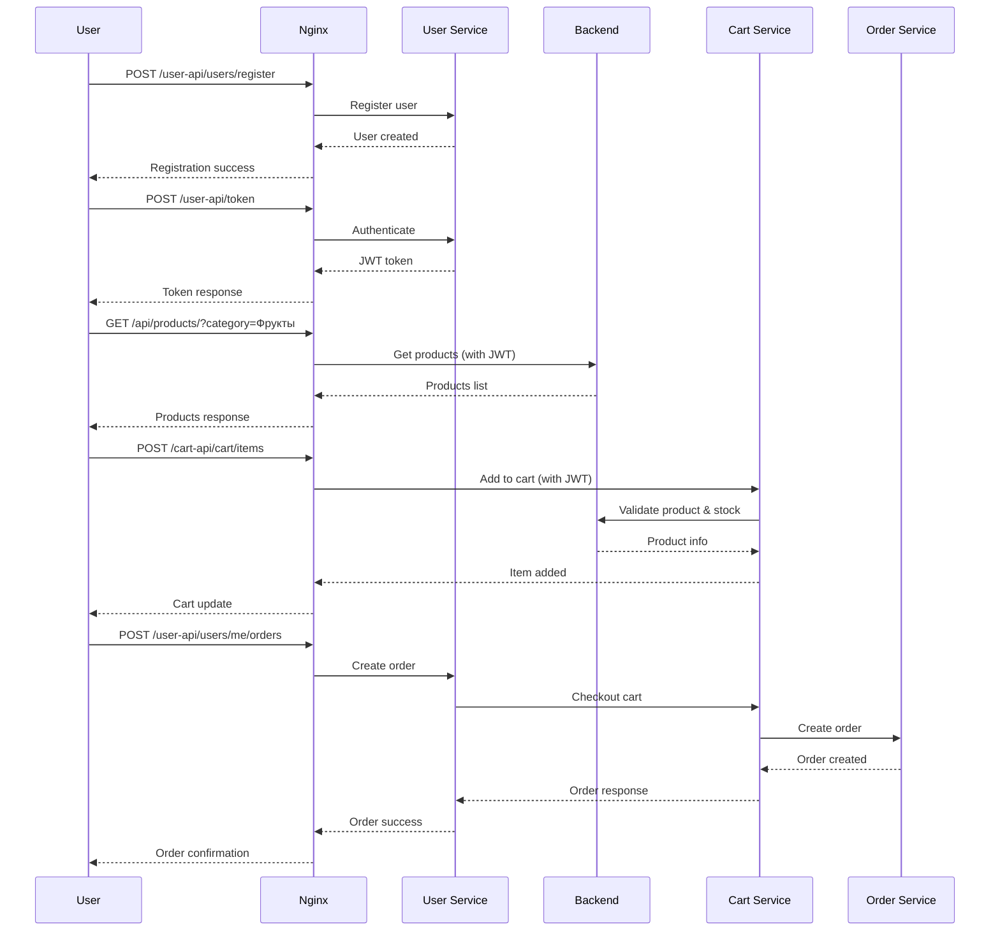
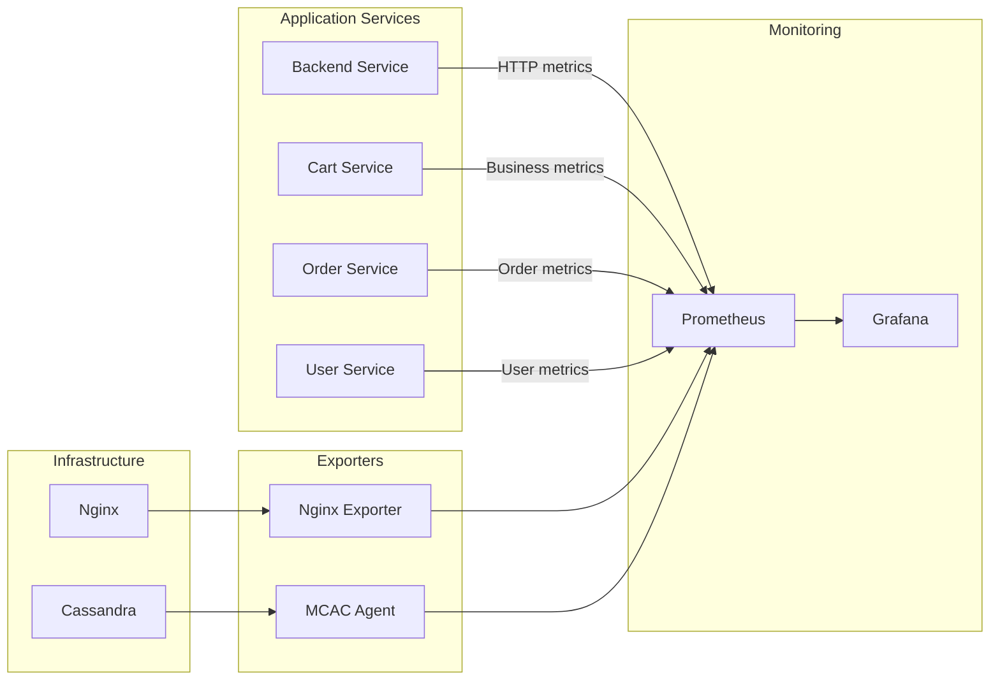

# 🏗️ Архитектура системы Product Store

Современная микросервисная система интернет-магазина, построенная на принципах Cloud Native архитектуры с полноценной системой мониторинга и observability.

## 🎯 Архитектурные принципы

- **Микросервисная архитектура** - каждый сервис отвечает за свою domain область
- **API-First подход** - все взаимодействия через REST API с OpenAPI документацией
- **Контейнеризация** - все компоненты упакованы в Docker контейнеры
- **Observability by design** - встроенный мониторинг с метриками и алертами
- **Асинхронное взаимодействие** - неблокирующие HTTP вызовы между сервисами
- **Отказоустойчивость** - health checks, graceful shutdown, error handling

## 🏛️ Схема взаимодействия сервисов



## 🛍️ Бизнес-сервисы (Микросервисы)

### 🏪 Backend Service (порт 8000)
**Управление товарами и каталогом**

**Основные функции:**
- ✅ CRUD операции с товарами (создание, чтение, обновление, удаление)
- ✅ Каталог с поддержкой категорий, фильтрации, сортировки и пагинации
- ✅ Контроль доступа: обычные пользователи видят товары только по категориям
- ✅ Административные функции для управления товарами
- ✅ Интеграция с Cassandra для персистентного хранения

**Технические особенности:**
- JWT аутентификация с ролевым доступом
- Автоматические HTTP метрики через FastAPI Instrumentator
- Кастомные метрики БД (время запросов, количество продуктов)
- Health checks для проверки состояния Cassandra
- Middleware для сбора метрик производительности

### 🛒 Cart Service (порт 8001)
**Управление корзиной покупок**

**Основные функции:**
- ✅ Добавление товаров в корзину с валидацией остатков
- ✅ Обновление количества товаров в корзине
- ✅ Удаление товаров из корзины (по item_id или product_id)
- ✅ Оформление заказа (checkout) с интеграцией Order Service
- ✅ Просмотр недавно просмотренных товаров

**Технические особенности:**
- In-memory хранилище для быстрого доступа
- Асинхронная валидация остатков через Backend Service
- Кастомные метрики: популярность товаров, стоимость корзин
- Автоматическая очистка корзины после успешного заказа
- Обработка fallback сценариев поиска товаров

### 📦 Order Service (порт 8002)
**Обработка и управление заказами**

**Основные функции:**
- ✅ Создание заказов из данных корзины
- ✅ Автоматическое изменение статусов: CREATED → PROCESSING → SHIPPING → DELIVERED
- ✅ Уведомления User Service об изменении статусов
- ✅ Административное управление статусами заказов
- ✅ Отмена заказов пользователями и администраторами

**Технические особенности:**
- Фоновые задачи для асинхронной обработки заказов
- In-memory хранилище с автоматическим удалением доставленных заказов
- Кастомные метрики: количество заказов по статусам, время доставки
- Background tasks для симуляции реального процесса доставки
- Интеграция с User Service для уведомлений

### 👤 User Service (порт 8003)
**Аутентификация и управление пользователями**

**Основные функции:**
- ✅ Регистрация пользователей с автоматическим определением роли
- ✅ JWT аутентификация с поддержкой ролей (admin/user)
- ✅ Профили пользователей с агрегацией данных из других сервисов
- ✅ Интеграция с Cart и Order сервисами для полной картины
- ✅ Оформление заказов через интеграцию сервисов

**Технические особенности:**
- Автоматическое создание демо-пользователей при старте
- Кастомные метрики регистраций пользователей
- In-memory хранилище с хэшированными паролями
- CORS middleware для поддержки веб-интерфейсов
- Агрегация данных из множественных источников

## 🌐 Инфраструктурные компоненты

### 🔀 Nginx (порт 80)
**Reverse Proxy и API Gateway**

**Функции:**
- Единая точка входа для всех клиентов
- Маршрутизация запросов по префиксам URL
- Передача заголовков аутентификации
- Поддержка WebSocket для Locust
- Экспорт метрик для мониторинга

**Маршрутизация:**
```
/api/*        → Backend Service (8000)
/cart-api/*   → Cart Service (8001)
/order-api/*  → Order Service (8002)
/user-api/*   → User Service (8003)
/swagger/*    → Swagger UI
/docs/*       → MkDocs
/locust/*     → Locust Load Testing
```

### 🗄️ Apache Cassandra (порт 9042)
**Основная база данных**

**Характеристики:**
- NoSQL база данных для высокой производительности
- Хранение информации о товарах и каталоге
- MCAC агент для детального мониторинга
- Health checks для проверки доступности
- Автоматическая инициализация схемы при старте

**Схема данных:**
```sql
-- Keyspace: store
CREATE TABLE products (
    id UUID PRIMARY KEY,
    name TEXT,
    category TEXT,
    price DECIMAL,
    quantity INT,
    description TEXT,
    manufacturer TEXT
);
```

## 📊 Система мониторинга (Observability)

### 📈 Prometheus (порт 9090)
**Сбор и хранение метрик**

**Собираемые метрики:**
- **HTTP метрики**: все сервисы через FastAPI Instrumentator
- **Бизнес-метрики**: регистрации, заказы, популярность товаров
- **Инфраструктурные метрики**: Nginx, Cassandra
- **Системные метрики**: JVM, memory, CPU

**Конфигурация сбора:**
- Интервал: 10 секунд
- Targets: все сервисы + экспортеры
- Retention: зависит от конфигурации

### 📊 Grafana (порт 3000)
**Визуализация метрик и дашборды**

**Предустановленные дашборды:**
- **Backend Service**: HTTP метрики, БД производительность
- **Cart Service**: популярность товаров, размер корзин
- **Order Service**: статистика заказов, время доставки
- **User Service**: регистрации, аутентификация
- **Nginx**: производительность веб-сервера
- **Cassandra**: системные метрики БД, JVM

**Доступ:**
- URL: http://localhost:3000
- Логин: admin / admin
- Автоматическое подключение к Prometheus

## 🔄 Потоки данных и взаимодействие

### 🛒 Типичный пользовательский сценарий



### 📊 Поток метрик



## 🚀 Развертывание и конфигурация

### Docker Compose архитектура
```yaml
# Основные сервисы
services:
  # Data Layer
  cassandra:          # База данных
  
  # Application Layer  
  backend:            # Товары и каталог
  cart-service:       # Корзина
  order-service:      # Заказы
  user-service:       # Пользователи
  
  # Infrastructure Layer
  nginx:              # Gateway
  swagger-ui:         # API Docs
  docs:               # Documentation
  
  # Monitoring Layer
  prometheus:         # Метрики
  grafana:           # Дашборды
  nginx-exporter:    # Nginx метрики
  
  # Testing Layer
  locust:            # Load testing
```

### 🔧 Настройки окружения

**Переменные окружения:**
```bash
# Backend Service
CASSANDRA_HOST=cassandra
SECRET_KEY=supersecretkey123

# Cart Service
BACKEND_URL=http://backend:8000
ORDER_SERVICE_URL=http://order-service:8002

# Order Service
BACKEND_URL=http://backend:8000
USER_SERVICE_URL=http://user-service:8003

# User Service
CART_SERVICE_URL=http://cart-service:8001
ORDER_SERVICE_URL=http://order-service:8002
```

## 🔒 Безопасность и аутентификация

### JWT токены
- **Алгоритм**: HS256
- **Секретный ключ**: настраивается через переменную окружения
- **Payload**: username, роль (is_admin), время истечения
- **Время жизни**: 30 минут (по умолчанию)

### Ролевая модель
- **Обычные пользователи**: просмотр товаров по категориям, управление корзиной
- **Администраторы**: полный доступ к товарам, административные операции

### Методы аутентификации
1. **Authorization header**: `Bearer JWT_TOKEN`
2. **X-User-ID header**: для внутренних вызовов
3. **Admin header**: для административных операций

## 📈 Производительность и масштабирование

### Текущие характеристики
- **In-memory хранилища** для быстрого доступа к корзинам и заказам
- **Асинхронные HTTP вызовы** между сервисами
- **Connection pooling** для Cassandra
- **Health checks** для всех сервисов

### Возможности масштабирования
- Горизонтальное масштабирование сервисов
- Распределенная БД Cassandra
- Load balancing через Nginx
- Контейнеризация для облачного развертывания
