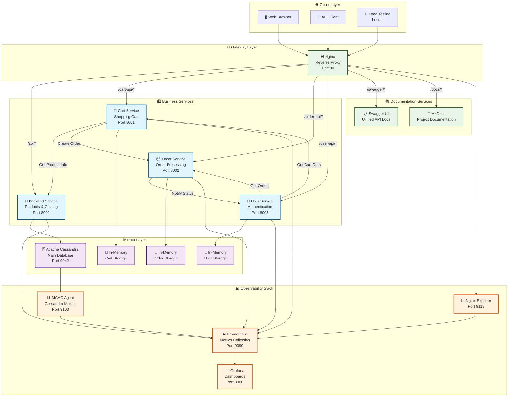
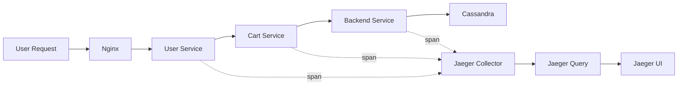
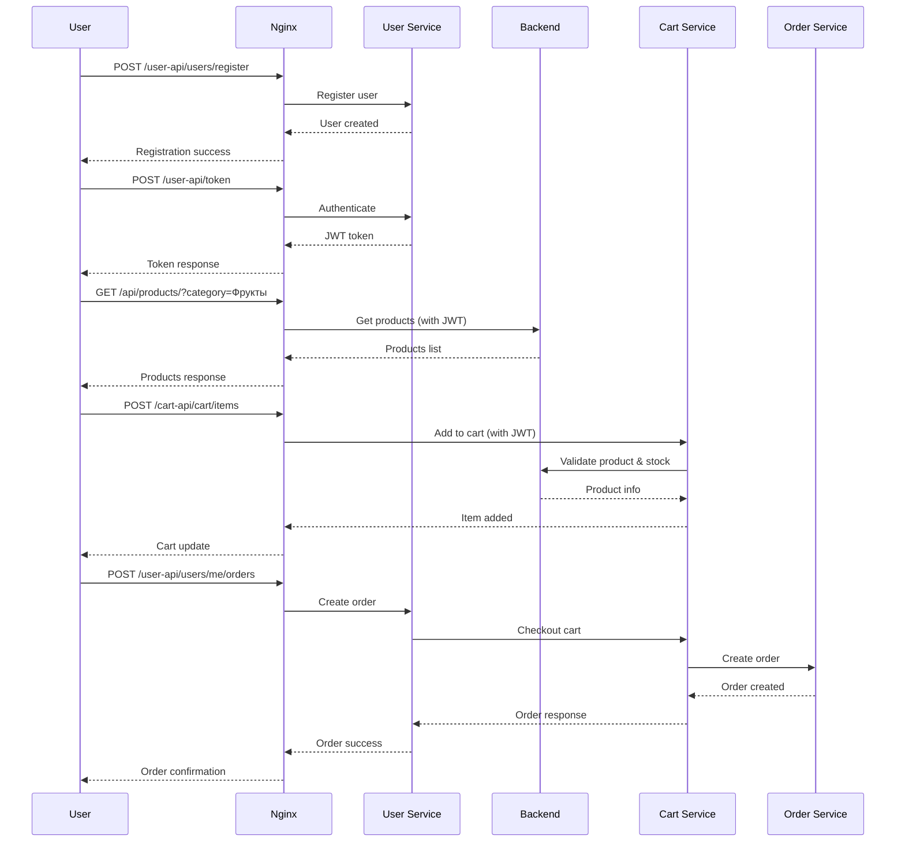
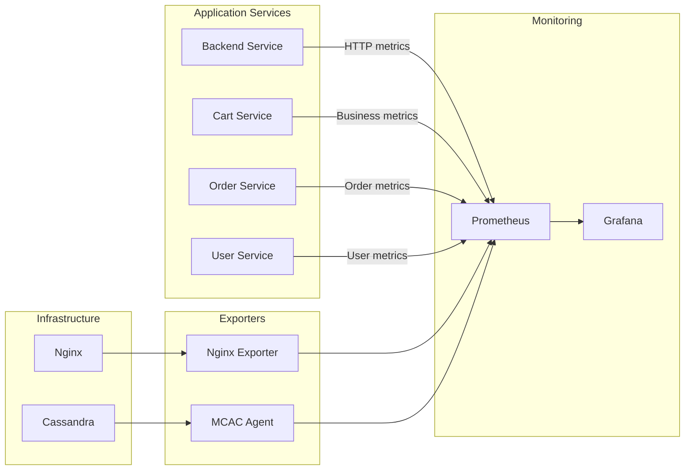

# 🏗️ Архитектура системы Product Store

Современная микросервисная система интернет-магазина, построенная на принципах Cloud Native архитектуры с полноценной системой мониторинга, трейсинга и observability.

## 🎯 Архитектурные принципы

- **Микросервисная архитектура** - каждый сервис отвечает за свою domain область с четкими границами
- **API-First подход** - все взаимодействия через REST API с автоматической OpenAPI документацией
- **Cloud Native дизайн** - контейнеризация, 12-factor app principles, stateless сервисы
- **Observability by design** - встроенный мониторинг с метриками, трейсингом и алертами
- **Асинхронное взаимодействие** - неблокирующие HTTP вызовы между сервисами с httpx
- **Security-first** - JWT аутентификация, ролевая модель, защищенные межсервисные вызовы
- **Performance optimization** - NoSQL база данных, in-memory кэширование, профилирование
- **Fault tolerance** - health checks, graceful shutdown, circuit breaker patterns
- **Horizontal scalability** - ready для Kubernetes и container orchestration
- **Infrastructure as Code** - полностью воспроизводимое развертывание через Docker Compose

## 🏛️ Схема взаимодействия сервисов



## 🛍️ Бизнес-сервисы (Микросервисы)

### 🏪 Backend Service (порт 8000)
**Управление товарами и каталогом**

**Основные функции:**
- ✅ CRUD операции с товарами (создание, чтение, обновление, удаление)
- ✅ Каталог с поддержкой категорий, фильтрации, сортировки и пагинации
- ✅ Контроль доступа: обычные пользователи видят товары только по категориям
- ✅ Административные функции для управления товарами
- ✅ Интеграция с Cassandra для персистентного хранения

**Технические особенности:**
- JWT аутентификация с ролевым доступом
- Автоматические HTTP метрики через FastAPI Instrumentator
- Кастомные метрики БД (время запросов, количество продуктов)
- Health checks для проверки состояния Cassandra
- Middleware для сбора метрик производительности

### 🛒 Cart Service (порт 8001)
**Управление корзиной покупок**

**Основные функции:**
- ✅ Добавление товаров в корзину с валидацией остатков
- ✅ Обновление количества товаров в корзине
- ✅ Удаление товаров из корзины (по item_id или product_id)
- ✅ Оформление заказа (checkout) с интеграцией Order Service
- ✅ Просмотр недавно просмотренных товаров

**Технические особенности:**
- In-memory хранилище для быстрого доступа
- Асинхронная валидация остатков через Backend Service
- Кастомные метрики: популярность товаров, стоимость корзин
- Автоматическая очистка корзины после успешного заказа
- Обработка fallback сценариев поиска товаров

### 📦 Order Service (порт 8002)
**Обработка и управление заказами**

**Основные функции:**
- ✅ Создание заказов из данных корзины
- ✅ Автоматическое изменение статусов: CREATED → PROCESSING → SHIPPING → DELIVERED
- ✅ Уведомления User Service об изменении статусов
- ✅ Административное управление статусами заказов
- ✅ Отмена заказов пользователями и администраторами

**Технические особенности:**
- Фоновые задачи для асинхронной обработки заказов
- In-memory хранилище с автоматическим удалением доставленных заказов
- Кастомные метрики: количество заказов по статусам, время доставки
- Background tasks для симуляции реального процесса доставки
- Интеграция с User Service для уведомлений

### 👤 User Service (порт 8003)
**Аутентификация и управление пользователями**

**Основные функции:**
- ✅ Регистрация пользователей с автоматическим определением роли
- ✅ JWT аутентификация с поддержкой ролей (admin/user)
- ✅ Профили пользователей с агрегацией данных из других сервисов
- ✅ Интеграция с Cart и Order сервисами для полной картины
- ✅ Оформление заказов через интеграцию сервисов

**Технические особенности:**
- Автоматическое создание демо-пользователей при старте
- Кастомные метрики регистраций пользователей
- In-memory хранилище с хэшированными паролями
- CORS middleware для поддержки веб-интерфейсов
- Агрегация данных из множественных источников

## 🌐 Инфраструктурные компоненты

### 🔀 Nginx (порт 80)
**Reverse Proxy и API Gateway**

**Функции:**
- Единая точка входа для всех клиентов
- Маршрутизация запросов по префиксам URL
- Load balancing между экземплярами сервисов
- Передача заголовков аутентификации и трейсинга
- Поддержка WebSocket для Locust и real-time функций
- Экспорт метрик через nginx-exporter для мониторинга
- CORS headers и security policies

**Маршрутизация:**
```nginx
/api/*        → Backend Service (8000)     # Товары и каталог
/cart-api/*   → Cart Service (8001)        # Корзина покупок
/order-api/*  → Order Service (8002)       # Заказы
/user-api/*   → User Service (8003)        # Пользователи
/swagger/*    → Swagger UI                 # API документация
/docs/*       → MkDocs                     # Проектная документация
/locust/*     → Locust (WebSocket)         # Нагрузочное тестирование
/search       → Jaeger UI                  # Распределенный трейсинг
/profiles/*   → Profile Server             # Файлы профилирования
```

**Метрики:**
- Nginx-exporter экспортирует метрики на порт 9113
- Prometheus собирает статистику соединений и latency
- Grafana дашборд показывает throughput и upstream performance

---

### 🗄️ Apache Cassandra (порт 9042)
**Основная база данных**

**Характеристики:**
- NoSQL база данных для высокой производительности и горизонтального масштабирования
- Keyspace: `store` с SimpleStrategy репликацией (replication_factor=1 для dev)
- Таблица `products` с UUID партиционированием для равномерного распределения
- MCAC Agent для детального мониторинга JVM, запросов и производительности
- Автоматическая инициализация схемы и индексов при старте Backend Service
- Health checks для проверки доступности и состояния кластера
- Оптимизированная конфигурация gc_grace_seconds для development окружения

**Схема данных:**
```sql
-- Keyspace: store
CREATE KEYSPACE store WITH replication = {
    'class': 'SimpleStrategy', 
    'replication_factor': '1'
};

-- Основная таблица товаров
CREATE TABLE products (
    id UUID PRIMARY KEY,           -- Партиционирующий ключ
    name TEXT,                     -- Название товара
    category TEXT,                 -- Категория (индекс)
    price DECIMAL,                 -- Цена (индекс)
    quantity INT,                  -- Остаток на складе
    description TEXT,              -- Подробное описание
    manufacturer TEXT              -- Производитель
) WITH gc_grace_seconds = 3600;

-- Индексы для оптимизации запросов
CREATE INDEX products_category_idx ON products (category);
CREATE INDEX products_price_idx ON products (price);
```

**Мониторинг:**
- MCAC Agent экспортирует 100+ метрик на порт 9103
- Cassandra Overview дашборд в Grafana
- System Metrics дашборд для OS-level мониторинга
- Алерты на RPS, latency и доступность базы данных

---

### 🔍 Jaeger (порт 16686)
**Система распределенного трейсинга**

**Архитектура:**
- All-in-one deployment для development/demo целей
- OpenTelemetry integration во все микросервисы
- Automatic HTTP request tracing с context propagation
- Custom spans для business operations и database queries
- In-memory storage с rotation до 50,000 трейсов

**Трейсинг flow:**


**Конфигурация трейсинга:**
```python
# Каждый сервис настроен с:
JAEGER_AGENT_HOST=jaeger
JAEGER_AGENT_PORT=6831
OTEL_EXPORTER_OTLP_ENDPOINT=http://jaeger:4318
OTEL_SERVICE_NAME=service-name
OTEL_RESOURCE_ATTRIBUTES=service.name=service-name,service.version=1.0.0
```

**Мониторинг трейсинга:**
- Spans received/dropped rate
- Collector queue length и processing latency
- Storage utilization и trace retention
- Jaeger-specific дашборд в Grafana

---

### 🧪 Locust (порт 8089)
**Система нагрузочного тестирования**

**Реалистичные сценарии:**
```python
class ShoppingUser(HttpUser):
    wait_time = between(2, 6)  # Имитация реального поведения
    
    @task(10)  # 10x вес - основная активность
    def browse_products(self):
        # Просмотр категорий, пагинация, детали товаров
        
    @task(5)   # 5x вес - средняя активность  
    def manage_cart(self):
        # Добавление в корзину, обновление количества
        
    @task(1)   # 1x вес - редкая активность
    def place_order(self):
        # Полный checkout flow с мониторингом статусов
```

**OpenTelemetry интеграция:**
- Автоматический трейсинг всех HTTP запросов от Locust
- Корреляция нагрузочных тестов с production трейсами
- OTLP экспорт в Jaeger для анализа performance под нагрузкой

**WebSocket поддержка:**
- Real-time updates через Nginx WebSocket proxy
- Live статистика в Locust Web UI
- Dynamic scaling тестов без restart

---

### ⚡ Performance Profiler
**Система профилирования производительности**

**Автоматическое профилирование:**
```python
@profile_endpoint("get_products")  # Декоратор для auto-profiling
async def get_products(...):
    # Automatic cProfile collection
    # Snakeviz-compatible .prof files
    # HTTP endpoints для download профилей
```

**Доступные профили:**
- GET `/profiles/` - список всех .prof файлов
- Backend Service: products CRUD, categories, search
- Cart Service: cart operations, stock validation
- Order Service: order creation, status updates  
- User Service: authentication, profile aggregation

**Анализ производительности:**
```bash
# Download и анализ профилей:
curl http://localhost/profiles/get_products.prof > profile.prof
snakeviz profile.prof  # Local analysis
```

---

### 📚 Swagger UI & Documentation
**Интерактивная API документация**

**Unified API Documentation:**
- Автоматическая генерация из FastAPI specs
- Объединенная документация всех 4 микросервисов
- Interactive testing прямо из браузера
- JWT token integration для protected endpoints
- Real-time API схемы и examples

**MkDocs Project Documentation:**
- Comprehensive architectural documentation
- Step-by-step deployment guides
- API usage examples и best practices
- Monitoring и troubleshooting guides
- Performance tuning recommendations

## 📊 Система мониторинга (Observability Stack)

### 📈 Prometheus (порт 9090)
**Центральная система сбора метрик**

**Конфигурация:**
- Сбор метрик каждые 10 секунд с всех сервисов
- 8 job targets: все микросервисы + nginx + cassandra
- 50+ custom метрик для бизнес-логики
- Retention: 15 дней метрик в TSDB
- Alert rules с автоматической эскалацией в Alertmanager

**Метрики по категориям:**
```yaml
# HTTP метрики (все сервисы)
http_request_duration_seconds_bucket    # Latency histograms
http_requests_total                     # Request counter by endpoint/status
http_requests_concurrent               # Active connections

# Бизнес-метрики
user_registrations_total               # Новые регистрации
cart_items_added_total                 # Добавления в корзину
orders_created_total                   # Созданные заказы
product_views_total                    # Просмотры товаров

# Infrastructure метрики
cassandra_query_duration_seconds       # Database latency
nginx_http_requests_total              # Gateway throughput
process_resident_memory_bytes          # Memory usage
```

---

### 📊 Grafana (порт 3000)
**Система визуализации и дашбордов**

**7 специализированных дашбордов:**

#### 1. **Backend Service Dashboard**
- Products CRUD операции и latency
- Cassandra query performance и connection pool
- Custom business metrics по товарам и категориям
- JVM memory usage и garbage collection statistics

#### 2. **Cart Service Dashboard**  
- Cart operations (add/remove/update) metrics
- Stock validation failures и retry statistics
- Shopping cart value distributions и popular products
- Inter-service call latency (Backend API calls)

#### 3. **Order Service Dashboard**
- Order lifecycle metrics (Created→Delivered)
- Average delivery time и order value distributions
- Background task performance и async processing
- User Service integration metrics

#### 4. **User Service Dashboard**
- Registration rate и authentication statistics
- JWT token usage и session management
- Profile aggregation performance
- Password hashing и security metrics

#### 5. **Nginx Gateway Dashboard**
- Request rate и response time по service routes
- Upstream latency и connection pooling statistics
- Error rate distribution по HTTP status codes
- WebSocket connections для Locust integration

#### 6. **Cassandra Database Dashboard**
- JVM heap usage, GC duration, thread pools
- CQL query latency и throughput statistics  
- Disk I/O, compaction queue и SSTable count
- Node health и cluster topology metrics

#### 7. **Jaeger Tracing Dashboard**
- Spans received rate и storage statistics
- Trace duration distributions и error analysis
- Collector performance и queue length monitoring
- Go runtime metrics для Jaeger processes

**Алерты и уведомления:**
- P99 latency > 500ms для критических операций
- Error rate > 5% для любого сервиса  
- Cassandra RPS > 100 для database overload
- Memory usage > 80% для any container

---

### 🚨 Alertmanager (порт 9093)
**Система управления алертами**

**Конфигурация алертов:**
```yaml
# 4 типа критических алертов:
1. BackendHighP99Latency     # P99 > 500ms на Backend API
2. CartServiceP99Latency     # P99 > 500ms на Cart Service  
3. OrderServiceP99Latency    # P99 > 500ms на Order Service
4. CassandraHighRPS         # RPS > 100 на Cassandra
```

**Интеграция с Telegram:**
- Автоматические уведомления в Telegram канал
- HTML форматирование с метриками и ссылками
- Группировка алертов по severity level
- Auto-resolution уведомления при восстановлении

**Маршрутизация:**
- group_wait: 10s - ожидание группировки алертов
- group_interval: 1m - интервал отправки сгруппированных алертов  
- repeat_interval: 5m - повтор для unfixed алертов

**Доступ:**
- URL: http://localhost:3000
- Логин: admin / admin
- Автоматическое подключение к Prometheus

## 🔄 Потоки данных и взаимодействие

### 🛒 Типичный пользовательский сценарий



### 📊 Поток метрик



## 🚀 Развертывание и конфигурация

### Docker Compose архитектура
```yaml
# Основные сервисы
services:
  # Data Layer
  cassandra:          # База данных
  
  # Application Layer  
  backend:            # Товары и каталог
  cart-service:       # Корзина
  order-service:      # Заказы
  user-service:       # Пользователи
  
  # Infrastructure Layer
  nginx:              # Gateway
  swagger-ui:         # API Docs
  docs:               # Documentation
  
  # Monitoring Layer
  prometheus:         # Метрики
  grafana:           # Дашборды
  nginx-exporter:    # Nginx метрики
  
  # Testing Layer
  locust:            # Load testing
```

### 🔧 Настройки окружения

**Переменные окружения:**
```bash
# Backend Service
CASSANDRA_HOST=cassandra
SECRET_KEY=supersecretkey123

# Cart Service
BACKEND_URL=http://backend:8000
ORDER_SERVICE_URL=http://order-service:8002

# Order Service
BACKEND_URL=http://backend:8000
USER_SERVICE_URL=http://user-service:8003

# User Service
CART_SERVICE_URL=http://cart-service:8001
ORDER_SERVICE_URL=http://order-service:8002
```

## 🔒 Безопасность и аутентификация

### JWT токены
- **Алгоритм**: HS256
- **Секретный ключ**: настраивается через переменную окружения
- **Payload**: username, роль (is_admin), время истечения
- **Время жизни**: 30 минут (по умолчанию)

### Ролевая модель
- **Обычные пользователи**: просмотр товаров по категориям, управление корзиной
- **Администраторы**: полный доступ к товарам, административные операции

### Методы аутентификации
1. **Authorization header**: `Bearer JWT_TOKEN`
2. **X-User-ID header**: для внутренних вызовов
3. **Admin header**: для административных операций

## 📈 Производительность и масштабирование

### Текущие характеристики
- **In-memory хранилища** для быстрого доступа к корзинам и заказам
- **Асинхронные HTTP вызовы** между сервисами
- **Connection pooling** для Cassandra
- **Health checks** для всех сервисов

### Возможности масштабирования
- Горизонтальное масштабирование сервисов
- Распределенная БД Cassandra
- Load balancing через Nginx
- Контейнеризация для облачного развертывания
