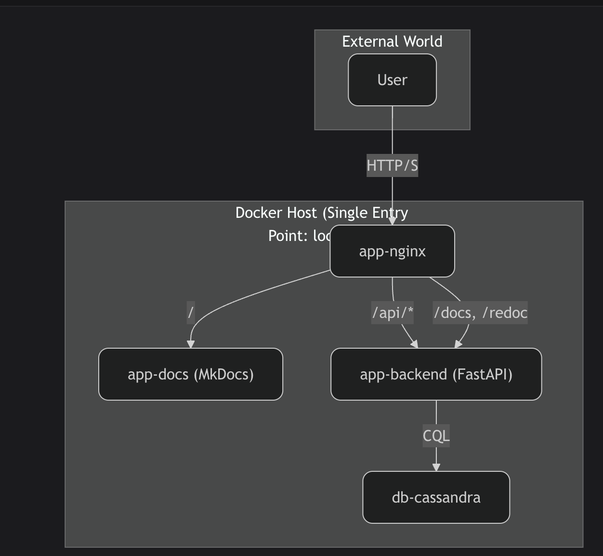

# Архитектура проекта

Система построена на микросервисной архитектуре и полностью контейнеризирована с помощью Docker. Оркестрация для локальной разработки осуществляется через Docker Compose.

## Схема взаимодействия сервисов

