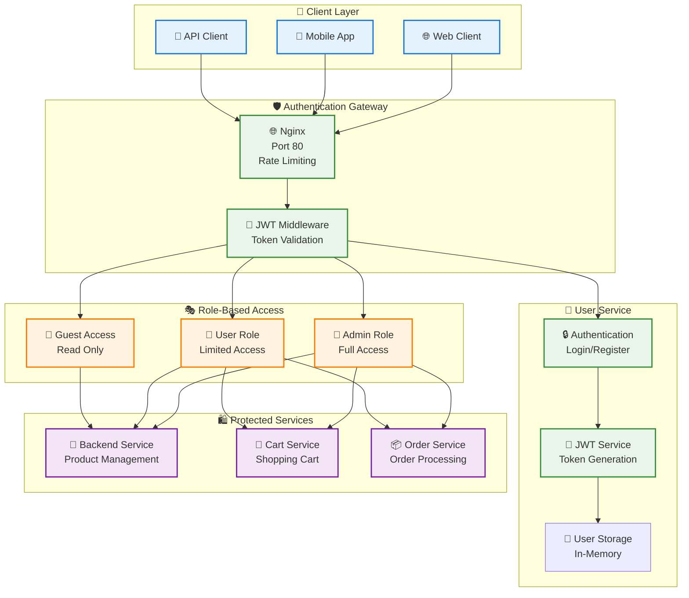

# 🔐 Система аутентификации и авторизации

Комплексная система безопасности Product Store, построенная на JWT токенах с ролевой моделью доступа и межсервисной аутентификацией.

## 🏗️ Архитектура безопасности



---

## 🔑 JWT Token System

### 📜 Token Structure

```python
# JWT Token Payload
{
    "sub": "user-uuid-here",          # Subject (User ID)
    "username": "john_doe",           # Username
    "email": "john@example.com",      # Email
    "role": "user",                   # Role (admin/user)
    "iat": 1642680000,               # Issued At
    "exp": 1642766400,               # Expiry (24 hours)
    "jti": "token-uuid-here"         # JWT ID for revocation
}
```

### 🔧 JWT Implementation

```python
# app/user-service/src/auth.py
import jwt
import uuid
from datetime import datetime, timedelta
from typing import Optional, Dict, Any
from fastapi import HTTPException, Depends
from fastapi.security import HTTPBearer, HTTPAuthorizationCredentials

# JWT Configuration
JWT_SECRET_KEY = "supersecretkey123"  # В продакшене - из переменных окружения
JWT_ALGORITHM = "HS256"
JWT_EXPIRATION_HOURS = 24

security = HTTPBearer()

class JWTService:
    """Сервис для работы с JWT токенами"""
    
    @staticmethod
    def create_access_token(user_data: Dict[str, Any]) -> str:
        """Создание JWT access token"""
        
        # Payload для токена
        payload = {
            "sub": user_data["id"],
            "username": user_data["username"],
            "email": user_data["email"],
            "role": user_data.get("role", "user"),
            "iat": datetime.utcnow(),
            "exp": datetime.utcnow() + timedelta(hours=JWT_EXPIRATION_HOURS),
            "jti": str(uuid.uuid4())  # Unique token ID
        }
        
        # Кодирование токена
        token = jwt.encode(payload, JWT_SECRET_KEY, algorithm=JWT_ALGORITHM)
        return token
    
    @staticmethod
    def verify_token(token: str) -> Dict[str, Any]:
        """Верификация JWT токена"""
        try:
            # Декодирование токена
            payload = jwt.decode(token, JWT_SECRET_KEY, algorithms=[JWT_ALGORITHM])
            
            # Проверка срока действия (автоматически в jwt.decode)
            current_time = datetime.utcnow().timestamp()
            if payload["exp"] < current_time:
                raise HTTPException(
                    status_code=401,
                    detail="Token expired"
                )
            
            return payload
            
        except jwt.ExpiredSignatureError:
            raise HTTPException(
                status_code=401,
                detail="Token expired"
            )
        except jwt.InvalidTokenError:
            raise HTTPException(
                status_code=401,
                detail="Invalid token"
            )
    
    @staticmethod
    def refresh_token(old_token: str) -> str:
        """Обновление токена (если до истечения < 1 часа)"""
        try:
            payload = jwt.decode(old_token, JWT_SECRET_KEY, algorithms=[JWT_ALGORITHM])
            
            # Проверяем, что до истечения меньше часа
            exp_time = datetime.fromtimestamp(payload["exp"])
            time_left = exp_time - datetime.utcnow()
            
            if time_left.total_seconds() < 3600:  # Меньше часа
                # Создаем новый токен с теми же данными
                new_payload = {
                    "sub": payload["sub"],
                    "username": payload["username"],
                    "email": payload["email"],
                    "role": payload["role"],
                    "iat": datetime.utcnow(),
                    "exp": datetime.utcnow() + timedelta(hours=JWT_EXPIRATION_HOURS),
                    "jti": str(uuid.uuid4())
                }
                
                return jwt.encode(new_payload, JWT_SECRET_KEY, algorithm=JWT_ALGORITHM)
            else:
                raise HTTPException(
                    status_code=400,
                    detail="Token still valid, refresh not needed"
                )
                
        except jwt.InvalidTokenError:
            raise HTTPException(
                status_code=401,
                detail="Invalid token for refresh"
            )

# Dependency для получения текущего пользователя
async def get_current_user(credentials: HTTPAuthorizationCredentials = Depends(security)) -> Dict[str, Any]:
    """Получение текущего пользователя из JWT токена"""
    token = credentials.credentials
    payload = JWTService.verify_token(token)
    return payload

# Dependency для проверки роли администратора
async def require_admin(current_user: Dict[str, Any] = Depends(get_current_user)) -> Dict[str, Any]:
    """Проверка прав администратора"""
    if current_user.get("role") != "admin":
        raise HTTPException(
            status_code=403,
            detail="Admin access required"
        )
    return current_user

# Dependency для проверки владельца ресурса
async def require_owner_or_admin(
    user_id: str,
    current_user: Dict[str, Any] = Depends(get_current_user)
) -> Dict[str, Any]:
    """Проверка, что пользователь владелец ресурса или админ"""
    if current_user.get("role") == "admin":
        return current_user
    
    if current_user.get("sub") != user_id:
        raise HTTPException(
            status_code=403,
            detail="Access denied: not resource owner"
        )
    
    return current_user
```

---

## 👥 User Management

### 📝 User Registration

```python
# app/user-service/src/api/auth.py
from fastapi import APIRouter, HTTPException, Depends
from pydantic import BaseModel, EmailStr
from passlib.context import CryptContext
import uuid
from typing import Dict, Any

router = APIRouter(prefix="/user-api", tags=["authentication"])

# Password hashing
pwd_context = CryptContext(schemes=["bcrypt"], deprecated="auto")

# In-memory user storage (в продакшене - база данных)
users_db: Dict[str, Dict[str, Any]] = {}

class UserRegister(BaseModel):
    username: str
    email: EmailStr
    password: str
    role: str = "user"  # По умолчанию роль "user"

class UserResponse(BaseModel):
    id: str
    username: str
    email: str
    role: str

class LoginRequest(BaseModel):
    username: str
    password: str

class TokenResponse(BaseModel):
    access_token: str
    token_type: str = "bearer"
    expires_in: int = 86400  # 24 hours in seconds

@router.post("/register", response_model=UserResponse, status_code=201)
async def register_user(user_data: UserRegister):
    """Регистрация нового пользователя"""
    
    # Проверка существующего username
    for existing_user in users_db.values():
        if existing_user["username"] == user_data.username:
            raise HTTPException(
                status_code=400,
                detail="Username already exists"
            )
        if existing_user["email"] == user_data.email:
            raise HTTPException(
                status_code=400,
                detail="Email already registered"
            )
    
    # Валидация пароля
    if len(user_data.password) < 8:
        raise HTTPException(
            status_code=400,
            detail="Password must be at least 8 characters long"
        )
    
    # Создание пользователя
    user_id = str(uuid.uuid4())
    hashed_password = pwd_context.hash(user_data.password)
    
    user = {
        "id": user_id,
        "username": user_data.username,
        "email": user_data.email,
        "password_hash": hashed_password,
        "role": user_data.role,
        "created_at": datetime.utcnow().isoformat(),
        "is_active": True
    }
    
    users_db[user_id] = user
    
    # Возвращаем пользователя без пароля
    return UserResponse(
        id=user_id,
        username=user["username"],
        email=user["email"],
        role=user["role"]
    )

@router.post("/login", response_model=TokenResponse)
async def login(login_data: LoginRequest):
    """Аутентификация пользователя"""
    
    # Поиск пользователя по username
    user = None
    for u in users_db.values():
        if u["username"] == login_data.username:
            user = u
            break
    
    if not user:
        raise HTTPException(
            status_code=401,
            detail="Invalid credentials"
        )
    
    # Проверка пароля
    if not pwd_context.verify(login_data.password, user["password_hash"]):
        raise HTTPException(
            status_code=401,
            detail="Invalid credentials"
        )
    
    # Проверка активности пользователя
    if not user.get("is_active", True):
        raise HTTPException(
            status_code=401,
            detail="Account is disabled"
        )
    
    # Создание JWT токена
    access_token = JWTService.create_access_token({
        "id": user["id"],
        "username": user["username"],
        "email": user["email"],
        "role": user["role"]
    })
    
    return TokenResponse(
        access_token=access_token,
        token_type="bearer",
        expires_in=JWT_EXPIRATION_HOURS * 3600
    )

@router.post("/refresh", response_model=TokenResponse)
async def refresh_token(current_user: Dict[str, Any] = Depends(get_current_user)):
    """Обновление JWT токена"""
    
    # Создание нового токена
    new_token = JWTService.create_access_token({
        "id": current_user["sub"],
        "username": current_user["username"],
        "email": current_user["email"],
        "role": current_user["role"]
    })
    
    return TokenResponse(
        access_token=new_token,
        token_type="bearer",
        expires_in=JWT_EXPIRATION_HOURS * 3600
    )

@router.get("/me", response_model=UserResponse)
async def get_current_user_info(current_user: Dict[str, Any] = Depends(get_current_user)):
    """Получение информации о текущем пользователе"""
    
    user = users_db.get(current_user["sub"])
    if not user:
        raise HTTPException(
            status_code=404,
            detail="User not found"
        )
    
    return UserResponse(
        id=user["id"],
        username=user["username"],
        email=user["email"],
        role=user["role"]
    )
```

---

## 🛡️ Authorization Middleware

### 🔒 JWT Middleware для микросервисов

```python
# shared/middleware/auth.py - общий middleware для всех сервисов
from fastapi import Request, HTTPException
from fastapi.security.utils import get_authorization_scheme_param
import jwt
from typing import Optional, Dict, Any

class JWTAuthMiddleware:
    """JWT Authentication Middleware для микросервисов"""
    
    def __init__(self, app, secret_key: str):
        self.app = app
        self.secret_key = secret_key
    
    async def __call__(self, scope, receive, send):
        if scope["type"] != "http":
            await self.app(scope, receive, send)
            return
        
        request = Request(scope, receive)
        
        # Извлекаем токен из заголовка
        authorization = request.headers.get("authorization")
        if authorization:
            scheme, token = get_authorization_scheme_param(authorization)
            if scheme.lower() == "bearer":
                try:
                    # Верификация токена
                    payload = jwt.decode(
                        token, 
                        self.secret_key, 
                        algorithms=["HS256"]
                    )
                    
                    # Добавляем информацию о пользователе в scope
                    scope["user"] = payload
                    
                except jwt.InvalidTokenError:
                    # Невалидный токен - продолжаем без пользователя
                    scope["user"] = None
            else:
                scope["user"] = None
        else:
            scope["user"] = None
        
        await self.app(scope, receive, send)

# Использование в каждом микросервисе
# app/backend/src/main.py
from fastapi import FastAPI, Request, Depends, HTTPException

app = FastAPI(title="Backend Service")

# Добавление middleware
app.add_middleware(JWTAuthMiddleware, secret_key="supersecretkey123")

# Helper function для получения пользователя из middleware
def get_user_from_request(request: Request) -> Optional[Dict[str, Any]]:
    """Получение пользователя из middleware"""
    return getattr(request.scope, "user", None)

def require_authentication(request: Request) -> Dict[str, Any]:
    """Требование аутентификации"""
    user = get_user_from_request(request)
    if not user:
        raise HTTPException(
            status_code=401,
            detail="Authentication required"
        )
    return user

def require_admin_role(request: Request) -> Dict[str, Any]:
    """Требование роли администратора"""
    user = require_authentication(request)
    if user.get("role") != "admin":
        raise HTTPException(
            status_code=403,
            detail="Admin role required"
        )
    return user
```

---

## 🎭 Role-Based Access Control (RBAC)

### 👑 Роли и разрешения

```python
# shared/rbac/permissions.py
from enum import Enum
from typing import Dict, List, Set

class Role(Enum):
    ADMIN = "admin"
    USER = "user"
    GUEST = "guest"

class Permission(Enum):
    # Product permissions
    PRODUCTS_READ = "products:read"
    PRODUCTS_CREATE = "products:create"
    PRODUCTS_UPDATE = "products:update"
    PRODUCTS_DELETE = "products:delete"
    
    # Cart permissions
    CART_READ = "cart:read"
    CART_WRITE = "cart:write"
    
    # Order permissions
    ORDERS_READ = "orders:read"
    ORDERS_CREATE = "orders:create"
    ORDERS_UPDATE = "orders:update"
    
    # User permissions
    USERS_READ = "users:read"
    USERS_CREATE = "users:create"
    USERS_UPDATE = "users:update"
    USERS_DELETE = "users:delete"
    
    # System permissions
    SYSTEM_ADMIN = "system:admin"
    METRICS_READ = "metrics:read"

# Матрица разрешений по ролям
ROLE_PERMISSIONS: Dict[Role, Set[Permission]] = {
    Role.ADMIN: {
        # Администратор имеет все разрешения
        Permission.PRODUCTS_READ,
        Permission.PRODUCTS_CREATE,
        Permission.PRODUCTS_UPDATE,
        Permission.PRODUCTS_DELETE,
        Permission.CART_READ,
        Permission.CART_WRITE,
        Permission.ORDERS_READ,
        Permission.ORDERS_CREATE,
        Permission.ORDERS_UPDATE,
        Permission.USERS_READ,
        Permission.USERS_CREATE,
        Permission.USERS_UPDATE,
        Permission.USERS_DELETE,
        Permission.SYSTEM_ADMIN,
        Permission.METRICS_READ,
    },
    
    Role.USER: {
        # Обычный пользователь
        Permission.PRODUCTS_READ,
        Permission.CART_READ,
        Permission.CART_WRITE,
        Permission.ORDERS_READ,
        Permission.ORDERS_CREATE,
        Permission.USERS_READ,  # Только свой профиль
    },
    
    Role.GUEST: {
        # Гость - только чтение товаров
        Permission.PRODUCTS_READ,
    }
}

class RBACService:
    """Сервис для проверки разрешений"""
    
    @staticmethod
    def has_permission(role: str, permission: Permission) -> bool:
        """Проверка разрешения для роли"""
        try:
            user_role = Role(role)
            return permission in ROLE_PERMISSIONS.get(user_role, set())
        except ValueError:
            return False
    
    @staticmethod
    def check_permission(user_role: str, required_permission: Permission):
        """Проверка разрешения с выбросом исключения"""
        if not RBACService.has_permission(user_role, required_permission):
            raise HTTPException(
                status_code=403,
                detail=f"Permission denied: {required_permission.value} required"
            )
    
    @staticmethod
    def get_user_permissions(role: str) -> List[str]:
        """Получение всех разрешений пользователя"""
        try:
            user_role = Role(role)
            permissions = ROLE_PERMISSIONS.get(user_role, set())
            return [perm.value for perm in permissions]
        except ValueError:
            return []

# Декораторы для проверки разрешений
def require_permission(permission: Permission):
    """Декоратор для проверки разрешения"""
    def decorator(func):
        def wrapper(*args, **kwargs):
            # Получаем пользователя из зависимостей FastAPI
            request = kwargs.get('request')
            if request:
                user = get_user_from_request(request)
                if user:
                    RBACService.check_permission(user.get("role", "guest"), permission)
                else:
                    # Проверяем, может ли гость выполнить действие
                    RBACService.check_permission("guest", permission)
            
            return func(*args, **kwargs)
        return wrapper
    return decorator
```

### 🔐 Применение RBAC в API

```python
# app/backend/src/api/products.py с RBAC
from fastapi import APIRouter, Depends, Request, HTTPException
from shared.rbac.permissions import Permission, RBACService, require_permission

router = APIRouter(prefix="/api", tags=["products"])

@router.get("/products")
async def get_products(
    request: Request,
    category: Optional[str] = None,
    page: int = 1,
    limit: int = 20
):
    """Получение списка товаров - доступно всем"""
    
    # Проверяем разрешение на чтение товаров
    user = get_user_from_request(request)
    user_role = user.get("role", "guest") if user else "guest"
    
    RBACService.check_permission(user_role, Permission.PRODUCTS_READ)
    
    # Логика получения товаров
    products = await get_products_from_db(category, page, limit)
    return products

@router.post("/products")
async def create_product(
    request: Request,
    product_data: ProductCreate,
    user: Dict[str, Any] = Depends(require_authentication)
):
    """Создание товара - только для администраторов"""
    
    # Проверяем разрешение на создание товаров
    RBACService.check_permission(user.get("role"), Permission.PRODUCTS_CREATE)
    
    # Логика создания товара
    new_product = await create_product_in_db(product_data, user["sub"])
    return new_product

@router.put("/products/{product_id}")
async def update_product(
    request: Request,
    product_id: str,
    product_data: ProductUpdate,
    user: Dict[str, Any] = Depends(require_authentication)
):
    """Обновление товара - только для администраторов"""
    
    RBACService.check_permission(user.get("role"), Permission.PRODUCTS_UPDATE)
    
    updated_product = await update_product_in_db(product_id, product_data, user["sub"])
    return updated_product

@router.delete("/products/{product_id}")
async def delete_product(
    request: Request,
    product_id: str,
    user: Dict[str, Any] = Depends(require_authentication)
):
    """Удаление товара - только для администраторов"""
    
    RBACService.check_permission(user.get("role"), Permission.PRODUCTS_DELETE)
    
    await delete_product_from_db(product_id, user["sub"])
    return {"message": "Product deleted successfully"}
```

---

## 🌐 API Gateway Security

### 🛡️ Nginx Security Configuration

```nginx
# app/nginx/nginx.conf - Security headers и rate limiting
upstream backend {
    server backend:8000;
}

upstream cart {
    server cart:8001;
}

upstream order {
    server order:8002;
}

upstream user {
    server user:8003;
}

# Rate limiting zones
limit_req_zone $binary_remote_addr zone=auth_limit:10m rate=5r/m;
limit_req_zone $binary_remote_addr zone=api_limit:10m rate=100r/m;
limit_req_zone $binary_remote_addr zone=upload_limit:10m rate=10r/m;

server {
    listen 80;
    server_name localhost;
    
    # Security headers
    add_header X-Frame-Options "SAMEORIGIN" always;
    add_header X-Content-Type-Options "nosniff" always;
    add_header X-XSS-Protection "1; mode=block" always;
    add_header Referrer-Policy "strict-origin-when-cross-origin" always;
    add_header Content-Security-Policy "default-src 'self'; script-src 'self' 'unsafe-inline'; style-src 'self' 'unsafe-inline';" always;
    
    # Hide server version
    server_tokens off;
    
    # Authentication endpoints with strict rate limiting
    location /user-api/login {
        limit_req zone=auth_limit burst=3 nodelay;
        limit_req_status 429;
        
        proxy_pass http://user;
        proxy_set_header Host $host;
        proxy_set_header X-Real-IP $remote_addr;
        proxy_set_header X-Forwarded-For $proxy_add_x_forwarded_for;
        proxy_set_header X-Forwarded-Proto $scheme;
        
        # Timeout settings
        proxy_connect_timeout 5s;
        proxy_send_timeout 10s;
        proxy_read_timeout 10s;
    }
    
    location /user-api/register {
        limit_req zone=auth_limit burst=2 nodelay;
        
        proxy_pass http://user;
        proxy_set_header Host $host;
        proxy_set_header X-Real-IP $remote_addr;
        proxy_set_header X-Forwarded-For $proxy_add_x_forwarded_for;
        proxy_set_header X-Forwarded-Proto $scheme;
    }
    
    # API endpoints with moderate rate limiting
    location /api/ {
        limit_req zone=api_limit burst=20 nodelay;
        
        proxy_pass http://backend;
        proxy_set_header Host $host;
        proxy_set_header X-Real-IP $remote_addr;
        proxy_set_header X-Forwarded-For $proxy_add_x_forwarded_for;
        proxy_set_header X-Forwarded-Proto $scheme;
        proxy_set_header Authorization $http_authorization;
    }
    
    # Cart API
    location /cart-api/ {
        limit_req zone=api_limit burst=15 nodelay;
        
        proxy_pass http://cart;
        proxy_set_header Host $host;
        proxy_set_header X-Real-IP $remote_addr;
        proxy_set_header X-Forwarded-For $proxy_add_x_forwarded_for;
        proxy_set_header X-Forwarded-Proto $scheme;
        proxy_set_header Authorization $http_authorization;
    }
    
    # Order API
    location /order-api/ {
        limit_req zone=api_limit burst=10 nodelay;
        
        proxy_pass http://order;
        proxy_set_header Host $host;
        proxy_set_header X-Real-IP $remote_addr;
        proxy_set_header X-Forwarded-For $proxy_add_x_forwarded_for;
        proxy_set_header X-Forwarded-Proto $scheme;
        proxy_set_header Authorization $http_authorization;
    }
    
    # User API
    location /user-api/ {
        limit_req zone=api_limit burst=10 nodelay;
        
        proxy_pass http://user;
        proxy_set_header Host $host;
        proxy_set_header X-Real-IP $remote_addr;
        proxy_set_header X-Forwarded-For $proxy_add_x_forwarded_for;
        proxy_set_header X-Forwarded-Proto $scheme;
        proxy_set_header Authorization $http_authorization;
    }
    
    # Deny access to hidden files
    location ~ /\. {
        deny all;
        access_log off;
        log_not_found off;
    }
    
    # Limit file upload size
    client_max_body_size 10M;
    
    # Buffer size limits
    client_body_buffer_size 16k;
    client_header_buffer_size 1k;
    large_client_header_buffers 4 8k;
}
```

---

## 🔍 Security Monitoring

### 📊 Security Metrics

```python
# shared/security/metrics.py
from prometheus_client import Counter, Histogram, Gauge

# Authentication metrics
auth_attempts_total = Counter(
    "auth_attempts_total",
    "Total authentication attempts",
    ["status", "method"]  # success/failed, login/register
)

auth_token_operations = Counter(
    "auth_token_operations_total",
    "JWT token operations",
    ["operation", "status"]  # create/verify/refresh, success/failed
)

failed_auth_by_ip = Counter(
    "failed_auth_by_ip_total",
    "Failed authentication attempts by IP",
    ["ip_address", "reason"]
)

# Authorization metrics
authorization_checks = Counter(
    "authorization_checks_total",
    "Authorization checks performed",
    ["role", "permission", "result"]  # admin/user/guest, permission, allowed/denied
)

# Security events
security_events = Counter(
    "security_events_total",
    "Security-related events",
    ["event_type", "severity"]  # suspicious_activity/rate_limit/etc, low/medium/high
)

# Token metrics
active_tokens_count = Gauge(
    "active_jwt_tokens",
    "Number of active JWT tokens"
)

token_expiry_time = Histogram(
    "token_time_to_expiry_seconds",
    "Time until token expiry"
)

def record_auth_attempt(status: str, method: str = "login"):
    """Запись попытки аутентификации"""
    auth_attempts_total.labels(status=status, method=method).inc()

def record_token_operation(operation: str, status: str):
    """Запись операции с токеном"""
    auth_token_operations.labels(operation=operation, status=status).inc()

def record_failed_auth(ip_address: str, reason: str):
    """Запись неудачной аутентификации"""
    failed_auth_by_ip.labels(ip_address=ip_address, reason=reason).inc()

def record_authorization_check(role: str, permission: str, result: str):
    """Запись проверки авторизации"""
    authorization_checks.labels(role=role, permission=permission, result=result).inc()

def record_security_event(event_type: str, severity: str):
    """Запись события безопасности"""
    security_events.labels(event_type=event_type, severity=severity).inc()
```

### 🚨 Security Alerts

```yaml
# prometheus/security_alerts.yml
groups:
  - name: security_alerts
    rules:
      # Подозрительная активность
      - alert: HighFailedAuthRate
        expr: rate(auth_attempts_total{status="failed"}[5m]) > 10
        for: 2m
        labels:
          severity: warning
          category: security
        annotations:
          summary: "High rate of failed authentication attempts"
          description: "{{ $value }} failed auth attempts per second"
      
      - alert: SuspiciousIPActivity
        expr: rate(failed_auth_by_ip_total[10m]) > 5
        for: 1m
        labels:
          severity: critical
          category: security
        annotations:
          summary: "Suspicious activity from IP address"
          description: "IP {{ $labels.ip_address }} has {{ $value }} failed attempts"
      
      # Проблемы с токенами
      - alert: HighTokenFailureRate
        expr: rate(auth_token_operations_total{status="failed"}[5m]) > 5
        for: 3m
        labels:
          severity: warning
          category: security
        annotations:
          summary: "High rate of token validation failures"
          description: "{{ $value }} token failures per second"
      
      # Нарушения авторизации
      - alert: UnauthorizedAccessAttempts
        expr: rate(authorization_checks_total{result="denied"}[5m]) > 20
        for: 2m
        labels:
          severity: warning
          category: security
        annotations:
          summary: "High rate of unauthorized access attempts"
          description: "{{ $value }} authorization denials per second"
      
      # Критические события безопасности
      - alert: CriticalSecurityEvent
        expr: security_events_total{severity="high"} > 0
        for: 0s
        labels:
          severity: critical
          category: security
        annotations:
          summary: "Critical security event detected"
          description: "{{ $labels.event_type }} security event occurred"
```

---

## 🔧 Security Best Practices

### ✅ Рекомендации по безопасности

#### **🔐 JWT Токены**
- ✅ Используйте короткий срок жизни токенов (24 часа)
- ✅ Реализуйте refresh token механизм
- ✅ Храните JWT secret в переменных окружения
- ✅ Добавляйте уникальный `jti` для возможности отзыва
- ✅ Проверяйте `exp` claim для предотвращения replay атак

#### **🛡️ Пароли**
- ✅ Минимум 8 символов
- ✅ Используйте bcrypt для хеширования
- ✅ Не возвращайте хеши паролей в API ответах
- ✅ Реализуйте rate limiting для попыток входа
- ✅ Блокируйте IP после множественных неудач

#### **🌐 API Security**
- ✅ HTTPS в продакшене
- ✅ CORS настройки
- ✅ Rate limiting по IP и пользователю
- ✅ Input validation и sanitization
- ✅ Security headers (CSP, XSS protection)

#### **🎭 RBAC**
- ✅ Принцип минимальных привилегий
- ✅ Проверка разрешений на каждом эндпоинте
- ✅ Аудит изменений ролей и разрешений
- ✅ Разделение административных и пользовательских ролей

### 🚨 Мониторинг безопасности

```python
# Security monitoring integration
import logging
from datetime import datetime
from typing import Dict, Any

class SecurityLogger:
    """Логгер событий безопасности"""
    
    def __init__(self):
        self.logger = logging.getLogger("security")
        self.logger.setLevel(logging.INFO)
        
        # Handler для записи в файл
        handler = logging.FileHandler("security.log")
        formatter = logging.Formatter(
            '%(asctime)s - %(name)s - %(levelname)s - %(message)s'
        )
        handler.setFormatter(formatter)
        self.logger.addHandler(handler)
    
    def log_auth_attempt(self, username: str, ip: str, success: bool, reason: str = ""):
        """Логирование попытки аутентификации"""
        status = "SUCCESS" if success else "FAILED"
        message = f"AUTH_ATTEMPT: {status} - User: {username}, IP: {ip}"
        if reason:
            message += f", Reason: {reason}"
        
        if success:
            self.logger.info(message)
        else:
            self.logger.warning(message)
            record_failed_auth(ip, reason)
    
    def log_authorization_check(self, user_id: str, role: str, permission: str, allowed: bool):
        """Логирование проверки авторизации"""
        status = "ALLOWED" if allowed else "DENIED"
        message = f"AUTHORIZATION: {status} - User: {user_id}, Role: {role}, Permission: {permission}"
        
        if allowed:
            self.logger.info(message)
        else:
            self.logger.warning(message)
        
        record_authorization_check(role, permission, status.lower())
    
    def log_security_event(self, event_type: str, severity: str, details: Dict[str, Any]):
        """Логирование события безопасности"""
        message = f"SECURITY_EVENT: {event_type} - Severity: {severity}, Details: {details}"
        
        if severity == "high":
            self.logger.critical(message)
        elif severity == "medium":
            self.logger.warning(message)
        else:
            self.logger.info(message)
        
        record_security_event(event_type, severity)

# Singleton instance
security_logger = SecurityLogger()
```

Эта система аутентификации и авторизации обеспечивает надежную защиту микросервисной архитектуры Product Store с современными подходами к безопасности.
