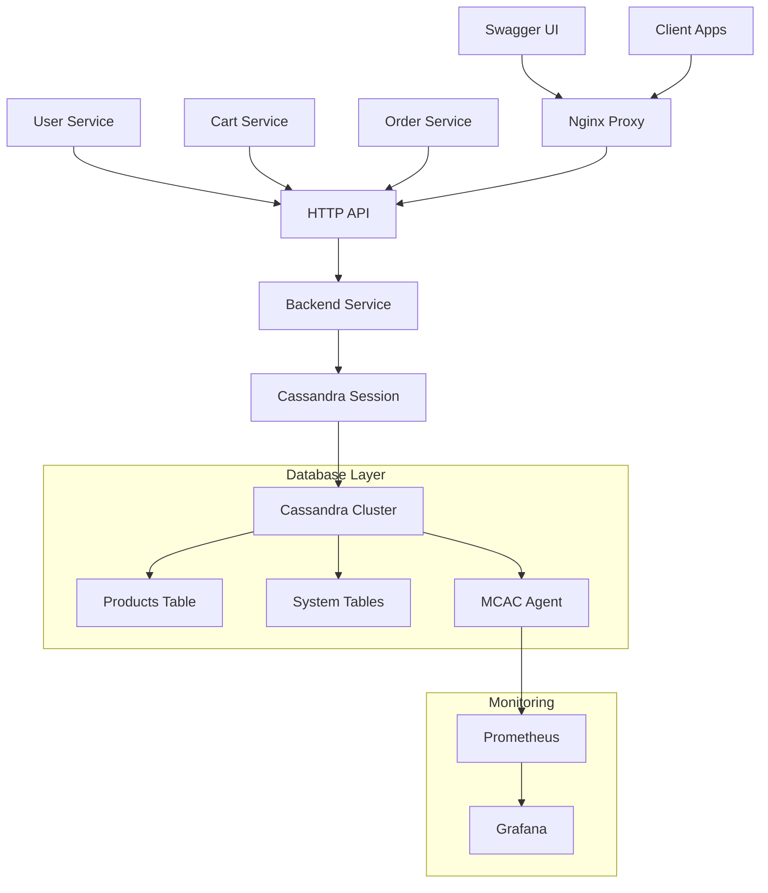

# 🗄️ База данных

Apache Cassandra как основа для хранения данных Product Store с настройкой для высокой производительности и масштабируемости.

## 🏗️ Архитектура данных

### 📊 Обзор системы
- **СУБД**: Apache Cassandra 4.1
- **Keyspace**: `store`
- **Репликация**: SimpleStrategy, replication_factor=1 (dev режим)
- **Контейнер**: `cassandra:4.1` с MCAC агентом для мониторинга

### 🎯 Принципы дизайна
- **📈 Горизонтальное масштабирование**: NoSQL для больших объемов данных
- **⚡ Высокая производительность**: Оптимизированные CQL запросы
- **🔄 Партиционирование**: Распределение данных по ключам
- **📊 Мониторинг**: Интеграция с Prometheus через MCAC

---

## 📋 Схема данных

### 🏪 Таблица: products

**Основная таблица для хранения каталога товаров магазина**

```cql
CREATE TABLE IF NOT EXISTS products (
    id UUID PRIMARY KEY,
    name TEXT,
    category TEXT,
    price DECIMAL,
    stock_count INT,
    description TEXT,
    manufacturer TEXT,
    created_at TIMESTAMP,
    updated_at TIMESTAMP
);
```

#### 📝 Структура полей

| Поле | Тип | Ключ | Описание | Пример |
|------|-----|------|----------|--------|
| `id` | UUID | 🔑 PRIMARY | Уникальный идентификатор товара | `f767c2cb-215d-469e-a3be-c6e40a6cf47f` |
| `name` | TEXT | | Название товара | `"Яблоки Гала"` |
| `category` | TEXT | | Категория товара | `"Фрукты"` |
| `price` | DECIMAL | | Цена товара в рублях | `89.99` |
| `stock_count` | INT | | Количество на складе | `150` |
| `description` | TEXT | | Подробное описание | `"Сладкие яблоки сорта Гала"` |
| `manufacturer` | TEXT | | Производитель/поставщик | `"Сады России"` |
| `created_at` | TIMESTAMP | | Дата создания записи | `2025-07-25 19:00:00+0000` |
| `updated_at` | TIMESTAMP | | Дата последнего обновления | `2025-07-25 19:30:00+0000` |

#### 🔍 Индексы и поиск

**Первичный ключ:**
- `id` (UUID) - обеспечивает уникальность и равномерное распределение

**Рекомендуемые вторичные индексы (для продакшена):**
```cql
-- Поиск по категории
CREATE INDEX IF NOT EXISTS idx_products_category 
ON products (category);

-- Поиск по производителю  
CREATE INDEX IF NOT EXISTS idx_products_manufacturer 
ON products (manufacturer);
```

---

## 🔧 Подключение и инициализация

### 🏃‍♂️ Автоматическая настройка при старте

**Файл: `/app/backend/src/services/cassandra.py`**

```python
import os
import logging
from cassandra.cluster import Cluster
from cassandra.auth import PlainTextAuthProvider

# Конфигурация
KEYSPACE = "store"
CASSANDRA_HOST = os.environ.get("CASSANDRA_HOST", "cassandra")
CASSANDRA_PORT = int(os.environ.get("CASSANDRA_PORT", "9042"))

def get_cassandra_session():
    """Подключение к Cassandra с автоматической настройкой"""
    try:
        # Подключение к кластеру
        cluster = Cluster(
            [CASSANDRA_HOST], 
            port=CASSANDRA_PORT,
            connect_timeout=10,
            control_connection_timeout=10
        )
        session = cluster.connect()
        
        # Проверка существования keyspace
        keyspaces = session.execute(
            "SELECT keyspace_name FROM system_schema.keyspaces"
        )
        existing_keyspaces = [row.keyspace_name for row in keyspaces]
        
        if KEYSPACE not in existing_keyspaces:
            logging.info(f"Creating keyspace '{KEYSPACE}'...")
            session.execute(f"""
                CREATE KEYSPACE {KEYSPACE}
                WITH replication = {{
                    'class': 'SimpleStrategy', 
                    'replication_factor': '1'
                }}
            """)
            logging.info(f"Keyspace '{KEYSPACE}' created successfully")
        else:
            logging.info(f"Keyspace '{KEYSPACE}' already exists")
        
        # Установка keyspace для сессии
        session.set_keyspace(KEYSPACE)
        
        # Создание схемы таблиц
        create_schema(session)
        
        return session
        
    except Exception as e:
        logging.error(f"Failed to connect to Cassandra: {e}")
        raise

def create_schema(session):
    """Создание таблиц и индексов"""
    logging.info("Creating products table...")
    
    session.execute("""
        CREATE TABLE IF NOT EXISTS products (
            id UUID PRIMARY KEY,
            name TEXT,
            category TEXT,
            price DECIMAL,
            stock_count INT,
            description TEXT,
            manufacturer TEXT,
            created_at TIMESTAMP,
            updated_at TIMESTAMP
        )
    """)
    
    logging.info("Products table created successfully")
```

### 🔄 Health Check

**Проверка доступности базы данных:**
```python
async def check_cassandra_health(session) -> dict:
    """Проверка состояния Cassandra"""
    try:
        # Простой запрос для проверки связи
        session.execute("SELECT release_version FROM system.local")
        
        # Проверка keyspace
        result = session.execute(f"SELECT * FROM {KEYSPACE}.products LIMIT 1")
        
        return {
            "status": "healthy",
            "database": "cassandra",
            "keyspace": KEYSPACE,
            "connection": "ok"
        }
    except Exception as e:
        return {
            "status": "unhealthy", 
            "database": "cassandra",
            "error": str(e)
        }
```

---

## 📊 CRUD операции

### 📖 Чтение данных (Read)

#### 🔍 Получение всех товаров
```python
# app/backend/src/api/products.py
async def get_products(
    session,
    category: Optional[str] = None,
    skip: int = 0,
    limit: int = 50,
    sort_by: Optional[str] = None,
    sort_order: str = "asc",
    min_price: Optional[float] = None,
    max_price: Optional[float] = None
):
    """Получение товаров с фильтрацией и пагинацией"""
    
    # Базовый запрос
    query = "SELECT id, name, category, price, stock_count, description, manufacturer FROM products"
    params = []
    
    # Применение фильтров (в реальном приложении используются prepared statements)
    conditions = []
    if category:
        conditions.append("category = ?")
        params.append(category)
    
    if conditions:
        query += " WHERE " + " AND ".join(conditions)
    
    # Выполнение запроса
    rows = session.execute(query, params)
    
    # Постобработка (фильтрация по цене, сортировка, пагинация)
    products = []
    for row in rows:
        product = {
            "id": str(row.id),
            "name": row.name,
            "category": row.category,
            "price": float(row.price),
            "stock_count": row.stock_count,
            "description": row.description,
            "manufacturer": row.manufacturer
        }
        
        # Фильтрация по цене
        if min_price and product["price"] < min_price:
            continue
        if max_price and product["price"] > max_price:
            continue
            
        products.append(product)
    
    # Сортировка
    if sort_by in ["name", "price"]:
        reverse = sort_order == "desc"
        products.sort(key=lambda x: x[sort_by], reverse=reverse)
    
    # Пагинация
    total_count = len(products)
    products = products[skip:skip+limit]
    
    return {
        "products": products,
        "total": total_count,
        "skip": skip,
        "limit": limit
    }
```

#### 🎯 Получение товара по ID
```python
async def get_product_by_id(session, product_id: str):
    """Получение конкретного товара"""
    try:
        rows = session.execute(
            "SELECT id, name, category, price, stock_count, description, manufacturer FROM products WHERE id = ?",
            [UUID(product_id)]
        )
        
        row = rows.one()
        if not row:
            return None
            
        return {
            "id": str(row.id),
            "name": row.name,
            "category": row.category,
            "price": float(row.price),
            "stock_count": row.stock_count,
            "description": row.description,
            "manufacturer": row.manufacturer
        }
    except Exception:
        return None
```

### ✏️ Создание данных (Create)

```python
async def create_product(session, product_data: dict):
    """Создание нового товара"""
    product_id = uuid4()
    current_time = datetime.now()
    
    session.execute("""
        INSERT INTO products (
            id, name, category, price, stock_count, 
            description, manufacturer, created_at, updated_at
        ) VALUES (?, ?, ?, ?, ?, ?, ?, ?, ?)
    """, [
        product_id,
        product_data["name"],
        product_data["category"], 
        Decimal(str(product_data["price"])),
        product_data.get("stock_count", 0),
        product_data.get("description", ""),
        product_data.get("manufacturer", ""),
        current_time,
        current_time
    ])
    
    return {
        "id": str(product_id),
        **product_data,
        "created_at": current_time.isoformat(),
        "updated_at": current_time.isoformat()
    }
```

### 🔄 Обновление данных (Update)

```python
async def update_product(session, product_id: str, product_data: dict):
    """Обновление существующего товара"""
    current_time = datetime.now()
    
    # Проверка существования товара
    existing = await get_product_by_id(session, product_id)
    if not existing:
        return None
    
    # Обновление записи
    session.execute("""
        UPDATE products SET 
            name = ?, category = ?, price = ?, stock_count = ?,
            description = ?, manufacturer = ?, updated_at = ?
        WHERE id = ?
    """, [
        product_data.get("name", existing["name"]),
        product_data.get("category", existing["category"]),
        Decimal(str(product_data.get("price", existing["price"]))),
        product_data.get("stock_count", existing["stock_count"]),
        product_data.get("description", existing["description"]),
        product_data.get("manufacturer", existing["manufacturer"]),
        current_time,
        UUID(product_id)
    ])
    
    return {
        **existing,
        **product_data,
        "updated_at": current_time.isoformat()
    }
```

### 🗑️ Удаление данных (Delete)

```python
async def delete_product(session, product_id: str):
    """Удаление товара"""
    # Проверка существования
    existing = await get_product_by_id(session, product_id)
    if not existing:
        return False
    
    # Удаление записи
    session.execute(
        "DELETE FROM products WHERE id = ?",
        [UUID(product_id)]
    )
    
    return True
```

---

## 🌐 Интеграция микросервисов

### 🏗️ Архитектура доступа к данным



### 🔄 Взаимодействие сервисов с данными

#### 1. 🏪 Backend Service (прямой доступ)
- **Роль**: Единственный сервис с прямым доступом к Cassandra
- **Функции**: CRUD операции, управление схемой, health checks
- **Эндпоинты**: `/api/products/*`, `/system/health`

#### 2. 🛒 Cart Service (через Backend API)
```python
# Cart Service получает данные о товарах через HTTP
async def get_product_info(product_id: str):
    """Получение информации о товаре для валидации корзины"""
    async with httpx.AsyncClient() as client:
        response = await client.get(
            f"{BACKEND_SERVICE_URL}/api/products/{product_id}"
        )
        if response.status_code == 200:
            return response.json()
        return None

async def validate_product_stock(product_id: str, quantity: int):
    """Проверка достаточности остатков"""
    product = await get_product_info(product_id)
    if not product:
        return False, "Product not found"
    
    if product["stock_count"] < quantity:
        return False, "Not enough items in stock"
    
    return True, product
```

#### 3. 📦 Order Service (через Backend API)
```python
# Order Service получает данные о товарах для создания заказа
async def validate_order_items(items: List[dict]):
    """Валидация товаров в заказе"""
    for item in items:
        product = await get_product_info(item["product_id"])
        if not product:
            raise HTTPException(404, f"Product {item['product_id']} not found")
        
        if product["stock_count"] < item["quantity"]:
            raise HTTPException(400, f"Not enough stock for {product['name']}")
```

#### 4. 👤 User Service (агрегация данных)
```python
# User Service агрегирует данные из других сервисов
async def get_user_full_profile(username: str):
    """Полный профиль пользователя с данными из всех сервисов"""
    # Базовая информация пользователя
    user_info = get_user_from_db(username)
    
    # Данные корзины из Cart Service
    cart_data = await get_user_cart(username)
    
    # История заказов из Order Service  
    orders_data = await get_user_orders(username)
    
    return {
        **user_info,
        "current_cart_total": cart_data.get("total", 0),
        "orders": orders_data.get("orders", []),
        "total_spent": sum(order["total"] for order in orders_data.get("orders", []))
    }
```

---

## 📊 Производительность и оптимизация

### ⚡ Текущие оптимизации

#### 1. 🎯 Эффективные запросы
```python
# Использование prepared statements для повторяющихся запросов
PREPARED_STATEMENTS = {
    "get_product": session.prepare(
        "SELECT id, name, category, price, stock_count FROM products WHERE id = ?"
    ),
    "update_stock": session.prepare(
        "UPDATE products SET stock_count = ? WHERE id = ?"
    )
}

# Использование prepared statement
async def get_product_fast(product_id: UUID):
    """Быстрое получение товара с prepared statement"""
    rows = session.execute(PREPARED_STATEMENTS["get_product"], [product_id])
    return rows.one()
```

#### 2. 🔄 Batch операции
```python
# Пакетное обновление остатков при создании заказа
async def update_multiple_stock_counts(updates: List[tuple]):
    """Пакетное обновление остатков товаров"""
    batch = BatchStatement()
    
    for product_id, new_stock in updates:
        batch.add(PREPARED_STATEMENTS["update_stock"], [new_stock, product_id])
    
    session.execute(batch)
```

### 📈 Рекомендации для продакшена

#### 1. 🏗️ Архитектура кластера
```yaml
# docker-compose.prod.yml
version: '3.8'
services:
  cassandra-node1:
    image: cassandra:4.1
    environment:
      - CASSANDRA_CLUSTER_NAME=ProductStore
      - CASSANDRA_SEEDS=cassandra-node1,cassandra-node2,cassandra-node3
      - CASSANDRA_DC=datacenter1
      - CASSANDRA_RACK=rack1
    
  cassandra-node2:
    image: cassandra:4.1
    environment:
      - CASSANDRA_CLUSTER_NAME=ProductStore
      - CASSANDRA_SEEDS=cassandra-node1,cassandra-node2,cassandra-node3
      - CASSANDRA_DC=datacenter1
      - CASSANDRA_RACK=rack2
    
  cassandra-node3:
    image: cassandra:4.1
    environment:
      - CASSANDRA_CLUSTER_NAME=ProductStore
      - CASSANDRA_SEEDS=cassandra-node1,cassandra-node2,cassandra-node3
      - CASSANDRA_DC=datacenter1
      - CASSANDRA_RACK=rack3
```

#### 2. 🔧 Оптимизированная схема
```cql
-- Продакшн keyspace с репликацией
CREATE KEYSPACE store_prod
WITH replication = {
    'class': 'NetworkTopologyStrategy',
    'datacenter1': 3
};

-- Материализованные представления для быстрого поиска
CREATE MATERIALIZED VIEW products_by_category AS
    SELECT * FROM products
    WHERE category IS NOT NULL AND id IS NOT NULL
    PRIMARY KEY (category, id);

-- Индексы для поиска
CREATE INDEX idx_products_price ON products (price);
CREATE INDEX idx_products_manufacturer ON products (manufacturer);
```

#### 3. 📊 Настройки производительности
```python
# Конфигурация драйвера для продакшена
from cassandra.cluster import Cluster
from cassandra.policies import DCAwareRoundRobinPolicy, TokenAwarePolicy

cluster = Cluster(
    contact_points=['cassandra-node1', 'cassandra-node2', 'cassandra-node3'],
    load_balancing_policy=TokenAwarePolicy(DCAwareRoundRobinPolicy()),
    default_retry_policy=RetryPolicy(),
    compression=True,
    protocol_version=4,
    port=9042
)

# Настройка сессии
session = cluster.connect()
session.default_timeout = 60
session.default_consistency_level = ConsistencyLevel.LOCAL_QUORUM
```

---

## 📊 Мониторинг и метрики

### 📈 MCAC Integration

**Cassandra интегрирован с Prometheus через MCAC (Metrics Collector for Apache Cassandra):**

```yaml
# infra/docker-compose.yml
cassandra:
  image: cassandra:4.1
  environment:
    - JVM_OPTS=-javaagent:/opt/cassandra/agents/dse-java-driver-core-shaded-4.17.0.jar
  volumes:
    - ./cassandra/mcac-agent:/opt/cassandra/agents
```

### 📊 Ключевые метрики

#### 🔧 Системные метрики
- **CPU Usage**: Загрузка процессора узлов Cassandra
- **Memory Usage**: Использование heap и off-heap памяти  
- **Disk I/O**: Операции чтения/записи на диск
- **Network I/O**: Сетевой трафик между узлами

#### 📋 Метрики запросов
- **Read Latency**: Время отклика на чтение
- **Write Latency**: Время отклика на запись
- **Request Rate**: Количество запросов в секунду
- **Error Rate**: Процент ошибочных запросов

#### 🗃️ Метрики хранения
- **Keyspace Size**: Размер keyspace в байтах
- **Table Count**: Количество таблиц
- **SSTable Count**: Количество SSTables на узел
- **Compaction Queue**: Очередь компактификации

### 📊 Grafana Dashboard

**URL**: [http://localhost:3000/d/cassandra-overview](http://localhost:3000/d/cassandra-overview)

**Панели мониторинга:**
- 📈 **System Metrics**: CPU, Memory, Disk, Network
- 🔍 **Query Performance**: Latency, Throughput, Errors
- 🗄️ **Storage Metrics**: Size, Growth, Compaction
- 🚨 **Alerts**: Critical thresholds and notifications

---

## 🧪 Тестирование базы данных

### 🔍 Health Check тесты

```bash
#!/bin/bash
# test_database.sh

echo "🗄️ Testing Cassandra database..."

# 1. Проверка доступности
curl -f http://localhost/api/system/health || {
    echo "❌ Database health check failed"
    exit 1
}

# 2. Тестирование CRUD операций
echo "📦 Testing product operations..."

# Создание товара
PRODUCT=$(curl -s -X POST http://localhost/api/products/ \
  -H "admin: true" \
  -H "Content-Type: application/json" \
  -d '{
    "name": "Test Product",
    "category": "Test Category",
    "price": 99.99,
    "stock_count": 100,
    "description": "Test description"
  }')

PRODUCT_ID=$(echo $PRODUCT | jq -r '.id')
echo "✅ Product created: $PRODUCT_ID"

# Чтение товара
curl -f "http://localhost/api/products/$PRODUCT_ID" || {
    echo "❌ Product read failed"
    exit 1
}
echo "✅ Product read successful"

# Обновление товара
curl -f -X PUT "http://localhost/api/products/$PRODUCT_ID" \
  -H "admin: true" \
  -H "Content-Type: application/json" \
  -d '{"name": "Updated Product", "price": 149.99}' || {
    echo "❌ Product update failed"
    exit 1
}
echo "✅ Product updated successfully"

# Удаление товара
curl -f -X DELETE "http://localhost/api/products/$PRODUCT_ID" \
  -H "admin: true" || {
    echo "❌ Product deletion failed"
    exit 1
}
echo "✅ Product deleted successfully"

echo "🎉 All database tests passed!"
```

### 📊 Нагрузочное тестирование

```python
# tests/load_test_database.py
import asyncio
import aiohttp
import time
from concurrent.futures import ThreadPoolExecutor

async def create_test_products(session, count: int):
    """Создание тестовых товаров для нагрузочного тестирования"""
    tasks = []
    
    for i in range(count):
        product_data = {
            "name": f"Load Test Product {i}",
            "category": f"Category {i % 10}",
            "price": round(10.0 + (i % 100), 2),
            "stock_count": 100 + (i % 500),
            "description": f"Load test product number {i}"
        }
        
        task = session.post(
            "http://localhost/api/products/",
            headers={"admin": "true"},
            json=product_data
        )
        tasks.append(task)
    
    start_time = time.time()
    responses = await asyncio.gather(*tasks)
    end_time = time.time()
    
    successful_creates = sum(1 for r in responses if r.status == 201)
    
    print(f"📊 Created {successful_creates}/{count} products in {end_time - start_time:.2f}s")
    print(f"⚡ Throughput: {successful_creates / (end_time - start_time):.2f} creates/sec")

# Запуск нагрузочного теста
# asyncio.run(create_test_products(session, 1000))
```

---

## 🔧 Настройка и развертывание

### 🐳 Docker конфигурация

```yaml
# infra/docker-compose.yml
version: '3.8'
services:
  cassandra:
    image: cassandra:4.1
    container_name: cassandra
    environment:
      - CASSANDRA_CLUSTER_NAME=ProductStore
      - CASSANDRA_DC=datacenter1
      - CASSANDRA_RACK=rack1
      - CASSANDRA_ENDPOINT_SNITCH=GossipingPropertyFileSnitch
      - MAX_HEAP_SIZE=1G
      - HEAP_NEWSIZE=200M
    ports:
      - "9042:9042"     # CQL port
      - "9160:9160"     # Thrift port  
      - "7000:7000"     # Inter-node communication
      - "7001:7001"     # SSL inter-node communication
      - "7199:7199"     # JMX port
      - "9404:9404"     # MCAC metrics port
    volumes:
      - cassandra_data:/var/lib/cassandra
      - ./cassandra/mcac-agent:/opt/cassandra/agents
    networks:
      - backend
    healthcheck:
      test: ["CMD-SHELL", "cqlsh -e 'describe cluster'"]
      interval: 30s
      timeout: 10s
      retries: 5
      start_period: 60s

volumes:
  cassandra_data:
    driver: local

networks:
  backend:
    driver: bridge
```

### ⚙️ Переменные окружения

```bash
# Backend Service (.env)
CASSANDRA_HOST=cassandra
CASSANDRA_PORT=9042
CASSANDRA_KEYSPACE=store
CASSANDRA_REPLICATION_FACTOR=1

# Connection settings
CASSANDRA_CONNECT_TIMEOUT=10
CASSANDRA_REQUEST_TIMEOUT=30

# Performance tuning
CASSANDRA_PREPARED_STATEMENTS=true
CASSANDRA_CONNECTION_POOL_SIZE=10
```

---

## 🚨 Troubleshooting

### ❗ Распространенные проблемы

#### 1. 🔌 Проблемы с подключением
```log
ERROR: Failed to connect to Cassandra: NoHostAvailable
```

**Решение:**
```bash
# Проверка статуса контейнера
docker ps | grep cassandra

# Проверка логов
docker logs cassandra

# Проверка сетевого подключения
docker exec backend ping cassandra

# Проверка порта
telnet localhost 9042
```

#### 2. 🗄️ Проблемы с keyspace
```log
ERROR: Keyspace 'store' does not exist
```

**Решение:**
```bash
# Подключение к Cassandra
docker exec -it cassandra cqlsh

# Создание keyspace вручную
CREATE KEYSPACE store 
WITH replication = {'class': 'SimpleStrategy', 'replication_factor': '1'};

# Проверка keyspaces
DESCRIBE KEYSPACES;
```

#### 3. 💾 Проблемы с памятью
```log
ERROR: OutOfMemoryError: Java heap space
```

**Решение:**
```yaml
# Увеличение heap size в docker-compose.yml
cassandra:
  environment:
    - MAX_HEAP_SIZE=2G
    - HEAP_NEWSIZE=400M
```

### 🔍 Диагностика производительности

```bash
# Проверка статуса кластера
docker exec cassandra nodetool status

# Проверка нагрузки на узлы
docker exec cassandra nodetool tpstats

# Проверка компактификации
docker exec cassandra nodetool compactionstats

# Мониторинг запросов
docker exec cassandra nodetool cfstats store.products
```

---

**🔗 Связанные разделы:**
- **[Backend Service](microservices.md#backend-service)** - Детали интеграции с Cassandra
- **[Monitoring](monitoring.md)** - Мониторинг производительности БД
- **[Testing](testing.md)** - Тестирование операций с данными
