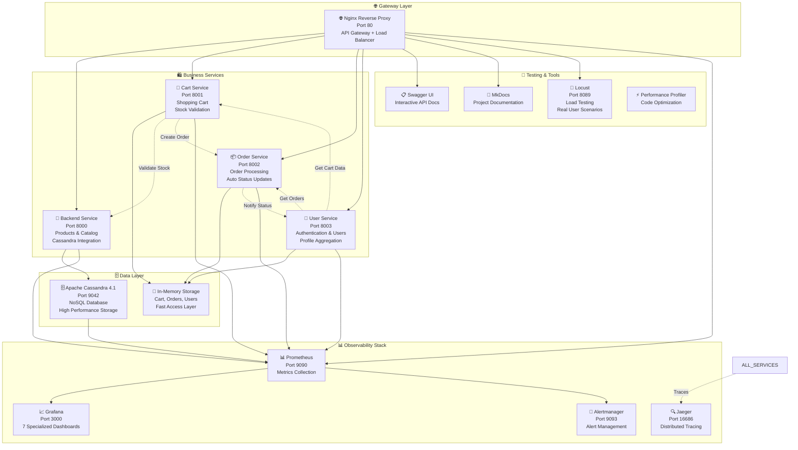

# 🏪 Добро пожаловать в Product Store

Современная микросервисная система интернет-магазина, построенная на принципах Cloud Native архитектуры с полноценной системой мониторинга, трейсинга и observability.

## 🎯 О проекте

Product Store — это комплексная демонстрационная платформа, показывающая лучшие практики современной разработки микросервисных приложений. Система включает в себя четыре основных микросервиса, полную систему мониторинга с трейсингом, нагрузочное тестирование, профилирование производительности и исчерпывающую документацию.

### ✨ Ключевые особенности

- **🏗️ Микросервисная архитектура** с четкой доменной изоляцией и независимыми сервисами
- **🔧 Cloud Native подход** с контейнеризацией, orchestration и современными паттернами
- **📊 Observability by design** с метриками, логами, трейсингом и профилированием
- **🚀 Performance-focused** с оптимизированными NoSQL базами данных и кэшированием
- **🔒 Security-first** с JWT аутентификацией, ролевым доступом и межсервисной авторизацией
- **🧪 Comprehensive testing** с автоматизированным тестированием, мониторингом и алертингом
- **⚡ Real-time processing** с асинхронной обработкой заказов и уведомлениями

---

## 🏗️ Микросервисная архитектура

### Основные компоненты



### Основные сервисы

#### 🏪 Backend Service (Port 8000)
- **Функции**: Управление товарами, каталог, интеграция с Cassandra
- **Особенности**: JWT авторизация, ролевой доступ, автоматические метрики
- **База данных**: Прямой доступ к Apache Cassandra
- **API**: 10+ эндпоинтов для работы с товарами и категориями

#### 🛒 Cart Service (Port 8001)  
- **Функции**: Управление корзиной, валидация остатков, интеграция с заказами
- **Особенности**: In-memory хранение, межсервисные вызовы, бизнес-метрики
- **Интеграция**: Backend (товары), Order Service (создание заказов)
- **API**: Полный CRUD для корзины + checkout функциональность

#### 📦 Order Service (Port 8002)
- **Функции**: Обработка заказов, автоматическое изменение статусов, уведомления
- **Особенности**: Background tasks, асинхронная обработка, автоудаление
- **Жизненный цикл**: CREATED → PROCESSING → SHIPPING → DELIVERED
- **API**: Управление заказами + административные функции

#### 👤 User Service (Port 8003)
- **Функции**: Аутентификация, управление пользователями, агрегация профилей
- **Особенности**: JWT токены, хэширование паролей, межсервисная интеграция
- **Агрегация**: Объединение данных из Cart и Order сервисов
- **API**: Регистрация, вход, профили + интеграционные эндпоинты

---

## 🚀 Быстрый старт

### 📋 Системные требования
- **Docker** 20.10+ и **Docker Compose** 2.0+
- **RAM**: 8 GB минимум, 16 GB рекомендуется
- **CPU**: 4 cores минимум
- **Свободные порты**: 80, 3000, 8089, 9090, 9093, 16686

### 🏃‍♂️ Запуск системы

```bash
# 1. Клонирование репозитория
git clone <repository-url>
cd product-store

# 2. Настройка переменных окружения (опционально)
cp infra/alertmanager/token.example infra/alertmanager/token
# Добавьте ваш Telegram Bot Token для алертов

# 3. Запуск всех сервисов
cd infra
docker-compose up -d

# 4. Проверка статуса сервисов
docker-compose ps

# 5. Ожидание готовности системы (30-60 секунд)
# Проверка health checks
curl http://localhost/api/system/health
curl http://localhost/cart-api/health
curl http://localhost/order-api/health
curl http://localhost/user-api/health
```

### 🔗 Доступные интерфейсы

После запуска системы доступны следующие интерфейсы:

| Сервис | URL | Логин | Описание |
|--------|-----|-------|----------|
| **🏠 Главная** | http://localhost/ | - | Автоматический редирект на документацию |
| **📖 Документация** | http://localhost/docs/ | - | Полная документация проекта (MkDocs) |
| **📋 Swagger API** | http://localhost/swagger/ | - | Интерактивная документация всех API |
| **📊 Grafana** | http://localhost:3000 | admin/admin | 7 дашбордов мониторинга |
| **🔍 Prometheus** | http://localhost:9090 | - | Метрики и правила алертов |
| **🚨 Alertmanager** | http://localhost:9093 | - | Управление алертами |
| **🔍 Jaeger** | http://localhost/search | - | Распределенный трейсинг |
| **🚀 Locust** | http://localhost/locust/ | - | Нагрузочное тестирование |
| **⚡ Профили** | http://localhost/profiles/ | - | Файлы профилирования производительности |

---

## 📊 Система мониторинга и observability

### 🎯 Компоненты мониторинга

#### 📊 Prometheus (Port 9090)
- **Сбор метрик** с интервалом 10 секунд
- **8 job targets** для всех сервисов и инфраструктуры
- **Custom метрики** для бизнес-логики
- **Alert rules** с автоматическими уведомлениями

#### 📈 Grafana (Port 3000)
**7 специализированных дашбордов:**
1. **Backend Service** - метрики товаров и Cassandra
2. **Cart Service** - корзины и бизнес-метрики  
3. **Order Service** - заказы и время доставки
4. **User Service** - регистрации и аутентификация
5. **Nginx** - web server метрики и upstream latency
6. **Cassandra Overview** - database performance
7. **Jaeger** - tracing statistics и collector metrics

#### 🔍 Jaeger Tracing
- **All-in-one** конфигурация для разработки
- **OpenTelemetry** интеграция во все сервисы
- **Автоматический трейсинг** HTTP запросов
- **Custom spans** для бизнес-операций
- **In-memory storage** с 50,000 трейсов

#### 🚨 Alertmanager (Port 9093)
- **4 типа алертов**: P99 latency, RPS, error rates
- **Telegram интеграция** для уведомлений
- **Группировка алертов** по severity
- **Auto-resolution** при восстановлении метрик

### 📈 Ключевые метрики

#### HTTP метрики (все сервисы)
- **Request duration** - гистограммы времени ответа
- **Request rate** - RPS по эндпоинтам
- **Error rate** - процент ошибок по статус-кодам
- **Concurrent requests** - активные соединения

#### Бизнес-метрики
- **Cart operations** - добавления/удаления товаров
- **Order lifecycle** - создание, статусы, доставка
- **User registrations** - новые пользователи
- **Product views** - популярность товаров

#### Infrastructure метрики
- **Database latency** - время запросов к Cassandra
- **Memory usage** - потребление RAM
- **CPU utilization** - загрузка процессора
- **Network I/O** - сетевой трафик

---

## 🧪 Тестирование и профилирование

### 🚀 Нагрузочное тестирование (Locust)

**Реалистичные сценарии пользователей:**
```python
# Автоматические сценарии включают:
1. Регистрацию пользователей (уникальные данные)
2. JWT аутентификацию и получение токенов
3. Просмотр товаров по категориям (с пагинацией)
4. Добавление товаров в корзину (с валидацией)
5. Управление корзиной (обновление, удаление)
6. Оформление заказов (full checkout flow)
7. Мониторинг статусов заказов
8. Агрегацию пользовательских профилей
```

**Веса задач:**
- `browse_products`: 10 (основная активность)
- `manage_cart`: 5 (средняя активность)  
- `place_order`: 1 (редкая активность)

### ⚡ Профилирование производительности

**Автоматическое профилирование:**
- **Декораторы** на ключевых эндпоинтах
- **cProfile** интеграция
- **Snakeviz** совместимые файлы
- **HTTP эндпоинты** для загрузки профилей

**Доступные профили:**
```bash
# Доступ к профилям производительности
http://localhost/profiles/

# Основные профилируемые операции:
- get_products (Backend)
- add_to_cart (Cart Service)  
- create_order (Order Service)
- get_user_profile (User Service)
```

### 📊 Целевые показатели производительности
- **Throughput**: 500+ RPS на сервис
- **P99 latency**: < 500ms для критичных операций
- **P95 latency**: < 200ms для обычных операций
- **Availability**: 99.9% uptime (8.76 hours downtime/year)
- **Database response**: < 100ms для простых запросов
- **Error rate**: < 0.1% для production traffic

---

## 🔧 Технический стек

### 🏗️ Основные технологии
- **Python 3.11** - современная версия с последними оптимизациями
- **FastAPI** - современный async веб-фреймворк для всех сервисов  
- **Apache Cassandra 4.1** - NoSQL база данных для высокой производительности
- **Nginx** - reverse proxy, load balancer и API gateway
- **Docker** - контейнеризация всех компонентов

### 📊 Мониторинг и observability
- **Prometheus** - центральный сбор метрик
- **Grafana** - визуализация и дашборды
- **Jaeger** - распределенный трейсинг
- **Alertmanager** - управление алертами
- **MCAC Agent** - детальный мониторинг Cassandra

### 🧪 Тестирование и развертывание
- **Locust** - нагрузочное тестирование с реалистичными сценариями
- **Docker Compose** - оркестрация всех сервисов
- **Health checks** - мониторинг состояния сервисов
- **Graceful shutdown** - корректное завершение работы

### 🔐 Безопасность
- **JWT токены** - stateless аутентификация
- **bcrypt** - хэширование паролей
- **CORS middleware** - кросс-доменные запросы
- **Role-based access** - разграничение доступа admin/user

---

## 📚 Документация

### 📖 Основные разделы
- **[🏗️ Архитектура системы](architecture.md)** - детальное описание архитектуры, компонентов и взаимодействий
- **[🛍️ Микросервисы](microservices.md)** - техническая документация по каждому сервису с API и примерами
- **[🗄️ База данных](database.md)** - схема данных Cassandra, операции и оптимизация
- **[📊 Мониторинг](monitoring.md)** - система observability, метрики, дашборды и алерты
- **[🔐 Аутентификация](authentication.md)** - JWT токены, безопасность и авторизация
- **[🧪 Тестирование](testing.md)** - руководство по тестированию, Locust сценарии
- **[🚀 Планы развития](future_plans.md)** - roadmap, будущие возможности и улучшения

### 📋 Дополнительные руководства
- **[🔧 Развертывание](reproduce_alerts.md)** - как воспроизвести алерты и тестировать систему
- **[📈 Нагрузочное тестирование](load_testing.md)** - подробное руководство по Locust
- **[🗄️ Обслуживание Cassandra](../CASSANDRA_MAINTENANCE.md)** - администрирование базы данных
- **[⚡ Профилирование](../PROFILING.md)** - анализ производительности кода

---

## 💡 Особенности реализации

### 🔄 Асинхронная архитектура
- **Полностью async** - все межсервисные вызовы используют httpx AsyncClient
- **Non-blocking I/O** - максимальная пропускная способность
- **Background tasks** - асинхронная обработка заказов и уведомлений
- **Connection pooling** - эффективное использование ресурсов

### 🛡️ Отказоустойчивость
- **Health checks** для всех сервисов с timeout и retry
- **Graceful shutdown** с корректной обработкой SIGTERM
- **Circuit breaker patterns** для внешних зависимостей
- **Automatic retry logic** с exponential backoff
- **Resource limits** для предотвращения memory leaks

### 📈 Масштабируемость
- **Stateless сервисы** - готовность к горизонтальному масштабированию
- **Партиционирование данных** в Cassandra по UUID
- **Load balancing** через Nginx с round-robin
- **Container-ready** архитектура с Docker
- **Независимые lifecycle** сервисов

### 🔍 Observability
- **Metrics everywhere** - автоматические и custom метрики
- **Distributed tracing** - полная видимость межсервисных вызовов
- **Structured logging** - консистентное логирование
- **Performance profiling** - детальный анализ производительности

---

## 🎯 Демо-данные и тестирование

### 👥 Предустановленные пользователи
```json
{
  "admin": {"password": "admin123", "role": "admin"},
  "user1": {"password": "user123", "role": "user"},
  "testuser": {"password": "test123", "role": "user"}
}
```

### 📦 Каталог товаров
- **20,000+ товаров** в 8 категориях
- **Автоматическая генерация** при старте Backend Service
- **Реалистичные данные** с ценами и описаниями
- **Категории**: Фрукты, Овощи, Мясо, Молочные продукты, Хлеб, Напитки, Сладости, Замороженные товары

### 🧪 Быстрый тест системы
```bash
# 1. Проверка API
curl http://localhost/api/products/categories/list

# 2. Регистрация пользователя
curl -X POST http://localhost/user-api/users/register \
  -H "Content-Type: application/json" \
  -d '{"username":"test","password":"test123","full_name":"Test User"}'

# 3. Получение токена
curl -X POST http://localhost/user-api/token \
  -H "Content-Type: application/x-www-form-urlencoded" \
  -d "username=test&password=test123"

# 4. Запуск нагрузочного тестирования
# Откройте http://localhost/locust/ и запустите тест с 10 пользователями
```

---

## 🤝 Использование и развитие

Этот проект создан как демонстрация лучших практик современной разработки. Вы можете использовать его как:

- **📚 Обучающий материал** для изучения микросервисной архитектуры
- **🏗️ Базовый шаблон** для новых проектов и стартапов
- **🔍 Референс реализации** observability и мониторинга
- **🧪 Playground** для экспериментов с новыми технологиями
- **📊 Benchmark** для сравнения производительности решений

### 🔄 Планы развития
- **Redis кэширование** для повышения производительности
- **Kubernetes deployment** для production-ready развертывания  
- **Event-driven architecture** с Apache Kafka
- **Machine Learning** для рекомендательной системы
- **Multi-region deployment** для глобального масштабирования

---

**🎯 Product Store** - ваш путь в мир современных микросервисных архитектур с полной observability!
