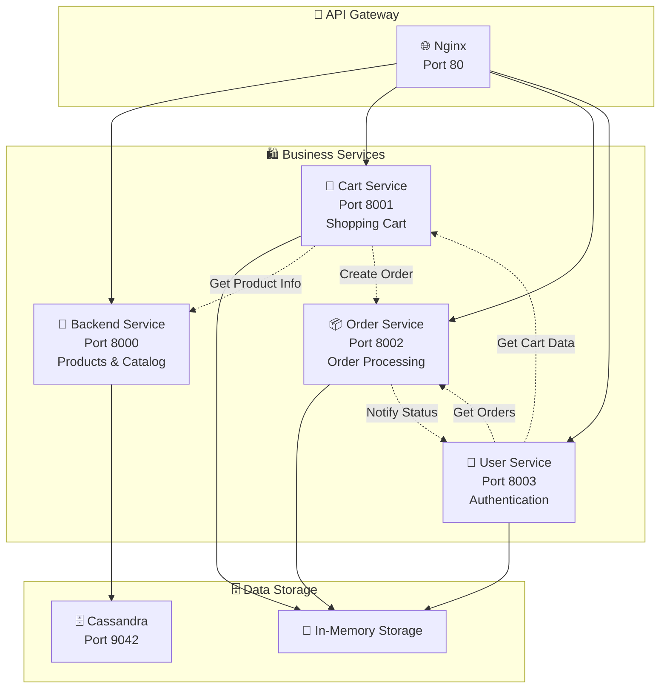
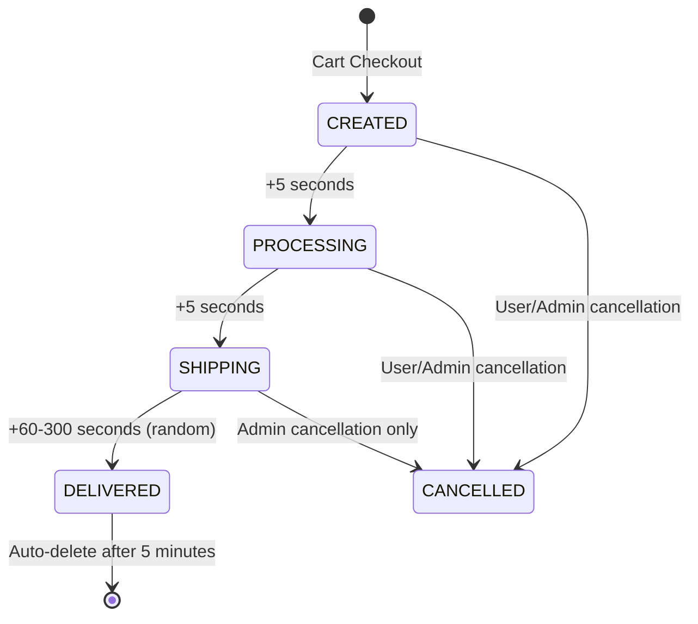
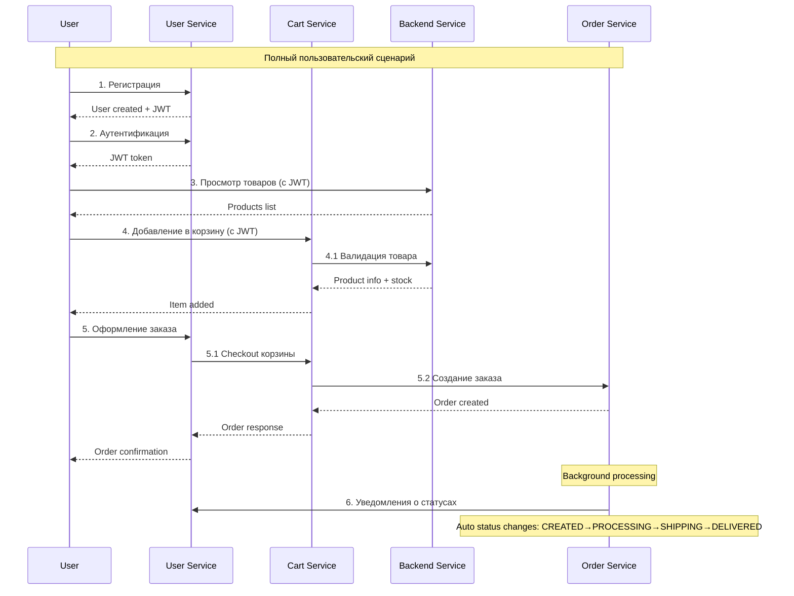

# 🛍️ Микросервисы Product Store

Детальная техническая документация по каждому микросервису системы. Каждый сервис разработан независимо, имеет свои API, зависимости и области ответственности.

## 🏗️ Общая архитектура микросервисов



---

## 🏪 Backend Service (порт 8000)

**Основной сервис для управления товарами и каталогом магазина**

### 📋 Технические характеристики

| Параметр | Значение |
|----------|----------|
| **Язык** | Python 3.11 |
| **Фреймворк** | FastAPI |
| **База данных** | Apache Cassandra |
| **Порт** | 8000 |
| **Dockerfile** | `app/backend/Dockerfile` |
| **Dependencies** | `app/backend/requirements.txt` |

### 🏗️ Структура проекта

```
app/backend/src/
├── __main__.py              # Точка входа приложения
├── auth.py                  # JWT аутентификация
├── api/
│   ├── __init__.py         # Экспорт роутеров
│   ├── products.py         # API товаров
│   └── system.py           # API системных функций
├── core/
│   ├── __init__.py
│   └── models.py           # Pydantic модели
└── services/
    ├── __init__.py
    ├── cassandra.py        # Сервис работы с БД
    └── metrics.py          # Сервис метрик
```

### 🔧 Основные компоненты

#### 1. **API Модуль** (`api/`)
- **products.py** - REST API для товаров с ролевым доступом
- **system.py** - Health checks и системная информация

#### 2. **Core Модуль** (`core/`)
- **models.py** - Pydantic модели для валидации данных

#### 3. **Services Модуль** (`services/`)
- **cassandra.py** - Инициализация БД, подключение, создание схемы
- **metrics.py** - Prometheus метрики и сборщики

#### 4. **Authentication** (`auth.py`)
- JWT токены валидация
- Ролевая модель (admin/user)
- Middleware для аутентификации

### 🌐 API Эндпоинты

#### Системные эндпоинты
```http
GET  /system/health              # Health check + БД статус
GET  /                          # Информация о сервисе
GET  /metrics                   # Prometheus метрики
```

#### Товары (Products)
```http
GET    /products/                    # Список товаров (с фильтрацией)
POST   /products/                    # Создание товара (admin only)
GET    /products/{product_id}        # Детали товара
PUT    /products/{product_id}        # Обновление товара (admin only)
DELETE /products/{product_id}        # Удаление товара (admin only)
GET    /products/categories/list     # Список категорий
GET    /products/by-category/{cat}   # Товары по категории
```

### 🔐 Система безопасности

**Контроль доступа:**
- **Обычные пользователи**: могут просматривать товары только по категориям
- **Администраторы**: полный доступ ко всем товарам и CRUD операциям

**Аутентификация:**
```python
# JWT токен обязателен для обычных пользователей
Authorization: Bearer JWT_TOKEN

# Администраторы могут использовать admin заголовок
admin: true
```

### 📊 Метрики и мониторинг

**Автоматические метрики:**
- HTTP запросы: количество, время выполнения, статусы
- Нормализация путей для группировки метрик

**Кастомные метрики:**
- `cassandra_connections_active` - активные подключения к БД
- `cassandra_queries_total` - общее количество запросов к БД
- `cassandra_query_duration_seconds` - время выполнения запросов
- `products_total` - общее количество товаров
- `products_by_category` - количество товаров по категориям

### 🗄️ Модель данных Cassandra

```sql
-- Keyspace: store
CREATE KEYSPACE store 
WITH replication = {'class': 'SimpleStrategy', 'replication_factor': '1'};

-- Таблица товаров
CREATE TABLE products (
    id UUID PRIMARY KEY,
    name TEXT,
    category TEXT,
    price DECIMAL,
    quantity INT,           -- stock_count в API
    description TEXT,
    manufacturer TEXT
);
```

---

## 🛒 Cart Service (порт 8001)

**Сервис управления корзиной покупок с валидацией остатков**

### 📋 Технические характеристики

| Параметр | Значение |
|----------|----------|
| **Язык** | Python 3.11 |
| **Фреймворк** | FastAPI |
| **Хранилище** | In-Memory (Dict) |
| **Порт** | 8001 |
| **Зависимости** | Backend Service, Order Service |

### 🔧 Основные функции

1. **Управление корзиной**
   - Добавление товаров с валидацией остатков
   - Обновление количества товаров
   - Удаление товаров (поддержка поиска по item_id и product_id)
   - Просмотр содержимого корзины

2. **Оформление заказов**
   - Checkout корзины с интеграцией Order Service
   - Автоматическая очистка корзины после успешного заказа
   - Передача данных заказа в Order Service

3. **Дополнительные функции**
   - Отслеживание недавно просмотренных товаров
   - Административный доступ ко всем корзинам

### 🌐 API Эндпоинты

```http
GET    /                           # Информация о сервисе
GET    /health                     # Health check
GET    /cart/                      # Просмотр корзины
POST   /cart/items                 # Добавление товара в корзину
PUT    /cart/items/{item_id}       # Обновление количества товара
DELETE /cart/items/{item_id}       # Удаление товара из корзины
DELETE /cart/                      # Очистка корзины
POST   /cart/checkout              # Оформление заказа
POST   /products/{id}/view         # Запись просмотра товара
GET    /products/recent-views      # Недавно просмотренные товары
GET    /carts/                     # Все корзины (admin only)
```

### 🔄 Межсервисное взаимодействие

#### С Backend Service
```python
# Валидация товара и остатков
async def get_product_info(product_id: UUID4) -> dict:
    response = await client.get(f"{BACKEND_URL}/products/{product_id}")
    return response.json()
```

#### С Order Service  
```python
# Создание заказа
async def checkout():
    order_data = {"items": order_items, "total": cart_total_value}
    response = await client.post(f"{ORDER_SERVICE_URL}/orders/", json=order_data)
```

### 📊 Бизнес-метрики

**Кастомные метрики:**
- `cart_value_cents` - стоимость корзины в центах при checkout
- `cart_items_count` - количество товаров в корзине при checkout
- `items_added_to_cart_total` - популярность товаров (по названию)
- `checkouts_total` - общее количество успешных заказов

**Buckets для анализа:**
```python
# Стоимость корзин: $10-$500
CART_VALUE_CENTS.buckets = [1000, 2500, 5000, 7500, 10000, 15000, 20000, 50000]

# Количество товаров: последовательность Фибоначчи
CART_ITEMS_COUNT.buckets = [1, 2, 3, 5, 8, 13, 21]
```

### 💾 Структура данных

```python
# In-memory хранилище корзин
carts_db: Dict[str, Dict[str, Any]] = {
    "user_id": {
        "items": {
            "item_uuid": {
                "id": "item_uuid",
                "product_id": "product_uuid", 
                "name": "Product Name",
                "price": 99.99,
                "quantity": 2,
                "total_price": 199.98
            }
        }
    }
}

# Недавние просмотры
recent_views_db: Dict[str, List[Dict]] = {
    "user_id": [
        {"product_id": "uuid", "viewed_at": "2025-07-25T19:00:00"}
    ]
}
```

---

## 📦 Order Service (порт 8002)

**Сервис обработки заказов с автоматическим изменением статусов**

### 📋 Технические характеристики

| Параметр | Значение |
|----------|----------|
| **Язык** | Python 3.11 |
| **Фреймворк** | FastAPI |
| **Хранилище** | In-Memory (Dict) |
| **Порт** | 8002 |
| **Особенности** | Background Tasks, Async Processing |

### 🔄 Жизненный цикл заказа



### 🌐 API Эндпоинты

```http
GET    /                           # Информация о сервисе
GET    /health                     # Health check
GET    /orders/                    # Список заказов пользователя
POST   /orders/                    # Создание заказа (из Cart Service)
GET    /orders/{order_id}          # Детали заказа
PUT    /orders/{order_id}/status   # Изменение статуса (admin only)
PUT    /orders/{order_id}/cancel   # Отмена заказа
GET    /orders/statuses/list       # Список всех статусов
```

### ⚙️ Автоматическая обработка заказов

**Background Tasks:**
```python
async def process_order(order_id: str):
    # Этап 1: CREATED → PROCESSING (5 сек)
    await asyncio.sleep(5)
    order["status"] = "PROCESSING"
    
    # Этап 2: PROCESSING → SHIPPING (5 сек)  
    await asyncio.sleep(5)
    order["status"] = "SHIPPING"
    
    # Этап 3: SHIPPING → DELIVERED (60-300 сек)
    delivery_time = random.randint(60, 300)
    await asyncio.sleep(delivery_time)
    order["status"] = "DELIVERED"
    
    # Автоудаление через 5 минут после доставки
    background_tasks.add_task(delete_order_after_delay, order_id, 300)
```

### 📢 Система уведомлений

**Интеграция с User Service:**
```python
async def notify_user_service(order_id: str, status: str):
    async with httpx.AsyncClient() as client:
        await client.post(
            f"{USER_SERVICE_URL}/users/notify/order-status",
            json={
                "order_id": order_id,
                "user_id": order["user_id"], 
                "status": status,
                "updated_at": order["updated_at"]
            }
        )
```

### 📊 Метрики заказов

**Кастомные метрики:**
- `orders_created_total` - общее количество созданных заказов
- `orders_status_total` - количество заказов по статусам (label: status)
- `order_delivery_duration_seconds` - время от создания до доставки

**Buckets для времени доставки:**
```python
# 30 секунд - 10 минут
ORDER_DELIVERY_DURATION_SECONDS.buckets = [30, 60, 120, 180, 240, 300, 360, 480, 600]
```

### 💾 Структура данных

```python
# In-memory хранилище заказов
orders_db: Dict[str, Dict[str, Any]] = {
    "order_uuid": {
        "id": "order_uuid",
        "user_id": "user_id",
        "items": [
            {
                "product_id": "product_uuid",
                "name": "Product Name", 
                "price": 99.99,
                "quantity": 2
            }
        ],
        "total": 199.98,
        "status": "CREATED",
        "created_at": "2025-07-25T19:00:00",
        "updated_at": "2025-07-25T19:00:00"
    }
}

# Доступные статусы
ORDER_STATUSES = {
    "CREATED": "Создан",
    "PROCESSING": "Обрабатывается", 
    "SHIPPING": "Доставляется",
    "DELIVERED": "Доставлен",
    "CANCELLED": "Отменен"
}
```

---

## 👤 User Service (порт 8003)

**Сервис аутентификации и управления пользователями**

### 📋 Технические характеристики

| Параметр | Значение |
|----------|----------|
| **Язык** | Python 3.11 |
| **Фреймворк** | FastAPI |
| **Хранилище** | In-Memory (Dict) |
| **Порт** | 8003 |
| **Особенности** | JWT Authentication, CORS, OAuth2 |

### 🔐 Система аутентификации

**JWT Конфигурация:**
```python
SECRET_KEY = "supersecretkey123"
ALGORITHM = "HS256"
ACCESS_TOKEN_EXPIRE_MINUTES = 30

# Payload токена
{
    "sub": "username",
    "is_admin": true/false,
    "exp": timestamp
}
```

**Ролевая модель:**
- **Обычные пользователи**: автоматически при регистрации
- **Администраторы**: username начинается с "admin_" или явно установлен флаг

### 🌐 API Эндпоинты

#### Аутентификация
```http
POST   /users/register             # Регистрация пользователя  
POST   /token                      # Получение JWT токена
GET    /users/me                   # Профиль текущего пользователя
PUT    /users/me                   # Обновление профиля
```

#### Интеграция с другими сервисами
```http
GET    /users/me/profile           # Полный профиль с агрегацией данных
GET    /users/me/orders            # Заказы пользователя
GET    /users/me/cart              # Корзина пользователя
POST   /users/me/orders            # Оформление заказа из корзины
GET    /users/me/total-spent       # Общая сумма покупок
```

#### Административные и системные
```http
GET    /                           # Информация о сервисе
GET    /health                     # Health check
POST   /users/notify/order-status  # Уведомления от Order Service
GET    /swagger-admin-token        # Токен для Swagger UI
```

### 🔄 Агрегация данных

**Профиль пользователя объединяет:**
```python
async def get_user_profile():
    # Данные пользователя из локального хранилища
    user_data = current_user
    
    # Корзина из Cart Service
    cart_response = await cart_api.get("/cart/")
    current_cart_total = cart_response.json().get("total", 0.0)
    
    # Заказы из Order Service  
    orders_response = await order_api.get("/orders/")
    orders = [OrderSummary(**order) for order in orders_response.json()]
    
    return UserProfile(
        **user_data,
        current_cart_total=current_cart_total,
        orders=orders
    )
```

### 👥 Демо-пользователи

**Автоматически создаются при старте:**
```python
# Обычный пользователь для тестирования
{
    "username": "swagger_user",
    "password": "password123", 
    "full_name": "Swagger Regular User",
    "phone": "+7 (999) 123-45-67",
    "is_admin": False
}

# Администратор для тестирования
{
    "username": "swagger_admin",
    "password": "admin123",
    "full_name": "Swagger Admin User", 
    "phone": "+7 (999) 987-65-43",
    "is_admin": True
}
```

### 📊 Метрики пользователей

**Кастомные метрики:**
- `users_registered_total` - общее количество зарегистрированных пользователей

**Автоматические метрики:**
- HTTP запросы через FastAPI Instrumentator
- Время ответа и статусы запросов

### 💾 Структура данных

```python
# In-memory хранилище пользователей
users_db: Dict[str, UserInDB] = {
    "username": {
        "username": "username",
        "full_name": "Full Name",
        "phone": "+7 (999) 123-45-67",
        "hashed_password": "bcrypt_hash",
        "id": "00000001", 
        "created_at": "2025-07-25T19:00:00",
        "total_spent": 0.0,
        "is_admin": False
    }
}
```

---

## 🔗 Межсервисное взаимодействие

### 🔄 Схема взаимодействия



### 🔧 HTTP Клиенты

**Настройка межсервисных вызовов:**
```python
# Cart Service → Backend Service
BACKEND_URL = "http://backend:8000"
async with httpx.AsyncClient() as client:
    response = await client.get(f"{BACKEND_URL}/products/{product_id}")

# Cart Service → Order Service
ORDER_SERVICE_URL = "http://order-service:8002"
headers = {"X-User-ID": user_id, "Authorization": f"Bearer {token}"}
await client.post(f"{ORDER_SERVICE_URL}/orders/", json=data, headers=headers)

# User Service → Cart/Order Services
CART_SERVICE_URL = "http://cart-service:8001"
ORDER_SERVICE_URL = "http://order-service:8002"
```

### 🔐 Передача аутентификации

**Методы передачи пользователя между сервисами:**
1. **Authorization header**: `Bearer JWT_TOKEN`
2. **X-User-ID header**: для прямой передачи ID пользователя
3. **Admin header**: для административных операций

---

## 📊 Общие характеристики

### 🛠️ Технологический стек

| Компонент | Технология |
|-----------|------------|
| **Язык** | Python 3.11 |
| **Веб-фреймворк** | FastAPI |
| **ASGI сервер** | uvicorn |
| **HTTP клиент** | httpx (async) |
| **Валидация данных** | Pydantic |
| **JWT токены** | python-jose |
| **Хэширование паролей** | passlib + bcrypt |
| **Метрики** | prometheus_fastapi_instrumentator |
| **База данных** | Apache Cassandra |
| **Контейнеризация** | Docker |

### 🔧 Общие паттерны

**Health Checks:**
```python
@app.get("/health")
async def health_check():
    return {"status": "ok", "service": "service-name"}
```

**Error Handling:**
```python
try:
    # Межсервисный вызов
    response = await client.get(url)
    response.raise_for_status()
except httpx.RequestError:
    raise HTTPException(status_code=503, detail="Service unavailable")
except httpx.HTTPStatusError as e:
    raise HTTPException(status_code=e.response.status_code, detail="Service error")
```

**Метрики:**
```python
# Автоматические HTTP метрики
instrumentator = Instrumentator(excluded_handlers=["/health"]).instrument(app).expose(app)

# Кастомные бизнес-метрики
CUSTOM_COUNTER = Counter('custom_metric_total', 'Description', ['label'])
CUSTOM_HISTOGRAM = Histogram('custom_duration_seconds', 'Description', buckets=[...])
```

### 🐳 Docker конфигурация

**Общий паттерн Dockerfile:**
```dockerfile
FROM python:3.11-slim
WORKDIR /app

# Health check dependencies
RUN apt-get update && apt-get install -y curl && apt-get clean

# Python dependencies
COPY requirements.txt .
RUN pip install --no-cache-dir -r requirements.txt

# Application code
COPY src ./src

EXPOSE 800X
CMD ["uvicorn", "src.main:app", "--host", "0.0.0.0", "--port", "800X"]
```

---

## 🚀 Развертывание и масштабирование

### 📦 Docker Compose

**Зависимости сервисов:**
```yaml
services:
  # Data layer
  cassandra:
    # ... database configuration
  
  # Application layer  
  backend:
    depends_on:
      cassandra:
        condition: service_healthy
        
  cart-service:
    depends_on:
      backend:
        condition: service_healthy
        
  order-service:
    depends_on:
      backend:
        condition: service_healthy
        
  user-service:
    depends_on:
      cart-service:
        condition: service_healthy
      order-service:
        condition: service_healthy
```

### 🔧 Переменные окружения

**Конфигурация взаимодействия:**
```bash
# Backend Service
CASSANDRA_HOST=cassandra
SECRET_KEY=supersecretkey123

# Cart Service  
BACKEND_URL=http://backend:8000
ORDER_SERVICE_URL=http://order-service:8002
SECRET_KEY=supersecretkey123

# Order Service
BACKEND_URL=http://backend:8000  
USER_SERVICE_URL=http://user-service:8003
SECRET_KEY=supersecretkey123

# User Service
CART_SERVICE_URL=http://cart-service:8001
ORDER_SERVICE_URL=http://order-service:8002
SECRET_KEY=supersecretkey123
```

### 📈 Возможности масштабирования

1. **Горизонтальное масштабирование** - каждый сервис может быть развернут в нескольких экземплярах
2. **Независимые релизы** - каждый сервис имеет свой lifecycle
3. **Отказоустойчивость** - падение одного сервиса не влияет на остальные
4. **Специализированные технологии** - каждый сервис может использовать оптимальные для него технологии
