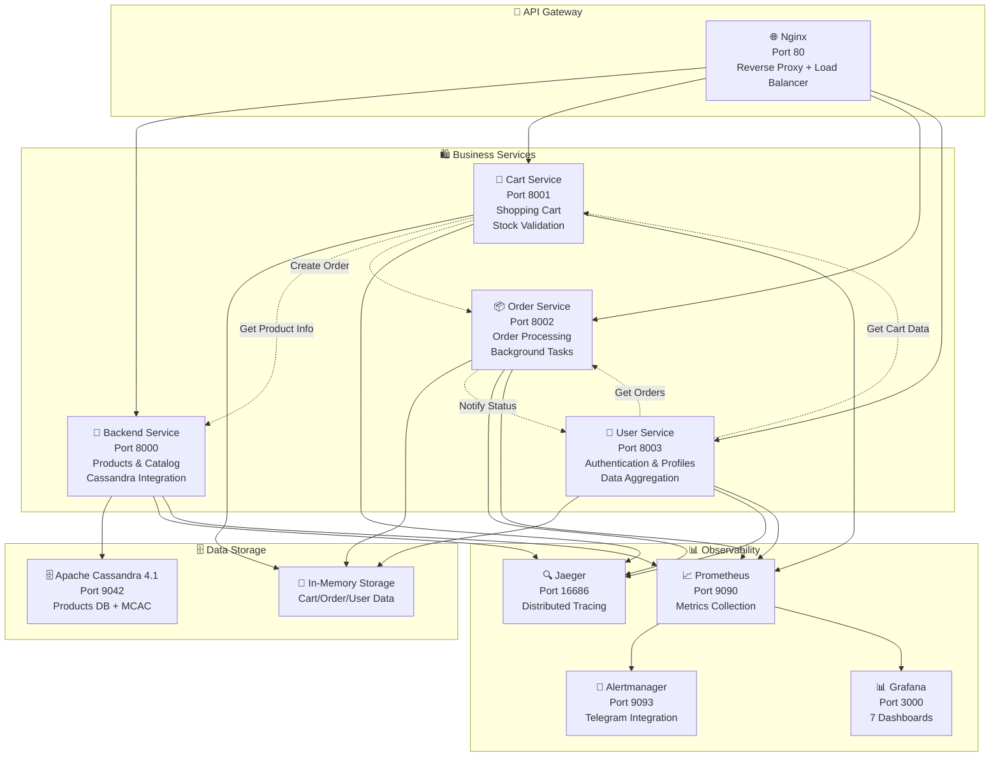

# 🛍️ Микросервисы Product Store

Детальная техническая документация по каждому микросервису системы. Каждый сервис разработан независимо, имеет свои API, зависимости и области ответственности.

## 🏗️ Общая архитектура микросервисов



---

## 🏪 Backend Service (порт 8000)

**Основной сервис для управления товарами и каталогом магазина**

### 📋 Технические характеристики

| Параметр | Значение |
|----------|----------|
| **Фреймворк** | FastAPI 0.104+ с async/await |
| **База данных** | Apache Cassandra 4.1 |
| **Аутентификация** | JWT tokens с ролевым доступом |
| **Мониторинг** | OpenTelemetry + Prometheus + cProfile |
| **Health Check** | `/health` endpoint с Cassandra connectivity |
| **API Documentation** | OpenAPI 3.0 с автогенерацией |

### 🎯 Основные функции

#### ✅ **Products CRUD API**
```python
# Основные операции с товарами
GET    /api/products                    # Каталог с фильтрацией
GET    /api/products/{product_id}       # Детали товара
POST   /api/products                    # Создание (admin only)
PUT    /api/products/{product_id}       # Обновление (admin only)
DELETE /api/products/{product_id}       # Удаление (admin only)

# Категории и фильтрация
GET    /api/categories                  # Список категорий
GET    /api/products?category=electronics&sort=price&order=asc&page=1&limit=20
```

#### 🔐 **Ролевая система доступа**
```yaml
# Роли пользователей:
- admin: CRUD операции с товарами, доступ ко всему каталогу
- user:  Просмотр товаров только по категориям, без админ функций

# JWT Token Payload:
{
  "sub": "user_id",
  "role": "admin|user", 
  "exp": timestamp,
  "iat": timestamp
}
```

#### 🗄️ **Cassandra Integration**
```python
# Схема keyspace и таблиц
keyspace: store
replication: SimpleStrategy, replication_factor=1

# Таблица products с оптимизированными индексами
CREATE TABLE products (
    id UUID PRIMARY KEY,           # Partition key для равномерного распределения
    name TEXT,                     # Название товара
    category TEXT,                 # Категория (индекс)
    price DECIMAL,                 # Цена (индекс)
    quantity INT,                  # Остаток на складе
    description TEXT,              # Подробное описание
    manufacturer TEXT              # Производитель
) WITH gc_grace_seconds = 3600;

# Secondary indexes для быстрых запросов
CREATE INDEX products_category_idx ON products (category);
CREATE INDEX products_price_idx ON products (price);
```

### 📊 **Мониторинг и производительность**

#### **Автоматическое профилирование**
```python
from src.profiling import profile_endpoint

@profile_endpoint("get_products")  # Автоматический cProfile
async def get_products(...):
    # Профили сохраняются в .prof файлы
    # Доступны через GET /profiles/get_products.prof
```

#### **Custom Business Metrics**
```python
# Prometheus метрики для бизнес-аналитики
product_views_total = Counter("product_views_total", ["category", "product_id"])
category_requests_total = Counter("category_requests_total", ["category"])
admin_operations_total = Counter("admin_operations_total", ["operation", "user_id"])
```

#### **OpenTelemetry Tracing**
```python
# Автоматический трейсинг HTTP запросов
# Custom spans для database operations
with tracer.start_as_current_span("cassandra_query") as span:
    span.set_attribute("query.table", "products")
    span.set_attribute("query.operation", "SELECT")
    result = await session.execute(query)
```

### 🔧 **Конфигурация и деплой**

#### **Environment Variables**
```bash
# Database
CASSANDRA_HOST=cassandra
CASSANDRA_PORT=9042
CASSANDRA_KEYSPACE=store

# Authentication  
JWT_SECRET_KEY=your-secret-key
JWT_ALGORITHM=HS256
JWT_ACCESS_TOKEN_EXPIRE_MINUTES=30

# Observability
JAEGER_AGENT_HOST=jaeger
JAEGER_AGENT_PORT=6831
OTEL_SERVICE_NAME=backend-service
OTEL_RESOURCE_ATTRIBUTES=service.name=backend-service,service.version=1.0.0

# Application
HOST=0.0.0.0
PORT=8000
LOG_LEVEL=INFO
```

#### **Docker Configuration**
```dockerfile
FROM python:3.11-slim
WORKDIR /app
COPY requirements.txt .
RUN pip install --no-cache-dir -r requirements.txt
COPY src/ .
EXPOSE 8000
HEALTHCHECK --interval=30s --timeout=10s --start-period=5s --retries=3 \
    CMD curl -f http://localhost:8000/health || exit 1
CMD ["python", "-m", "uvicorn", "__main__:app", "--host", "0.0.0.0", "--port", "8000"]
```

---

## 🛒 Cart Service (порт 8001)

**Сервис управления корзиной покупок с валидацией товаров**

### 📋 Технические характеристики

| Параметр | Значение |
|----------|----------|
| **Фреймворк** | FastAPI с async HTTP client |
| **Хранилище** | In-memory dict с user_id ключами |
| **Интеграция** | Backend Service для валидации товаров |
| **Checkout** | Order Service для создания заказов |
| **Мониторинг** | OpenTelemetry + business metrics |

### 🎯 Основные функции

#### ✅ **Cart Management API**
```python
# Операции с корзиной
GET    /cart-api/cart/{user_id}                    # Просмотр корзины
POST   /cart-api/cart/{user_id}/add                # Добавить товар
PUT    /cart-api/cart/{user_id}/update             # Обновить количество
DELETE /cart-api/cart/{user_id}/remove             # Удалить товар
DELETE /cart-api/cart/{user_id}/clear              # Очистить корзину
POST   /cart-api/cart/{user_id}/checkout           # Оформить заказ
```

#### 🔍 **Stock Validation Flow**
```python
# Автоматическая валидация при добавлении товара
async def add_to_cart(user_id: str, product_id: str, quantity: int):
    # 1. Запрос к Backend Service для проверки товара
    product = await backend_client.get(f"/api/products/{product_id}")
    
    # 2. Валидация наличия и остатков
    if not product:
        raise HTTPException(404, "Product not found")
    if product["quantity"] < quantity:
        raise HTTPException(400, "Insufficient stock")
    
    # 3. Добавление в корзину
    cart[user_id][product_id] = {
        "quantity": quantity,
        "price": product["price"],
        "name": product["name"]
    }
```

#### 🛍️ **Checkout Integration**
```python
# Полный checkout flow с Order Service
async def checkout_cart(user_id: str):
    cart_items = carts.get(user_id, {})
    if not cart_items:
        raise HTTPException(400, "Cart is empty")
    
    # Финальная валидация всех товаров
    for product_id, item in cart_items.items():
        product = await backend_client.get(f"/api/products/{product_id}")
        if product["quantity"] < item["quantity"]:
            raise HTTPException(400, f"Insufficient stock for {product['name']}")
    
    # Создание заказа через Order Service
    order_data = {
        "user_id": user_id,
        "items": cart_items,
        "total_amount": calculate_total(cart_items)
    }
    
    order = await order_client.post("/order-api/orders", json=order_data)
    
    # Очистка корзины после успешного заказа
    carts[user_id].clear()
    
    return order
```

### 📊 **Business Metrics & Analytics**

#### **Shopping Behavior Tracking**
```python
# Prometheus метрики для анализа поведения
cart_items_added_total = Counter("cart_items_added", ["product_id", "category"])
cart_abandonment_total = Counter("cart_abandonment", ["stage", "reason"])
checkout_success_total = Counter("checkout_success", ["user_id"])
stock_validation_failures = Counter("stock_validation_failures", ["product_id"])

# Histogram для анализа корзин
cart_value_histogram = Histogram("cart_value_distribution", 
                                buckets=[10, 50, 100, 200, 500, 1000])
cart_items_count_histogram = Histogram("cart_items_count", 
                                      buckets=[1, 2, 5, 10, 20])
```

#### **Popular Products Analytics**
```python
# Трекинг популярности товаров через корзину
async def track_product_popularity(product_id: str, action: str):
    product_popularity.labels(
        product_id=product_id, 
        action=action  # "added", "removed", "purchased"
    ).inc()
```

### 🔧 **Inter-service Communication**

#### **Backend Service Integration**
```python
# HTTP клиент для валидации товаров
class BackendServiceClient:
    def __init__(self):
        self.base_url = "http://backend:8000"
        self.session = aiohttp.ClientSession()
    
    async def get_product(self, product_id: str):
        async with self.session.get(f"{self.base_url}/api/products/{product_id}") as resp:
            if resp.status == 200:
                return await resp.json()
            return None
    
    async def validate_stock(self, items: dict):
        """Batch validation для checkout"""
        for product_id, quantity in items.items():
            product = await self.get_product(product_id)
            if not product or product["quantity"] < quantity:
                return False, f"Stock validation failed for {product_id}"
        return True, "Stock validation passed"
```

#### **Order Service Integration**
```python
# Создание заказов через Order Service API
async def create_order_from_cart(user_id: str, cart_items: dict):
    order_payload = {
        "user_id": user_id,
        "items": cart_items,
        "total_amount": sum(item["price"] * item["quantity"] 
                          for item in cart_items.values()),
        "status": "created",
        "created_at": datetime.utcnow().isoformat()
    }
    
    async with aiohttp.ClientSession() as session:
        async with session.post(
            "http://order:8002/order-api/orders",
            json=order_payload
        ) as resp:
            if resp.status == 201:
                return await resp.json()
            raise HTTPException(500, "Failed to create order")
```

---

## 📦 Order Service (порт 8002)

**Сервис обработки заказов с автоматическими статусами и уведомлениями**

### 📋 Технические характеристики

| Параметр | Значение |
|----------|----------|
| **Фреймворк** | FastAPI с Background Tasks |
| **Хранилище** | In-memory dict + JSON persistence |
| **Lifecycle** | Автоматические статусы (Created→Delivered) |
| **Cleanup** | Авто-удаление через 5 минут после доставки |
| **Notifications** | User Service integration |

### 🎯 Основные функции

#### ✅ **Order Management API**
```python
# Операции с заказами
GET    /order-api/orders                         # Все заказы (admin)
GET    /order-api/orders/{order_id}              # Детали заказа
GET    /order-api/orders/user/{user_id}          # Заказы пользователя
POST   /order-api/orders                         # Создать заказ
PUT    /order-api/orders/{order_id}/status       # Обновить статус (admin)
DELETE /order-api/orders/{order_id}              # Удалить заказ (admin)
```

#### 🔄 **Автоматический Order Lifecycle**
```python
# Background task для автоматической смены статусов
async def auto_update_order_status(order_id: str):
    """
    Автоматический переход статусов:
    CREATED (0s) → PROCESSING (30s) → SHIPPING (60s) → DELIVERED (90s) → DELETED (5min)
    """
    statuses = [
        ("PROCESSING", 30),   # Через 30 секунд
        ("SHIPPING", 60),     # Через 60 секунд  
        ("DELIVERED", 90),    # Через 90 секунд
    ]
    
    for status, delay in statuses:
        await asyncio.sleep(delay)
        
        if order_id in orders:
            orders[order_id]["status"] = status
            orders[order_id]["updated_at"] = datetime.utcnow().isoformat()
            
            # Уведомление User Service о смене статуса
            await notify_user_service(order_id, status)
            
            # Метрики для мониторинга
            order_status_changes.labels(
                order_id=order_id,
                status=status,
                user_id=orders[order_id]["user_id"]
            ).inc()
    
    # Авто-удаление через 5 минут после доставки
    await asyncio.sleep(300)  # 5 минут
    if order_id in orders:
        del orders[order_id]
        order_deletions_total.inc()
```

#### 📨 **User Service Notifications**
```python
# Уведомления об изменении статуса через User Service
async def notify_user_service(order_id: str, new_status: str):
    """Отправка уведомления пользователю через User Service"""
    if order_id not in orders:
        return
    
    order = orders[order_id]
    notification_data = {
        "user_id": order["user_id"],
        "type": "order_status_update",
        "order_id": order_id,
        "new_status": new_status,
        "message": f"Ваш заказ {order_id} изменил статус на: {new_status}",
        "timestamp": datetime.utcnow().isoformat()
    }
    
    try:
        async with aiohttp.ClientSession() as session:
            async with session.post(
                "http://user:8003/user-api/notifications",
                json=notification_data
            ) as resp:
                if resp.status == 200:
                    notifications_sent_total.labels(
                        type="order_status",
                        status="success"
                    ).inc()
                else:
                    notifications_sent_total.labels(
                        type="order_status", 
                        status="failed"
                    ).inc()
    except Exception as e:
        logger.error(f"Failed to notify user service: {e}")
        notifications_sent_total.labels(
            type="order_status",
            status="error"
        ).inc()
```

### 📊 **Order Analytics & Business Metrics**

#### **Order Lifecycle Tracking**
```python
# Подробная аналитика заказов
order_creation_total = Counter("orders_created_total", ["user_id"])
order_status_changes = Counter("order_status_changes", 
                              ["order_id", "status", "user_id"])
order_completion_time = Histogram("order_completion_seconds",
                                 buckets=[60, 120, 180, 300, 600])
order_value_distribution = Histogram("order_value_distribution",
                                   buckets=[10, 50, 100, 200, 500, 1000])

# Среднее время доставки
delivery_time_histogram = Histogram("delivery_time_minutes",
                                   buckets=[30, 60, 90, 120, 180, 300])
```

#### **Business Intelligence Metrics**
```python
# Метрики для бизнес-аналитики
async def track_order_metrics(order: dict):
    # Общая стоимость заказа
    order_value_distribution.observe(order["total_amount"])
    
    # Количество товаров в заказе
    items_count = len(order["items"])
    order_items_count.observe(items_count)
    
    # Популярные товары в заказах
    for product_id, item in order["items"].items():
        popular_products_in_orders.labels(
            product_id=product_id,
            category=item.get("category", "unknown")
        ).inc()
    
    # Активность пользователей
    user_order_frequency.labels(user_id=order["user_id"]).inc()
```

### 🔧 **Data Persistence & Recovery**

#### **JSON-based Persistence**
```python
# Автоматическое сохранение состояния заказов
import json
import os

ORDERS_FILE = "orders_backup.json"

async def save_orders_to_file():
    """Периодическое сохранение заказов на диск"""
    try:
        with open(ORDERS_FILE, 'w') as f:
            # Конвертация для JSON serialization
            serializable_orders = {}
            for order_id, order in orders.items():
                serializable_orders[order_id] = {
                    **order,
                    "created_at": order["created_at"],
                    "updated_at": order["updated_at"]
                }
            json.dump(serializable_orders, f, indent=2)
        logger.info(f"Saved {len(orders)} orders to {ORDERS_FILE}")
    except Exception as e:
        logger.error(f"Failed to save orders: {e}")

async def load_orders_from_file():
    """Восстановление заказов при запуске сервиса"""
    if os.path.exists(ORDERS_FILE):
        try:
            with open(ORDERS_FILE, 'r') as f:
                loaded_orders = json.load(f)
                orders.update(loaded_orders)
            logger.info(f"Loaded {len(orders)} orders from {ORDERS_FILE}")
            
            # Restart background tasks для активных заказов
            for order_id, order in orders.items():
                if order["status"] not in ["DELIVERED", "CANCELLED"]:
                    asyncio.create_task(auto_update_order_status(order_id))
        except Exception as e:
            logger.error(f"Failed to load orders: {e}")
```

---

## 👤 User Service (порт 8003)

**Сервис аутентификации и управления пользователями с агрегацией данных**

### 📋 Технические характеристики

| Параметр | Значение |
|----------|----------|
| **Фреймворк** | FastAPI с JWT аутентификацией |
| **Хранилище** | In-memory dict для пользователей |
| **Аутентификация** | JWT tokens + bcrypt hashing |
| **Агрегация** | Cart & Order Service integration |
| **Роли** | admin/user с access control |

### 🎯 Основные функции

#### ✅ **Authentication & User Management API**
```python
# Аутентификация
POST   /user-api/register                        # Регистрация пользователя
POST   /user-api/login                           # Авторизация (JWT)
POST   /user-api/logout                          # Выход
GET    /user-api/me                              # Текущий пользователь

# Управление пользователями
GET    /user-api/users                           # Все пользователи (admin)
GET    /user-api/users/{user_id}                 # Профиль пользователя
PUT    /user-api/users/{user_id}                 # Обновление профиля
DELETE /user-api/users/{user_id}                 # Удаление пользователя (admin)

# Агрегированные данные
GET    /user-api/users/{user_id}/profile         # Полный профиль с Cart/Order данными
POST   /user-api/notifications                   # Прием уведомлений от других сервисов
```

#### 🔐 **JWT Authentication System**
```python
# Генерация и валидация JWT токенов
from jose import JWTError, jwt
from passlib.context import CryptContext
from datetime import datetime, timedelta

pwd_context = CryptContext(schemes=["bcrypt"], deprecated="auto")

def create_access_token(data: dict, expires_delta: timedelta = None):
    to_encode = data.copy()
    if expires_delta:
        expire = datetime.utcnow() + expires_delta
    else:
        expire = datetime.utcnow() + timedelta(minutes=ACCESS_TOKEN_EXPIRE_MINUTES)
    
    to_encode.update({
        "exp": expire,
        "iat": datetime.utcnow(),
        "type": "access"
    })
    
    encoded_jwt = jwt.encode(to_encode, SECRET_KEY, algorithm=ALGORITHM)
    return encoded_jwt

def verify_token(token: str):
    try:
        payload = jwt.decode(token, SECRET_KEY, algorithms=[ALGORITHM])
        user_id: str = payload.get("sub")
        role: str = payload.get("role")
        if user_id is None:
            raise HTTPException(401, "Invalid token")
        return {"user_id": user_id, "role": role}
    except JWTError:
        raise HTTPException(401, "Invalid token")
```

#### 👥 **User Registration & Role Management**
```python
# Регистрация с автоматическим хешированием паролей
async def register_user(user_data: UserCreate):
    # Проверка уникальности username
    if any(u["username"] == user_data.username for u in users.values()):
        raise HTTPException(400, "Username already exists")
    
    # Первый пользователь становится admin
    role = "admin" if len(users) == 0 else "user"
    
    user_id = str(uuid.uuid4())
    hashed_password = pwd_context.hash(user_data.password)
    
    user = {
        "id": user_id,
        "username": user_data.username,
        "email": user_data.email,
        "hashed_password": hashed_password,
        "role": role,
        "created_at": datetime.utcnow().isoformat(),
        "is_active": True
    }
    
    users[user_id] = user
    
    # Метрики регистрации
    user_registrations_total.labels(role=role).inc()
    
    return {
        "id": user_id,
        "username": user["username"],
        "email": user["email"], 
        "role": role
    }
```

### 🔄 **Data Aggregation from Other Services**

#### **Comprehensive User Profile**
```python
# Агрегация данных из Cart и Order Service
async def get_user_profile_with_data(user_id: str):
    """Полный профиль пользователя с данными из всех сервисов"""
    if user_id not in users:
        raise HTTPException(404, "User not found")
    
    user = users[user_id].copy()
    user.pop("hashed_password", None)  # Удаляем пароль из ответа
    
    # Данные корзины из Cart Service
    cart_data = await get_user_cart_data(user_id)
    
    # История заказов из Order Service  
    order_data = await get_user_order_data(user_id)
    
    # Агрегированная статистика
    profile = {
        **user,
        "cart": cart_data,
        "orders": order_data,
        "statistics": {
            "total_orders": len(order_data.get("orders", [])),
            "cart_items_count": len(cart_data.get("items", {})),
            "cart_total_value": cart_data.get("total_value", 0),
            "total_spent": sum(o.get("total_amount", 0) for o in order_data.get("orders", [])),
            "last_order_date": max([o.get("created_at") for o in order_data.get("orders", [])], default=None)
        }
    }
    
    return profile

async def get_user_cart_data(user_id: str):
    """Получение данных корзины пользователя"""
    try:
        async with aiohttp.ClientSession() as session:
            async with session.get(f"http://cart:8001/cart-api/cart/{user_id}") as resp:
                if resp.status == 200:
                    return await resp.json()
                return {"items": {}, "total_value": 0}
    except Exception as e:
        logger.error(f"Failed to get cart data for user {user_id}: {e}")
        return {"items": {}, "total_value": 0}

async def get_user_order_data(user_id: str):
    """Получение истории заказов пользователя"""
    try:
        async with aiohttp.ClientSession() as session:
            async with session.get(f"http://order:8002/order-api/orders/user/{user_id}") as resp:
                if resp.status == 200:
                    return await resp.json()
                return {"orders": []}
    except Exception as e:
        logger.error(f"Failed to get order data for user {user_id}: {e}")
        return {"orders": []}
```

#### **Real-time Notifications System**
```python
# Прием уведомлений от других сервисов
user_notifications = {}  # user_id -> [notifications]

async def receive_notification(notification: dict):
    """Endpoint для приема уведомлений от других сервисов"""
    user_id = notification.get("user_id")
    if not user_id:
        raise HTTPException(400, "user_id is required")
    
    if user_id not in user_notifications:
        user_notifications[user_id] = []
    
    notification["received_at"] = datetime.utcnow().isoformat()
    user_notifications[user_id].append(notification)
    
    # Ограничиваем историю уведомлений (last 100)
    if len(user_notifications[user_id]) > 100:
        user_notifications[user_id] = user_notifications[user_id][-100:]
    
    # Метрики уведомлений
    notifications_received_total.labels(
        type=notification.get("type", "unknown"),
        source=notification.get("source", "unknown")
    ).inc()
    
    logger.info(f"Notification received for user {user_id}: {notification.get('type')}")
    
    return {"status": "notification received"}

async def get_user_notifications(user_id: str, limit: int = 20):
    """Получение уведомлений пользователя"""
    notifications = user_notifications.get(user_id, [])
    return {"notifications": notifications[-limit:]}
```

### 📊 **Authentication & Security Metrics**

#### **Security & Performance Tracking**
```python
# Метрики безопасности и производительности
login_attempts_total = Counter("login_attempts_total", ["status", "username"])
jwt_token_operations = Counter("jwt_operations_total", ["operation", "status"])
password_hash_duration = Histogram("password_hash_seconds")
profile_aggregation_duration = Histogram("profile_aggregation_seconds")

# Мониторинг попыток входа
async def track_login_attempt(username: str, success: bool):
    status = "success" if success else "failed"
    login_attempts_total.labels(status=status, username=username).inc()
    
    if not success:
        # Логирование неудачных попыток для анализа безопасности
        logger.warning(f"Failed login attempt for username: {username}")

# Мониторинг операций с JWT
async def track_jwt_operation(operation: str, success: bool):
    status = "success" if success else "failed"
    jwt_token_operations.labels(operation=operation, status=status).inc()
```

---

## 🔄 Межсервисное взаимодействие

### 📡 **Communication Patterns**

#### **Synchronous HTTP Calls**
```python
# Cart Service → Backend Service (Product validation)
# Cart Service → Order Service (Checkout)
# Order Service → User Service (Notifications)
# User Service → Cart Service (Profile aggregation)
# User Service → Order Service (Profile aggregation)

# Пример HTTP клиента с retry и timeout
class ServiceClient:
    def __init__(self, base_url: str, timeout: int = 30):
        self.base_url = base_url
        self.timeout = aiohttp.ClientTimeout(total=timeout)
    
    async def get(self, endpoint: str, **kwargs):
        async with aiohttp.ClientSession(timeout=self.timeout) as session:
            async with session.get(f"{self.base_url}{endpoint}", **kwargs) as resp:
                resp.raise_for_status()
                return await resp.json()
    
    async def post(self, endpoint: str, **kwargs):
        async with aiohttp.ClientSession(timeout=self.timeout) as session:
            async with session.post(f"{self.base_url}{endpoint}", **kwargs) as resp:
                resp.raise_for_status()
                return await resp.json()
```

#### **Error Handling & Circuit Breaker Pattern**
```python
# Graceful degradation при недоступности сервисов
from functools import wraps
import asyncio

def with_circuit_breaker(service_name: str, failure_threshold: int = 5):
    def decorator(func):
        failure_count = 0
        last_failure_time = None
        
        @wraps(func)
        async def wrapper(*args, **kwargs):
            nonlocal failure_count, last_failure_time
            
            # Circuit breaker open - reject requests
            if failure_count >= failure_threshold:
                if last_failure_time and (time.time() - last_failure_time) < 60:
                    raise HTTPException(503, f"{service_name} temporarily unavailable")
                else:
                    failure_count = 0  # Reset after timeout
            
            try:
                result = await func(*args, **kwargs)
                failure_count = 0  # Reset on success
                return result
            except Exception as e:
                failure_count += 1
                last_failure_time = time.time()
                logger.error(f"{service_name} call failed: {e}")
                raise
        
        return wrapper
    return decorator

# Использование circuit breaker
@with_circuit_breaker("backend-service")
async def get_product_from_backend(product_id: str):
    return await backend_client.get(f"/api/products/{product_id}")
```

### 🔍 **OpenTelemetry Distributed Tracing**

#### **Cross-service Request Tracing**
```python
# Автоматическое распространение trace context между сервисами
from opentelemetry import trace
from opentelemetry.propagate import inject, extract

tracer = trace.get_tracer(__name__)

async def make_service_call(service_url: str, headers: dict = None):
    # Extract incoming trace context
    context = extract(headers or {})
    
    with tracer.start_as_current_span(
        "service_call",
        context=context,
        attributes={
            "service.url": service_url,
            "http.method": "GET"
        }
    ) as span:
        # Inject trace context into outgoing request
        call_headers = {}
        inject(call_headers)
        
        async with aiohttp.ClientSession() as session:
            async with session.get(service_url, headers=call_headers) as resp:
                span.set_attribute("http.status_code", resp.status)
                span.set_attribute("http.response_size", len(await resp.text()))
                
                if resp.status >= 400:
                    span.set_status(trace.Status(trace.StatusCode.ERROR))
                
                return await resp.json()
```

---

## 🚀 Performance Optimization

### ⚡ **Async/Await Patterns**

#### **Concurrent Operations**
```python
# Параллельное выполнение независимых операций
import asyncio

async def get_user_profile_optimized(user_id: str):
    """Параллельная агрегация данных из разных сервисов"""
    tasks = [
        get_user_cart_data(user_id),
        get_user_order_data(user_id),
        get_user_notifications(user_id)
    ]
    
    # Выполнение всех запросов параллельно
    cart_data, order_data, notifications = await asyncio.gather(*tasks, return_exceptions=True)
    
    # Graceful handling исключений
    if isinstance(cart_data, Exception):
        cart_data = {"items": {}, "total_value": 0}
    if isinstance(order_data, Exception):
        order_data = {"orders": []}
    if isinstance(notifications, Exception):
        notifications = {"notifications": []}
    
    return {
        "user": users[user_id],
        "cart": cart_data,
        "orders": order_data,
        "notifications": notifications
    }
```

#### **Connection Pooling**
```python
# Оптимизированный HTTP клиент с connection pooling
import aiohttp

class OptimizedServiceClient:
    def __init__(self):
        # Connection pool для повторного использования соединений
        connector = aiohttp.TCPConnector(
            limit=100,          # Максимум соединений
            limit_per_host=30,  # Максимум на хост
            keepalive_timeout=300,
            enable_cleanup_closed=True
        )
        
        self.session = aiohttp.ClientSession(
            connector=connector,
            timeout=aiohttp.ClientTimeout(total=30),
            headers={'User-Agent': 'ProductStore/1.0'}
        )
    
    async def close(self):
        await self.session.close()
    
    async def __aenter__(self):
        return self
    
    async def __aexit__(self, exc_type, exc_val, exc_tb):
        await self.close()
```

### 🎯 **Caching Strategy**

#### **In-Memory Caching**
```python
# Simple TTL cache для часто запрашиваемых данных
from functools import wraps
import time

cache = {}

def ttl_cache(ttl_seconds: int = 300):
    def decorator(func):
        @wraps(func)
        async def wrapper(*args, **kwargs):
            cache_key = f"{func.__name__}:{hash(str(args) + str(kwargs))}"
            
            if cache_key in cache:
                value, timestamp = cache[cache_key]
                if time.time() - timestamp < ttl_seconds:
                    return value
            
            # Cache miss - выполняем функцию
            result = await func(*args, **kwargs)
            cache[cache_key] = (result, time.time())
            
            return result
        return wrapper
    return decorator

# Кеширование популярных товаров
@ttl_cache(ttl_seconds=60)
async def get_popular_products():
    # Дорогая операция агрегации
    return await aggregate_popular_products()
```
