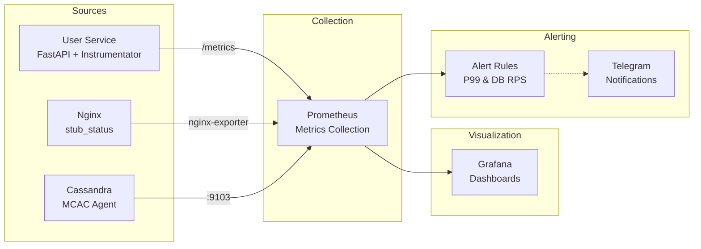

# Система мониторинга и Observability

Проект включает в себя комплексную систему мониторинга, построенную на современных инструментах observability для обеспечения надежности, производительности и операционной прозрачности.

## Архитектура мониторинга



## Компоненты системы мониторинга

### 1. Prometheus (Центральный сбор метрик)

**Конфигурация:** `/infra/prometheus/prometheus.yml`

**Основные настройки:**
- Интервал сбора: 10 секунд
- Интервал оценки правил: 10 секунд
- Retention: стандартный (15 дней)

**Источники метрик:**
```yaml
scrape_configs:
  - job_name: 'prometheus'      # Self-monitoring
  - job_name: 'nginx'           # Nginx metrics via exporter
  - job_name: 'user-service'    # User service /metrics endpoint
  - job_name: 'cassandra-mcac'  # Cassandra via MCAC agent
```

**Специальная обработка метрик Cassandra:**
- Преобразование collectd формата в Prometheus
- Нормализация имен метрик
- Добавление семантических лейблов

### 2. Grafana (Визуализация и дашборды)

**Доступ:** http://localhost:3000 (admin/admin)

**Предустановленные дашборды:**

#### User Service Dashboard
- **HTTP метрики**: RPS, latency (включая P99), error rate
- **Бизнес метрики**: счетчик зарегистрированных пользователей
- **Системные метрики**: CPU, память процесса
- **Детализация по эндпоинтам**: метрики для каждого API endpoint

#### Nginx Dashboard  
- **Соединения**: активные, принятые, обработанные
- **Throughput**: запросы в секунду
- **Состояние соединений**: reading, writing, waiting
- **Upstream производительность**: время ответа backend сервисов

#### Cassandra Dashboards
- **System Metrics**: CPU, память, диск, сеть хоста
- **Overview**: метрики JVM, компакция, клиентские запросы
- **Performance**: latency запросов, throughput, pending operations

### 3. Источники метрик

#### User Service (FastAPI + Instrumentator)

**Технологии:**
```python
from prometheus_fastapi_instrumentator import Instrumentator
from prometheus_client import Counter

# Автоматические HTTP метрики
instrumentator = Instrumentator().instrument(app).expose(app)

# Кастомные бизнес-метрики  
users_registered_counter = Counter('users_registered_total', 'Total users registered')
```

**Собираемые метрики:**
- `http_requests_total{method, handler, status}` - общее количество запросов
- `http_request_duration_seconds{method, handler}` - время выполнения запросов
- `http_requests_in_progress{method, handler}` - запросы в обработке
- `users_registered_total` - кастомная бизнес-метрика

**Эндпоинт метрик:** http://user-service:8003/metrics

#### Nginx (с Prometheus Exporter)

**Конфигурация:**
```nginx
server {
    listen 8080;
    location /stub_status {
        stub_status;
        allow 172.0.0.0/8;  # Docker network only
        deny all;
    }
}
```

**Собираемые метрики:**
- `nginx_connections_active` - активные соединения
- `nginx_connections_accepted` - принятые соединения  
- `nginx_connections_handled` - обработанные соединения
- `nginx_http_requests_total` - общее количество HTTP запросов
- `nginx_connections_reading/writing/waiting` - состояние соединений

#### Cassandra (MCAC Agent)

**DataStax Metric Collector for Apache Cassandra**

**Преимущества MCAC:**
- Комплексный мониторинг: JVM + Cassandra + система
- Минимальное влияние на производительность
- Нативная интеграция с Prometheus
- Автоматическая конфигурация метрик

**Категории метрик:**
```yaml
# JVM метрики
mcac_jvm_memory_used{memory_type="heap"}
mcac_jvm_gc_time{collector_type="G1Old"}

# Cassandra метрики  
mcac_client_request_latency{request_type="READ"}
mcac_table_live_ss_table_count{keyspace, table}
mcac_compaction_pending_tasks

# Системные метрики
collectd_cpu_total{cpu, type}
collectd_memory{type}
collectd_disk_io_time{disk}
collectd_interface_if_octets_total{interface}
```

## Ключевые метрики для мониторинга

### Application Performance Monitoring (APM)

1. **Latency (задержка)**
   - P99 latency: `histogram_quantile(0.99, http_request_duration_seconds_bucket)`
   - Среднее время ответа API
   - Latency по эндпоинтам

2. **Throughput (пропускная способность)**  
   - RPS: `rate(http_requests_total[5m])`
   - Запросы по методам и статусам
   - Peak и sustained load

3. **Error Rate (частота ошибок)**
   - 4xx/5xx ошибки: `rate(http_requests_total{status=~"4.."}[5m])`
   - Error ratio: ошибки / общие запросы
   - Error budget tracking

### Infrastructure Monitoring

1. **Database Performance**
   - Cassandra read/write latency
   - Connection pool utilization  
   - Compaction operations
   - JVM heap usage

2. **System Resources**
   - CPU utilization
   - Memory usage  
   - Disk I/O и space
   - Network traffic

3. **Service Health**
   - Service availability (up/down)
   - Health check status
   - Inter-service connectivity

### Business Metrics

1. **User Activity**
   - Регистрации пользователей: `users_registered_total`
   - Active users per time period
   - User journey funnel

2. **API Usage Patterns**
   - Most popular endpoints
   - Authentication success rate
   - Feature adoption metrics

## Планируемые алерты

### Критические алерты

1. **API Performance Alert**
   ```yaml
   alert: HighAPILatency
   expr: histogram_quantile(0.99, rate(http_request_duration_seconds_bucket{handler!~"/health|/metrics"}[5m])) > 0.5
   for: 2m
   labels:
     severity: critical
   annotations:
     summary: "API P99 latency exceeds 500ms"
   ```

2. **Database RPS Alert**  
   ```yaml
   alert: HighDatabaseRPS
   expr: rate(mcac_client_request_count_total[1m]) > 100
   for: 1m
   labels:
     severity: warning
   annotations:
     summary: "Database RPS exceeds 100 requests/second"
   ```

### Предупреждающие алерты

3. **Service Availability**
4. **High Error Rate** 
5. **Resource Exhaustion**
6. **Disk Space Low**

## Интеграции и расширения

### Планируемые интеграции

1. **Alertmanager + Telegram**
   - Настройка Telegram webhook
   - Группировка и дедупликация алертов
   - Escalation policies

2. **Distributed Tracing**
   - Jaeger или Zipkin
   - OpenTelemetry instrumentation
   - Request flow visualization

3. **Log Aggregation**
   - ELK Stack или Loki
   - Centralized logging
   - Log correlation with metrics

4. **Application Profiling**
   - Continuous profiling (pyspy)
   - Memory leak detection
   - Performance bottleneck analysis

## Операционные практики

### Runbooks

1. **High Latency Response**
   - Check Grafana dashboards
   - Identify bottleneck service
   - Scale or restart affected components

2. **Database Issues**
   - Monitor Cassandra health
   - Check compaction status
   - Verify disk space and I/O

3. **Service Outages**
   - Check service health endpoints  
   - Review recent deployments
   - Escalate to on-call engineer

### SLIs/SLOs Framework

**Service Level Indicators (SLIs):**
- API availability: 99.9%
- P99 latency: < 500ms  
- Error rate: < 0.1%

**Service Level Objectives (SLOs):**
- Monthly uptime: 99.9%
- Weekly error budget: 0.1%
- Response time SLO: 95% of requests < 200ms

## Развертывание мониторинга

### Быстрый старт

```bash
# Запуск всей системы с мониторингом
cd infra
docker-compose up -d

# Проверка статуса
docker-compose ps

# Доступ к интерфейсам
open http://localhost:3000    # Grafana
open http://localhost:9090    # Prometheus  
open http://localhost/swagger # API docs
```

### Проверка метрик

```bash
# Проверка эндпоинтов метрик
curl http://localhost/user-api/metrics
curl http://localhost:9113/metrics        # Nginx exporter
curl http://localhost:9090/api/v1/targets  # Prometheus targets
```

Эта система мониторинга обеспечивает полную прозрачность работы приложения и позволяет проактивно выявлять и решать проблемы производительности.
