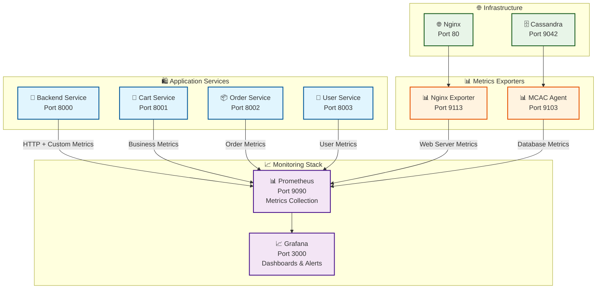

# 📊 Система мониторинга и Observability

Комплексная система мониторинга Product Store, построенная на современном стеке observability инструментов для обеспечения полной прозрачности работы микросервисной архитектуры.

## 🏛️ Архитектура мониторинга



## 📊 Prometheus - Центральный сбор метрик

### 🔧 Конфигурация

**Файл:** `/infra/prometheus/prometheus.yml`

**Основные настройки:**
```yaml
global:
  scrape_interval: 10s        # Сбор метрик каждые 10 секунд
  evaluation_interval: 10s    # Оценка правил каждые 10 секунд

scrape_configs:
  - job_name: 'prometheus'          # Self-monitoring
    static_configs:
      - targets: ['localhost:9090']
      
  - job_name: 'backend-api'         # Backend Service метрики
    static_configs:
      - targets: ['backend:8000']
      
  - job_name: 'cart-service'        # Cart Service метрики
    static_configs:
      - targets: ['cart-service:8001']
      
  - job_name: 'order-service'       # Order Service метрики  
    static_configs:
      - targets: ['order-service:8002']
      
  - job_name: 'user-service'        # User Service метрики
    static_configs:
      - targets: ['user-service:8003']
      
  - job_name: 'nginx'               # Nginx метрики через exporter
    static_configs:
      - targets: ['nginx-exporter:9113']
      
  - job_name: 'cassandra-mcac'      # Cassandra метрики через MCAC
    scrape_interval: 15s
    static_configs:
      - targets: ['cassandra:9103']
```

### 📈 Собираемые типы метрик

#### 1. **HTTP метрики (все сервисы)**
- `http_requests_total` - общее количество HTTP запросов
- `http_request_duration_seconds` - время выполнения запросов (включая P99)
- `http_requests_in_progress` - текущее количество обрабатываемых запросов

#### 2. **Бизнес-метрики**
- `users_registered_total` - количество зарегистрированных пользователей  
- `cart_value_cents` - стоимость корзин при checkout
- `cart_items_count` - количество товаров в корзинах
- `items_added_to_cart_total` - популярность товаров
- `checkouts_total` - количество завершенных покупок
- `orders_created_total` - созданные заказы
- `orders_status_total` - заказы по статусам
- `order_delivery_duration_seconds` - время доставки

#### 3. **База данных метрики**
- `cassandra_queries_total` - количество запросов к БД
- `cassandra_query_duration_seconds` - время выполнения запросов
- `products_total` - общее количество товаров
- `products_by_category` - товары по категориям

#### 4. **Инфраструктурные метрики**
- Nginx: соединения, throughput, upstream latency
- Cassandra: JVM метрики, производительность БД, системные ресурсы

## 📈 Grafana - Визуализация и дашборды

### 🔧 Доступ и настройка

**URL:** http://localhost:3000  
**Логин:** admin / admin  
**Datasource:** Prometheus (автоматически настроен)

### 📊 Предустановленные дашборды

#### 🏪 Backend Service Dashboard
**Файл:** `/infra/grafana/provisioning/dashboards/backend/main.json`

**Панели:**
- **HTTP Requests Rate** - количество запросов в секунду по эндпоинтам
- **HTTP Response Time** - P50/P90/P95/P99 percentiles
- **HTTP Status Codes** - распределение кодов ответов
- **Database Queries** - метрики запросов к Cassandra
- **Products Metrics** - общее количество товаров и по категориям
- **Error Rate** - процент ошибок по эндпоинтам

#### 🛒 Cart Service Dashboard  
**Файл:** `/infra/grafana/provisioning/dashboards/cart-service/main.json`

**Панели:**
- **Popular Products** - топ товаров добавляемых в корзину
- **Cart Value Distribution** - распределение стоимости корзин
- **Cart Items Count** - распределение количества товаров в корзинах
- **Checkout Rate** - частота оформления заказов
- **HTTP Metrics** - стандартные HTTP метрики сервиса

#### 📦 Order Service Dashboard
**Файл:** `/infra/grafana/provisioning/dashboards/order-service/main.json`

**Панели:**
- **Orders Created** - количество создаваемых заказов
- **Order Status Distribution** - распределение заказов по статусам
- **Delivery Time** - время от создания до доставки заказа
- **Order Lifecycle** - визуализация этапов обработки заказов
- **Cancellation Rate** - процент отмененных заказов

#### 👤 User Service Dashboard
**Файл:** `/infra/grafana/provisioning/dashboards/user-service/main.json`

**Панели:**
- **User Registrations** - количество регистраций пользователей
- **Authentication Rate** - частота аутентификации
- **HTTP Performance** - производительность API эндпоинтов
- **JWT Token Usage** - статистика использования токенов
- **Service Health** - состояние сервиса и зависимостей

#### 🌐 Nginx Dashboard
**Файл:** `/infra/grafana/provisioning/dashboards/nginx/nginx-dashboard.json`

**Панели:**
- **Connections** - активные, принятые, обработанные соединения
- **Requests Rate** - запросы в секунду по всем upstream
- **Connection States** - reading, writing, waiting states
- **Upstream Performance** - время ответа backend сервисов
- **HTTP Status Codes** - коды ответов от всех сервисов

#### 🗄️ Cassandra Dashboards

**System Metrics** (`/infra/grafana/provisioning/dashboards/cassandra/system-metrics.json`):
- **CPU Usage** - загрузка процессора узла Cassandra
- **Memory Usage** - использование памяти JVM и системы
- **Disk I/O** - операции чтения/записи, latency дисков
- **Network** - сетевой трафик и соединения

**Overview** (`/infra/grafana/provisioning/dashboards/cassandra/overview.json`):
- **JVM Metrics** - heap memory, GC статистика
- **Client Requests** - CQL запросы, latency, throughput
- **Compaction** - задачи компакции и их производительность
- **Storage** - использование места на диске

## 🚨 Система алертов

### ⚠️ Настроенные правила алертинга

#### 1. **High P99 Latency Alert**
```yaml
groups:
  - name: performance_alerts
    rules:
      - alert: HighP99Latency
        expr: histogram_quantile(0.99, http_request_duration_seconds_bucket) > 0.5
        for: 2m
        labels:
          severity: warning
        annotations:
          summary: "High P99 latency detected"
          description: "P99 latency is {{ $value }}s, which is above 500ms threshold"
```

#### 2. **Database High RPS Alert**  
```yaml
      - alert: DatabaseHighRPS
        expr: rate(cassandra_queries_total[5m]) > 100
        for: 1m
        labels:
          severity: warning
        annotations:
          summary: "High database query rate"
          description: "Database RPS is {{ $value }}, which is above 100 RPS threshold"
```

#### 3. **Service Availability Alert**
```yaml
      - alert: ServiceDown
        expr: up == 0
        for: 30s
        labels:
          severity: critical
        annotations:
          summary: "Service {{ $labels.instance }} is down"
          description: "Service has been down for more than 30 seconds"
```

### 📱 Каналы уведомлений

**Telegram Bot Integration:**
- Алерты отправляются в Telegram канал
- Поддержка форматирования и разных уровней важности
- Автоматическое разрешение алертов

**Grafana Notifications:**
- Интеграция с Grafana для визуальных уведомлений
- Dashboard annotations для важных событий

## 🔍 Метрики по сервисам

### 🏪 Backend Service Metrics

#### Автоматические HTTP метрики
```python
# FastAPI Instrumentator
instrumentator = Instrumentator(excluded_handlers=["/health"]).instrument(app).expose(app)
```

#### Кастомные метрики
```python
# Database метрики
db_query_count = Counter('cassandra_queries_total', 'Total Cassandra queries', ['operation'])
db_query_duration = Histogram('cassandra_query_duration_seconds', 'Query execution time', ['operation'])

# Product метрики
products_total = Gauge('products_total', 'Total products in database')
products_by_category = Gauge('products_by_category', 'Products by category', ['category'])
```

### 🛒 Cart Service Metrics

#### Бизнес-метрики корзины
```python
# Стоимость корзин при checkout
CART_VALUE_CENTS = Histogram(
    'cart_value_cents',
    'Cart value in cents at checkout',
    buckets=[1000, 2500, 5000, 7500, 10000, 15000, 20000, 50000]  # $10-$500
)

# Количество товаров в корзине
CART_ITEMS_COUNT = Histogram(
    'cart_items_count', 
    'Total items in cart at checkout',
    buckets=[1, 2, 3, 5, 8, 13, 21]  # Fibonacci sequence
)

# Популярность товаров
ITEMS_ADDED_TO_CART_TOTAL = Counter(
    'items_added_to_cart_total',
    'Times product added to cart',
    ['product_name']
)
```

### 📦 Order Service Metrics

#### Метрики заказов
```python
# Созданные заказы
ORDERS_CREATED_TOTAL = Counter('orders_created_total', 'Total created orders')

# Заказы по статусам  
ORDERS_STATUS_TOTAL = Counter(
    'orders_status_total',
    'Orders by status', 
    ['status']  # CREATED, PROCESSING, SHIPPING, DELIVERED, CANCELLED
)

# Время доставки
ORDER_DELIVERY_DURATION_SECONDS = Histogram(
    'order_delivery_duration_seconds',
    'Order delivery time',
    buckets=[30, 60, 120, 180, 240, 300, 360, 480, 600]  # 30s-10min
)
```

### 👤 User Service Metrics

#### Пользовательские метрики
```python
# Регистрации пользователей
users_registered_counter = Counter(
    'users_registered_total',
    'Total registered users'
)

# Автоматические HTTP метрики через Instrumentator
instrumentator = Instrumentator().instrument(app).expose(app)
```

## 🔧 Практические примеры запросов

### 📊 PromQL запросы для анализа

#### Performance анализ
```promql
# P99 latency по сервисам
histogram_quantile(0.99, 
  rate(http_request_duration_seconds_bucket[5m])
) by (service)

# RPS по эндпоинтам
rate(http_requests_total[5m]) by (method, endpoint)

# Error rate
rate(http_requests_total{status=~"5.."}[5m]) / 
rate(http_requests_total[5m]) * 100
```

#### Бизнес-метрики
```promql
# Популярные товары (топ 10)
topk(10, increase(items_added_to_cart_total[1h]))

# Средняя стоимость корзины
histogram_quantile(0.5, rate(cart_value_cents_bucket[1h])) / 100

# Конверсия checkout
rate(checkouts_total[5m]) / rate(items_added_to_cart_total[5m]) * 100
```

#### Infrastructure метрики
```promql
# Database latency
histogram_quantile(0.95, rate(cassandra_query_duration_seconds_bucket[5m]))

# Nginx throughput
rate(nginx_http_requests_total[5m])

# Memory usage
process_resident_memory_bytes / 1024 / 1024  # MB
```

## 📱 Мониторинг в реальном времени

### 🎯 Key Performance Indicators (KPIs)

#### Технические KPI
- **Availability**: 99.9% uptime для всех сервисов
- **Performance**: P99 latency < 500ms
- **Error Rate**: < 1% ошибок 5xx
- **Database Performance**: < 100ms query latency

#### Бизнес KPI  
- **User Growth**: количество новых регистраций
- **Conversion Rate**: cart additions → checkouts
- **Popular Products**: топ товаров по добавлениям в корзину
- **Order Processing**: время от создания до доставки

### 🔄 Operational Runbooks

#### При срабатывании алертов

**High P99 Latency:**
1. Проверить дашборд производительности сервиса
2. Анализ медленных запросов к БД
3. Проверка ресурсов (CPU, Memory)
4. Масштабирование при необходимости

**Database High RPS:**
1. Анализ паттернов нагрузки
2. Оптимизация запросов
3. Проверка connection pool
4. Рассмотрение кэширования

**Service Down:**
1. Проверка логов контейнера
2. Restart сервиса при необходимости
3. Проверка зависимостей (БД, другие сервисы)
4. Эскалация при продолжительном недоступности

## 🚀 Continuous Monitoring

### 📊 Automated Reporting

**Daily Reports:**
- Service performance summary
- Top errors and slow queries  
- Business metrics trends
- Infrastructure capacity planning

**Weekly Reviews:**
- Performance trends analysis
- Capacity planning recommendations
- Alert frequency analysis
- SLA compliance reports

### 🔧 Monitoring Best Practices

1. **Proactive Monitoring** - алерты настроены на предупреждение проблем
2. **Business Metrics** - мониторинг не только технических, но и бизнес показателей
3. **Historical Analysis** - сохранение метрик для trend analysis
4. **Documentation** - все алерты имеют runbook для реагирования

---

**🎯 Результат:** Полная прозрачность работы микросервисной системы с возможностью оперативного реагирования на проблемы и анализа трендов производительности.
