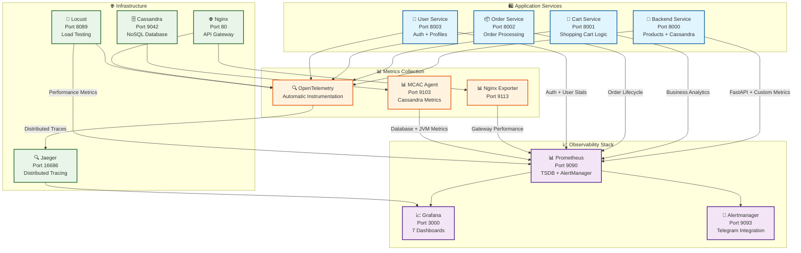

# 📊 Система мониторинга и Observability

Комплексная система мониторинга Product Store, построенная на современном стеке observability инструментов для обеспечения полной прозрачности работы микросервисной архитектуры.

## 🏛️ Архитектура мониторинга



---

## 📈 Prometheus - Центральная система метрик

### ⚙️ Конфигурация сбора метрик

#### **🎯 Scrape Configuration**
```yaml
# prometheus.yml
global:
  scrape_interval: 10s           # Сбор метрик каждые 10 секунд
  evaluation_interval: 10s       # Оценка правил алертов
  external_labels:
    monitor: 'product-store-dev'
    environment: 'development'

# Alerting integration
alerting:
  alertmanagers:
    - static_configs:
        - targets:
          - alertmanager:9093

# Alert rules
rule_files:
  - "alert.rules.yml"

# Scrape targets
scrape_configs:
  # Application services
  - job_name: 'backend-service'
    static_configs:
      - targets: ['backend:8000']
    scrape_interval: 10s
    metrics_path: '/metrics'
    
  - job_name: 'cart-service'
    static_configs:
      - targets: ['cart:8001']
    scrape_interval: 10s
    
  - job_name: 'order-service'
    static_configs:
      - targets: ['order:8002']
    scrape_interval: 10s
    
  - job_name: 'user-service'
    static_configs:
      - targets: ['user:8003']
    scrape_interval: 10s

  # Infrastructure exporters
  - job_name: 'nginx-exporter'
    static_configs:
      - targets: ['nginx-exporter:9113']
    scrape_interval: 15s
    
  - job_name: 'cassandra-mcac'
    static_configs:
      - targets: ['cassandra:9103']
    scrape_interval: 15s
    metrics_path: '/metrics'
    
  # Load testing metrics
  - job_name: 'locust'
    static_configs:
      - targets: ['locust:8089']
    scrape_interval: 5s
    metrics_path: '/stats/prometheus'
```

### 📊 Собираемые метрики по категориям

#### **🌐 HTTP & API Metrics (все сервисы)**
```python
# FastAPI Instrumentator автоматически генерирует:
http_requests_total{method, endpoint, status}                    # Request counter
http_request_duration_seconds{method, endpoint}                 # Latency histogram  
http_requests_concurrent{method, endpoint}                      # Active requests gauge
http_request_size_bytes{method, endpoint}                       # Request size histogram
http_response_size_bytes{method, endpoint}                      # Response size histogram

# Примеры запросов:
# P99 latency: histogram_quantile(0.99, rate(http_request_duration_seconds_bucket[5m]))
# RPS: rate(http_requests_total[1m])
# Error rate: rate(http_requests_total{status=~"4..|5.."}[5m]) / rate(http_requests_total[5m])
```

#### **🛍️ Business Metrics (custom)**
```python
# Backend Service - Product Analytics
product_views_total = Counter("product_views_total", ["product_id", "category"])
category_requests_total = Counter("category_requests_total", ["category"])
admin_operations_total = Counter("admin_operations_total", ["operation", "user_id"])
cassandra_query_duration = Histogram("cassandra_query_seconds", ["table", "operation"])

# Cart Service - Shopping Behavior
cart_items_added_total = Counter("cart_items_added", ["product_id", "category"])
cart_checkout_total = Counter("cart_checkout_total", ["user_id"])
cart_abandonment_total = Counter("cart_abandonment", ["stage"])
cart_value_distribution = Histogram("cart_total_value", buckets=[10,50,100,200,500,1000])

# Order Service - Order Lifecycle
orders_created_total = Counter("orders_created_total", ["user_id"])
order_status_changes = Counter("order_status_changes", ["status", "order_id"])
order_completion_time = Histogram("order_completion_seconds", buckets=[60,120,180,300])
delivery_time_distribution = Histogram("delivery_time_minutes", buckets=[30,60,90,120])

# User Service - Authentication & Security
user_registrations_total = Counter("user_registrations_total", ["role"])
login_attempts_total = Counter("login_attempts_total", ["status", "username"])
jwt_operations_total = Counter("jwt_operations_total", ["operation", "status"])
profile_aggregation_duration = Histogram("profile_aggregation_seconds")
```

#### **🏗️ Infrastructure Metrics**
```yaml
# Nginx Gateway Metrics (nginx-exporter)
nginx_http_requests_total{server, location, method, status}     # HTTP requests
nginx_http_request_duration_seconds{server, location}          # Request latency
nginx_connections_active                                        # Active connections
nginx_connections_reading                                       # Reading requests
nginx_connections_writing                                       # Writing responses
nginx_connections_waiting                                       # Waiting connections

# Cassandra Database Metrics (MCAC)
org_apache_cassandra_metrics_ClientRequest_Read_Latency_99thPercentile   # Read P99
org_apache_cassandra_metrics_ClientRequest_Write_Latency_99thPercentile  # Write P99
org_apache_cassandra_metrics_Table_store_products_ReadLatency_Count      # Read count
org_apache_cassandra_metrics_Table_store_products_WriteLatency_Count     # Write count
jvm_memory_heap_used{instance="cassandra:9103"}                         # JVM heap
jvm_gc_collection_seconds_sum{instance="cassandra:9103"}                # GC time
```

---

## 📊 Grafana - Система визуализации

### 🎨 7 специализированных дашбордов

#### **1. 🏪 Backend Service Dashboard**
```json
{
  "dashboard": {
    "title": "Backend Service - Products & Catalog",
    "tags": ["backend", "cassandra", "products"],
    "panels": [
      {
        "title": "API Request Rate",
        "type": "graph",
        "targets": [
          {
            "expr": "rate(http_requests_total{job=\"backend-service\"}[5m])",
            "legendFormat": "{{method}} {{endpoint}}"
          }
        ]
      },
      {
        "title": "P99 Latency by Endpoint", 
        "type": "graph",
        "targets": [
          {
            "expr": "histogram_quantile(0.99, rate(http_request_duration_seconds_bucket{job=\"backend-service\"}[5m]))",
            "legendFormat": "{{endpoint}} P99"
          }
        ]
      },
      {
        "title": "Cassandra Query Performance",
        "type": "graph",
        "targets": [
          {
            "expr": "rate(cassandra_query_duration_sum[5m]) / rate(cassandra_query_duration_count[5m])",
            "legendFormat": "{{table}} {{operation}} avg"
          }
        ]
      },
      {
        "title": "Product Views by Category",
        "type": "graph",
        "targets": [
          {
            "expr": "rate(product_views_total[5m])",
            "legendFormat": "{{category}}"
          }
        ]
      },
      {
        "title": "Admin Operations",
        "type": "graph", 
        "targets": [
          {
            "expr": "rate(admin_operations_total[5m])",
            "legendFormat": "{{operation}}"
          }
        ]
      }
    ]
  }
}
```

#### **2. 🛒 Cart Service Dashboard**
```json
{
  "title": "Cart Service - Shopping Analytics",
  "panels": [
    {
      "title": "Cart Operations Rate",
      "targets": [
        {
          "expr": "rate(http_requests_total{job=\"cart-service\", endpoint=~\"/cart-api/.*\"}[5m])",
          "legendFormat": "{{endpoint}}"
        }
      ]
    },
    {
      "title": "Items Added to Cart",
      "targets": [
        {
          "expr": "rate(cart_items_added_total[5m])",
          "legendFormat": "{{category}}"
        }
      ]
    },
    {
      "title": "Cart Value Distribution",
      "type": "heatmap",
      "targets": [
        {
          "expr": "rate(cart_value_distribution_bucket[5m])",
          "format": "heatmap"
        }
      ]
    },
    {
      "title": "Checkout Success Rate",
      "targets": [
        {
          "expr": "rate(cart_checkout_total[5m])",
          "legendFormat": "Successful Checkouts"
        },
        {
          "expr": "rate(cart_abandonment_total[5m])",
          "legendFormat": "Cart Abandonment"
        }
      ]
    },
    {
      "title": "Stock Validation Errors",
      "targets": [
        {
          "expr": "rate(http_requests_total{job=\"cart-service\", status=~\"4..\"}[5m])",
          "legendFormat": "4xx Errors (Stock Issues)"
        }
      ]
    }
  ]
}
```

#### **3. 📦 Order Service Dashboard**
```json
{
  "title": "Order Service - Order Lifecycle",
  "panels": [
    {
      "title": "Orders Created vs Completed",
      "targets": [
        {
          "expr": "rate(orders_created_total[5m])",
          "legendFormat": "Orders Created"
        },
        {
          "expr": "rate(order_status_changes{status=\"DELIVERED\"}[5m])",
          "legendFormat": "Orders Delivered"
        }
      ]
    },
    {
      "title": "Order Status Distribution",
      "type": "stat",
      "targets": [
        {
          "expr": "sum by (status) (rate(order_status_changes[5m]))",
          "legendFormat": "{{status}}"
        }
      ]
    },
    {
      "title": "Average Order Completion Time",
      "targets": [
        {
          "expr": "rate(order_completion_time_sum[5m]) / rate(order_completion_time_count[5m])",
          "legendFormat": "Avg Completion Time (seconds)"
        }
      ]
    },
    {
      "title": "Delivery Time Distribution",
      "type": "heatmap",
      "targets": [
        {
          "expr": "rate(delivery_time_distribution_bucket[5m])",
          "format": "heatmap"
        }
      ]
    },
    {
      "title": "Background Task Performance",
      "targets": [
        {
          "expr": "rate(http_requests_total{job=\"order-service\", endpoint=\"/background_tasks\"}[5m])",
          "legendFormat": "Background Tasks/sec"
        }
      ]
    }
  ]
}
```

#### **4. 👤 User Service Dashboard**
```json
{
  "title": "User Service - Authentication & Users",
  "panels": [
    {
      "title": "User Registration Rate",
      "targets": [
        {
          "expr": "rate(user_registrations_total[5m])",
          "legendFormat": "{{role}} registrations"
        }
      ]
    },
    {
      "title": "Login Success vs Failures",
      "targets": [
        {
          "expr": "rate(login_attempts_total{status=\"success\"}[5m])",
          "legendFormat": "Successful Logins"
        },
        {
          "expr": "rate(login_attempts_total{status=\"failed\"}[5m])",
          "legendFormat": "Failed Attempts"
        }
      ]
    },
    {
      "title": "JWT Operations",
      "targets": [
        {
          "expr": "rate(jwt_operations_total[5m])",
          "legendFormat": "{{operation}} {{status}}"
        }
      ]
    },
    {
      "title": "Profile Aggregation Performance",
      "targets": [
        {
          "expr": "histogram_quantile(0.95, rate(profile_aggregation_duration_bucket[5m]))",
          "legendFormat": "P95 Aggregation Time"
        }
      ]
    },
    {
      "title": "Active Users by Role",
      "type": "stat",
      "targets": [
        {
          "expr": "sum by (role) (rate(http_requests_total{job=\"user-service\", endpoint=\"/user-api/me\"}[5m]))",
          "legendFormat": "{{role}}"
        }
      ]
    }
  ]
}
```

#### **5. 🌐 Nginx Gateway Dashboard**
```json
{
  "title": "Nginx - API Gateway Performance",
  "panels": [
    {
      "title": "Request Rate by Route",
      "targets": [
        {
          "expr": "rate(nginx_http_requests_total[5m])",
          "legendFormat": "{{location}}"
        }
      ]
    },
    {
      "title": "Response Time by Upstream",
      "targets": [
        {
          "expr": "rate(nginx_http_request_duration_seconds_sum[5m]) / rate(nginx_http_request_duration_seconds_count[5m])",
          "legendFormat": "{{location}} avg latency"
        }
      ]
    },
    {
      "title": "Connection States",
      "targets": [
        {
          "expr": "nginx_connections_active",
          "legendFormat": "Active"
        },
        {
          "expr": "nginx_connections_waiting",
          "legendFormat": "Waiting"
        },
        {
          "expr": "nginx_connections_reading",
          "legendFormat": "Reading"
        },
        {
          "expr": "nginx_connections_writing",
          "legendFormat": "Writing"
        }
      ]
    },
    {
      "title": "HTTP Status Codes",
      "type": "stat",
      "targets": [
        {
          "expr": "sum by (status) (rate(nginx_http_requests_total[5m]))",
          "legendFormat": "{{status}}"
        }
      ]
    },
    {
      "title": "Upstream Response Times",
      "targets": [
        {
          "expr": "histogram_quantile(0.99, rate(nginx_http_request_duration_seconds_bucket[5m]))",
          "legendFormat": "P99 Response Time"
        }
      ]
    }
  ]
}
```

#### **6. 🗄️ Cassandra Database Dashboard**
```json
{
  "title": "Cassandra - Database Performance",
  "panels": [
    {
      "title": "Read/Write Latency P99",
      "targets": [
        {
          "expr": "org_apache_cassandra_metrics_ClientRequest_Read_Latency_99thPercentile",
          "legendFormat": "Read P99"
        },
        {
          "expr": "org_apache_cassandra_metrics_ClientRequest_Write_Latency_99thPercentile",
          "legendFormat": "Write P99"
        }
      ]
    },
    {
      "title": "Operations per Second",
      "targets": [
        {
          "expr": "rate(org_apache_cassandra_metrics_ClientRequest_Read_Count[5m])",
          "legendFormat": "Reads/sec"
        },
        {
          "expr": "rate(org_apache_cassandra_metrics_ClientRequest_Write_Count[5m])",
          "legendFormat": "Writes/sec"
        }
      ]
    },
    {
      "title": "JVM Heap Usage",
      "targets": [
        {
          "expr": "jvm_memory_heap_used{instance=\"cassandra:9103\"}",
          "legendFormat": "Used Heap"
        },
        {
          "expr": "jvm_memory_heap_max{instance=\"cassandra:9103\"}",
          "legendFormat": "Max Heap"
        }
      ]
    },
    {
      "title": "GC Performance",
      "targets": [
        {
          "expr": "rate(jvm_gc_collection_seconds_sum{instance=\"cassandra:9103\"}[5m])",
          "legendFormat": "{{gc}} GC Time"
        }
      ]
    },
    {
      "title": "Products Table Performance",
      "targets": [
        {
          "expr": "org_apache_cassandra_metrics_Table_store_products_ReadLatency_99thPercentile",
          "legendFormat": "Products Read P99"
        },
        {
          "expr": "org_apache_cassandra_metrics_Table_store_products_LiveSSTableCount",
          "legendFormat": "Live SSTables"
        }
      ]
    }
  ]
}
```

#### **7. 🔍 Jaeger Tracing Dashboard**
```json
{
  "title": "Jaeger - Distributed Tracing",
  "panels": [
    {
      "title": "Spans Received Rate",
      "targets": [
        {
          "expr": "rate(jaeger_collector_spans_received_total[5m])",
          "legendFormat": "{{format}} spans/sec"
        }
      ]
    },
    {
      "title": "Trace Duration Distribution",
      "type": "heatmap",
      "targets": [
        {
          "expr": "rate(jaeger_query_trace_duration_seconds_bucket[5m])",
          "format": "heatmap"
        }
      ]
    },
    {
      "title": "Collector Queue Length",
      "targets": [
        {
          "expr": "jaeger_collector_queue_length",
          "legendFormat": "{{queue_name}}"
        }
      ]
    },
    {
      "title": "Storage Operations",
      "targets": [
        {
          "expr": "rate(jaeger_storage_latency_count[5m])",
          "legendFormat": "{{operation}} ops/sec"
        }
      ]
    },
    {
      "title": "Spans by Service",
      "type": "stat",
      "targets": [
        {
          "expr": "sum by (service_name) (rate(jaeger_collector_spans_received_total[5m]))",
          "legendFormat": "{{service_name}}"
        }
      ]
    }
  ]
}
```

---

## 🚨 Система алертов

### ⚙️ Alertmanager Configuration

#### **📋 Alert Rules (alert.rules.yml)**
```yaml
groups:
  - name: microservices_alerts
    rules:
      # High latency alerts
      - alert: BackendHighP99Latency
        expr: histogram_quantile(0.99, rate(http_request_duration_seconds_bucket{job="backend-service"}[5m])) > 0.5
        for: 2m
        labels:
          severity: critical
          service: backend
        annotations:
          summary: "Backend service P99 latency is high"
          description: "P99 latency is {{ $value }}s for backend service"
          
      - alert: CartServiceP99Latency
        expr: histogram_quantile(0.99, rate(http_request_duration_seconds_bucket{job="cart-service"}[5m])) > 0.5
        for: 2m
        labels:
          severity: critical
          service: cart
        annotations:
          summary: "Cart service P99 latency is high"
          description: "P99 latency is {{ $value }}s for cart service"
          
      - alert: OrderServiceP99Latency
        expr: histogram_quantile(0.99, rate(http_request_duration_seconds_bucket{job="order-service"}[5m])) > 0.5
        for: 2m
        labels:
          severity: critical
          service: order
        annotations:
          summary: "Order service P99 latency is high"
          description: "P99 latency is {{ $value }}s for order service"

      # Database alerts
      - alert: CassandraHighRPS
        expr: rate(org_apache_cassandra_metrics_ClientRequest_Read_Count[5m]) + rate(org_apache_cassandra_metrics_ClientRequest_Write_Count[5m]) > 100
        for: 5m
        labels:
          severity: warning
          service: cassandra
        annotations:
          summary: "Cassandra RPS is high"
          description: "Cassandra is handling {{ $value }} operations per second"
          
      - alert: CassandraHighLatency
        expr: org_apache_cassandra_metrics_ClientRequest_Read_Latency_99thPercentile > 100
        for: 2m
        labels:
          severity: critical
          service: cassandra
        annotations:
          summary: "Cassandra read latency is high"
          description: "Cassandra P99 read latency is {{ $value }}ms"

      # Error rate alerts
      - alert: HighErrorRate
        expr: (rate(http_requests_total{status=~"5.."}[5m]) / rate(http_requests_total[5m])) * 100 > 5
        for: 5m
        labels:
          severity: critical
        annotations:
          summary: "High error rate detected"
          description: "Error rate is {{ $value }}% for {{ $labels.job }}"

      # Resource usage alerts
      - alert: HighMemoryUsage
        expr: (jvm_memory_heap_used / jvm_memory_heap_max) * 100 > 80
        for: 5m
        labels:
          severity: warning
        annotations:
          summary: "High JVM memory usage"
          description: "JVM heap usage is {{ $value }}% for {{ $labels.instance }}"
```

#### **📱 Telegram Integration (alertmanager.yml)**
```yaml
global:
  smtp_smarthost: 'localhost:587'
  smtp_from: 'alertmanager@productstore.local'

# Routing configuration
route:
  group_by: ['alertname', 'instance']
  group_wait: 10s
  group_interval: 1m
  repeat_interval: 5m
  receiver: 'telegram'

# Telegram receiver configuration
receivers:
  - name: 'telegram'
    telegram_configs:
      - bot_token: 'YOUR_BOT_TOKEN'
        chat_id: YOUR_CHAT_ID
        api_url: 'https://api.telegram.org'
        parse_mode: 'HTML'
        message: |
          🚨 <b>{{ .GroupLabels.alertname }}</b>

          <b>Service:</b> {{ .GroupLabels.service }}
          <b>Severity:</b> {{ .GroupLabels.severity }}
          
          {{ range .Alerts }}
          <b>Alert:</b> {{ .Annotations.summary }}
          <b>Description:</b> {{ .Annotations.description }}
          <b>Started:</b> {{ .StartsAt.Format "2006-01-02 15:04:05" }}
          {{ end }}

          <a href="http://localhost:3000">📊 Open Grafana</a>
          <a href="http://localhost:9090">📈 Open Prometheus</a>

# Inhibition rules (prevent spam)
inhibit_rules:
  - source_match:
      severity: 'critical'
    target_match:
      severity: 'warning'
    equal: ['alertname', 'instance']
```

---

## 🔍 Distributed Tracing с Jaeger

### 🎯 OpenTelemetry Integration

#### **⚙️ Трейсинг конфигурация (каждый сервис)**
```python
# tracing.py - общий модуль для всех сервисов
from opentelemetry import trace
from opentelemetry.exporter.otlp.proto.grpc.trace_exporter import OTLPSpanExporter  
from opentelemetry.sdk.trace import TracerProvider
from opentelemetry.sdk.trace.export import BatchSpanProcessor
from opentelemetry.instrumentation.fastapi import FastAPIInstrumentor
from opentelemetry.instrumentation.requests import RequestsInstrumentor
from opentelemetry.instrumentation.aiohttp_client import AioHttpClientInstrumentor

def init_tracing(service_name: str):
    """Инициализация трейсинга для микросервиса"""
    
    # Configure tracer provider
    trace.set_tracer_provider(TracerProvider(
        resource=Resource.create({
            "service.name": service_name,
            "service.version": "1.0.0",
            "deployment.environment": "development"
        })
    ))
    
    # OTLP exporter для отправки в Jaeger
    otlp_exporter = OTLPSpanExporter(
        endpoint="http://jaeger:4317",
        insecure=True
    )
    
    # Batch span processor для оптимизации производительности
    span_processor = BatchSpanProcessor(otlp_exporter)
    trace.get_tracer_provider().add_span_processor(span_processor)
    
    # Automatic instrumentation
    FastAPIInstrumentor.instrument()           # FastAPI requests
    RequestsInstrumentor.instrument()          # Outgoing HTTP requests
    AioHttpClientInstrumentor.instrument()     # Async HTTP requests
    
    return trace.get_tracer(service_name)

# Использование в каждом сервисе
tracer = init_tracing("backend-service")  # или cart-service, order-service, user-service
```

#### **📊 Custom Spans для бизнес-логики**
```python
# Backend Service - Cassandra операции
async def get_products_with_tracing(category: str = None):
    with tracer.start_as_current_span("get_products") as span:
        span.set_attribute("products.category", category or "all")
        
        # Database query span
        with tracer.start_as_current_span("cassandra_query") as db_span:
            db_span.set_attribute("db.system", "cassandra")
            db_span.set_attribute("db.keyspace", "store")
            db_span.set_attribute("db.table", "products")
            db_span.set_attribute("db.operation", "SELECT")
            
            if category:
                query = "SELECT * FROM products WHERE category = ?"
                db_span.set_attribute("db.statement", query)
                result = await session.execute(query, [category])
            else:
                query = "SELECT * FROM products"
                db_span.set_attribute("db.statement", query)
                result = await session.execute(query)
        
        products = [dict(row) for row in result]
        span.set_attribute("products.count", len(products))
        
        return products

# Cart Service - межсервисное взаимодействие
async def validate_product_with_tracing(product_id: str):
    with tracer.start_as_current_span("validate_product") as span:
        span.set_attribute("product.id", product_id)
        
        # HTTP call to Backend Service
        with tracer.start_as_current_span("backend_api_call") as http_span:
            http_span.set_attribute("http.method", "GET")
            http_span.set_attribute("http.url", f"http://backend:8000/api/products/{product_id}")
            
            async with aiohttp.ClientSession() as session:
                async with session.get(f"http://backend:8000/api/products/{product_id}") as resp:
                    http_span.set_attribute("http.status_code", resp.status)
                    
                    if resp.status == 200:
                        product = await resp.json()
                        span.set_attribute("product.name", product["name"])
                        span.set_attribute("product.price", product["price"])
                        span.set_attribute("validation.result", "success")
                        return product
                    else:
                        span.set_attribute("validation.result", "failed")
                        span.set_status(trace.Status(trace.StatusCode.ERROR, "Product not found"))
                        return None
```

### 📈 Jaeger Metrics в Grafana

#### **🔍 Tracing Performance Dashboard**
```json
{
  "title": "Jaeger - Tracing Performance",
  "panels": [
    {
      "title": "Span Ingestion Rate",
      "targets": [
        {
          "expr": "rate(jaeger_collector_spans_received_total[5m])",
          "legendFormat": "{{format}} spans/sec"
        }
      ]
    },
    {
      "title": "Trace Latency by Service",
      "targets": [
        {
          "expr": "histogram_quantile(0.95, rate(jaeger_tracer_spans_bucket[5m]))",
          "legendFormat": "{{service_name}} P95"
        }
      ]
    },
    {
      "title": "Error Spans Rate",
      "targets": [
        {
          "expr": "rate(jaeger_tracer_spans_total{sampled=\"true\", error=\"true\"}[5m])",
          "legendFormat": "{{service_name}} errors"
        }
      ]
    },
    {
      "title": "Storage Utilization",
      "targets": [
        {
          "expr": "jaeger_storage_latency_bucket",
          "legendFormat": "{{operation}} {{le}}"
        }
      ]
    }
  ]
}
```

---

## 🧪 Performance Profiling

### ⚡ Automatic Code Profiling

#### **📊 cProfile Integration**
```python
# profiling.py - автоматическое профилирование endpoints
import cProfile
import pstats
import io
from functools import wraps
from pathlib import Path

def profile_endpoint(profile_name: str):
    """Декоратор для автоматического профилирования endpoint'ов"""
    def decorator(func):
        @wraps(func)
        async def wrapper(*args, **kwargs):
            # Создаем profiler
            profiler = cProfile.Profile()
            
            try:
                # Запускаем профилирование
                profiler.enable()
                result = await func(*args, **kwargs)
                profiler.disable()
                
                # Сохраняем результаты
                profile_dir = Path("profiles")
                profile_dir.mkdir(exist_ok=True)
                
                profile_file = profile_dir / f"{profile_name}.prof"
                profiler.dump_stats(str(profile_file))
                
                # Генерируем текстовый отчет
                s = io.StringIO()
                ps = pstats.Stats(profiler, stream=s)
                ps.sort_stats('cumulative')
                ps.print_stats(20)  # Top 20 functions
                
                # Логируем summary
                logger.info(f"Profile for {profile_name}: {profile_file}")
                
                return result
                
            except Exception as e:
                profiler.disable()
                logger.error(f"Profiling failed for {profile_name}: {e}")
                raise
                
        return wrapper
    return decorator

# Использование в API endpoints
@app.get("/api/products")
@profile_endpoint("get_products")
async def get_products(category: str = None, page: int = 1, limit: int = 20):
    # Endpoint logic here
    return await fetch_products(category, page, limit)

@app.post("/cart-api/cart/{user_id}/checkout")
@profile_endpoint("checkout_cart")
async def checkout_cart(user_id: str):
    # Checkout logic here
    return await process_checkout(user_id)
```

#### **📁 Profile Files Access**
```python
# Каждый сервис предоставляет HTTP endpoints для download профилей
@app.get("/profiles/")
async def list_profiles():
    """Список всех доступных .prof файлов"""
    profile_dir = Path("profiles")
    if not profile_dir.exists():
        return {"profiles": []}
    
    profiles = []
    for prof_file in profile_dir.glob("*.prof"):
        stat = prof_file.stat()
        profiles.append({
            "name": prof_file.name,
            "size": stat.st_size,
            "created": stat.st_mtime,
            "download_url": f"/profiles/{prof_file.name}"
        })
    
    return {"profiles": sorted(profiles, key=lambda x: x["created"], reverse=True)}

@app.get("/profiles/{profile_name}")
async def download_profile(profile_name: str):
    """Download .prof файла для анализа в snakeviz"""
    profile_path = Path("profiles") / profile_name
    
    if not profile_path.exists():
        raise HTTPException(404, "Profile not found")
    
    return FileResponse(
        path=profile_path,
        media_type="application/octet-stream",
        filename=profile_name
    )
```

#### **🐍 Snakeviz Analysis Integration**
```bash
# Анализ производительности с помощью snakeviz
# 1. Download profile file
curl http://localhost/profiles/get_products.prof > get_products.prof

# 2. Анализ с snakeviz
pip install snakeviz
snakeviz get_products.prof

# 3. Или через веб-интерфейс
snakeviz --server get_products.prof
# Откроется http://localhost:8080 с интерактивным анализом

# 4. Command line analysis
python -m pstats get_products.prof
# (Pdb) sort cumulative
# (Pdb) stats 20
```

---

## 📊 Load Testing Integration

### 🧪 Locust + OpenTelemetry

#### **⚙️ Traced Load Testing**
```python
# locustfile.py с трейсингом
from locust import HttpUser, task, between
from opentelemetry import trace
from opentelemetry.instrumentation.requests import RequestsInstrumentor

# Включаем трейсинг для Locust HTTP requests
RequestsInstrumentor().instrument()

tracer = trace.get_tracer("locust-load-test")

class TracedShoppingUser(HttpUser):
    wait_time = between(2, 6)
    
    def on_start(self):
        """Setup для каждого пользователя"""
        self.user_id = None
        self.auth_token = None
        self.register_and_login()
    
    def register_and_login(self):
        """Регистрация и аутентификация пользователя"""
        with tracer.start_as_current_span("user_registration") as span:
            # Регистрация
            response = self.client.post("/user-api/register", json={
                "username": f"testuser_{self.client.base_url.split(':')[-1]}_{id(self)}",
                "email": f"test_{id(self)}@example.com", 
                "password": "testpass123"
            })
            
            if response.status_code == 201:
                user_data = response.json()
                self.user_id = user_data["id"]
                span.set_attribute("user.id", self.user_id)
                
                # Аутентификация
                login_response = self.client.post("/user-api/login", json={
                    "username": user_data["username"],
                    "password": "testpass123"
                })
                
                if login_response.status_code == 200:
                    self.auth_token = login_response.json()["access_token"]
                    span.set_attribute("auth.success", True)
                    
    @task(10)  # 10x weight - основная активность
    def browse_products(self):
        """Просмотр каталога товаров"""
        with tracer.start_as_current_span("browse_products") as span:
            # Просмотр категорий
            categories = ["Electronics", "Books", "Clothing", "Home"]
            category = self.client.get("/api/categories").json()[0] if categories else None
            
            if category:
                span.set_attribute("category", category)
                # Просмотр товаров в категории
                self.client.get(f"/api/products?category={category}&limit=20")
                
                # Детали случайного товара
                products = self.client.get(f"/api/products?category={category}&limit=5").json()
                if products:
                    product = products[0]
                    span.set_attribute("product.id", product["id"])
                    self.client.get(f"/api/products/{product['id']}")

    @task(5)   # 5x weight - средняя активность
    def manage_cart(self):
        """Управление корзиной"""
        if not self.user_id:
            return
            
        with tracer.start_as_current_span("cart_operations") as span:
            span.set_attribute("user.id", self.user_id)
            
            # Получение товаров для добавления в корзину
            products = self.client.get("/api/products?limit=10").json()
            if products:
                product = products[0]
                
                # Добавление в корзину
                add_response = self.client.post(f"/cart-api/cart/{self.user_id}/add", json={
                    "product_id": product["id"],
                    "quantity": 2
                })
                
                if add_response.status_code == 200:
                    span.set_attribute("cart.add.success", True)
                    
                    # Просмотр корзины
                    self.client.get(f"/cart-api/cart/{self.user_id}")
                    
                    # Обновление количества
                    self.client.put(f"/cart-api/cart/{self.user_id}/update", json={
                        "product_id": product["id"],
                        "quantity": 3
                    })

    @task(1)   # 1x weight - редкая активность
    def complete_purchase(self):
        """Полный процесс покупки"""
        if not self.user_id:
            return
            
        with tracer.start_as_current_span("complete_purchase") as span:
            span.set_attribute("user.id", self.user_id)
            
            # Добавляем товар в корзину
            products = self.client.get("/api/products?limit=5").json()
            if products:
                product = products[0]
                
                self.client.post(f"/cart-api/cart/{self.user_id}/add", json={
                    "product_id": product["id"],
                    "quantity": 1
                })
                
                # Checkout
                checkout_response = self.client.post(f"/cart-api/cart/{self.user_id}/checkout")
                
                if checkout_response.status_code == 201:
                    order = checkout_response.json()
                    span.set_attribute("order.id", order["id"])
                    span.set_attribute("purchase.success", True)
                    
                    # Отслеживание статуса заказа
                    self.client.get(f"/order-api/orders/{order['id']}")
```

#### **📊 Load Testing Metrics**
```python
# Custom metrics для Locust performance
from prometheus_client import Counter, Histogram, Gauge

# Locust-specific metrics
locust_requests_total = Counter("locust_requests_total", ["method", "endpoint", "status"])
locust_response_time = Histogram("locust_response_time_seconds", ["method", "endpoint"])
locust_active_users = Gauge("locust_active_users")
locust_rps = Gauge("locust_requests_per_second")

# События Locust для метрик
from locust import events

@events.request.add_listener
def record_request_metrics(request_type, name, response_time, response_length, exception, **kwargs):
    """Запись метрик для каждого HTTP request"""
    status = "success" if exception is None else "error"
    
    locust_requests_total.labels(
        method=request_type,
        endpoint=name,
        status=status
    ).inc()
    
    locust_response_time.labels(
        method=request_type,
        endpoint=name
    ).observe(response_time / 1000)  # Convert ms to seconds

@events.user_count_changed.add_listener  
def update_user_count(user_count, **kwargs):
    """Обновление количества активных пользователей"""
    locust_active_users.set(user_count)
```

---

## 🔧 Операционные процедуры

### 📋 Health Checks

#### **🏥 Comprehensive Health Endpoint**
```python
# health.py - общий модуль health checks
from dataclasses import dataclass
from typing import Dict, Any
import time
import asyncio

@dataclass
class HealthStatus:
    service: str
    status: str  # "healthy", "degraded", "unhealthy"
    checks: Dict[str, Any]
    timestamp: float
    version: str = "1.0.0"

async def check_database_health() -> Dict[str, Any]:
    """Проверка состояния Cassandra"""
    try:
        from cassandra.cluster import Cluster
        cluster = Cluster(['cassandra'], port=9042)
        session = cluster.connect('store')
        
        start_time = time.time()
        result = session.execute("SELECT COUNT(*) FROM products LIMIT 1")
        latency = (time.time() - start_time) * 1000
        
        session.shutdown()
        cluster.shutdown()
        
        return {
            "status": "healthy",
            "latency_ms": round(latency, 2),
            "connection": "ok"
        }
    except Exception as e:
        return {
            "status": "unhealthy",
            "error": str(e),
            "connection": "failed"
        }

async def check_dependent_services() -> Dict[str, Any]:
    """Проверка доступности зависимых сервисов"""
    services = {
        "backend": "http://backend:8000/health",
        "cart": "http://cart:8001/health", 
        "order": "http://order:8002/health",
        "user": "http://user:8003/health"
    }
    
    results = {}
    
    async def check_service(name: str, url: str):
        try:
            async with aiohttp.ClientSession() as session:
                async with session.get(url, timeout=aiohttp.ClientTimeout(total=5)) as resp:
                    if resp.status == 200:
                        return name, {"status": "healthy", "response_code": resp.status}
                    else:
                        return name, {"status": "degraded", "response_code": resp.status}
        except Exception as e:
            return name, {"status": "unhealthy", "error": str(e)}
    
    tasks = [check_service(name, url) for name, url in services.items()]
    results_list = await asyncio.gather(*tasks)
    
    return dict(results_list)

# Health endpoint в каждом сервисе
@app.get("/health")
async def health_check():
    """Comprehensive health check endpoint"""
    checks = {}
    overall_status = "healthy"
    
    # Database check (только для Backend Service)
    if "backend" in __name__:
        db_health = await check_database_health()
        checks["database"] = db_health
        if db_health["status"] != "healthy":
            overall_status = "degraded"
    
    # Dependent services check
    services_health = await check_dependent_services()
    checks["services"] = services_health
    
    # Check if any service is unhealthy
    unhealthy_services = [name for name, status in services_health.items() 
                         if status.get("status") != "healthy"]
    if unhealthy_services:
        overall_status = "degraded"
    
    # Memory usage check
    import psutil
    memory_percent = psutil.virtual_memory().percent
    checks["memory"] = {
        "usage_percent": memory_percent,
        "status": "healthy" if memory_percent < 80 else "degraded"
    }
    
    if memory_percent > 90:
        overall_status = "unhealthy"
    
    health_status = HealthStatus(
        service=service_name,
        status=overall_status,
        checks=checks,
        timestamp=time.time()
    )
    
    return health_status.__dict__
```

### 🔍 Debugging Tools

#### **📊 Debug Endpoints**
```python
# debug.py - диагностические endpoints
@app.get("/debug/metrics")
async def debug_metrics():
    """Внутренние метрики сервиса для отладки"""
    import psutil
    import gc
    
    return {
        "memory": {
            "rss": psutil.Process().memory_info().rss,
            "vms": psutil.Process().memory_info().vms,
            "percent": psutil.virtual_memory().percent
        },
        "cpu": {
            "percent": psutil.cpu_percent(),
            "count": psutil.cpu_count()
        },
        "gc": {
            "collections": gc.get_count(),
            "objects": len(gc.get_objects())
        },
        "connections": {
            "total": len(psutil.net_connections()),
            "established": len([c for c in psutil.net_connections() if c.status == "ESTABLISHED"])
        }
    }

@app.get("/debug/config")
async def debug_config():
    """Текущая конфигурация сервиса"""
    import os
    
    config = {
        key: value for key, value in os.environ.items()
        if not key.lower().endswith(('password', 'secret', 'key', 'token'))
    }
    
    return {"environment": config}

@app.get("/debug/traces")
async def debug_recent_traces():
    """Последние traces для отладки"""
    # Возвращает последние N traces с их duration и status
    return {
        "jaeger_endpoint": "http://jaeger:16686",
        "recent_traces": "Use Jaeger UI for detailed trace analysis",
        "service_name": service_name
    }
```

### 📈 Performance Optimization

#### **⚡ Async Optimization Tips**
```python
# Оптимизация async operations
import asyncio
from contextlib import asynccontextmanager

# Connection pooling для HTTP clients
@asynccontextmanager
async def get_http_session():
    """Reusable HTTP session с connection pooling"""
    connector = aiohttp.TCPConnector(
        limit=100,                    # Max connections
        limit_per_host=30,           # Max per host
        keepalive_timeout=300,       # Keep connections alive
        enable_cleanup_closed=True
    )
    
    session = aiohttp.ClientSession(
        connector=connector,
        timeout=aiohttp.ClientTimeout(total=30)
    )
    
    try:
        yield session
    finally:
        await session.close()

# Batch operations для улучшения производительности
async def batch_product_validation(product_ids: List[str]) -> Dict[str, bool]:
    """Batch validation товаров вместо individual requests"""
    async with get_http_session() as session:
        tasks = []
        for product_id in product_ids:
            task = session.get(f"http://backend:8000/api/products/{product_id}")
            tasks.append(task)
        
        responses = await asyncio.gather(*tasks, return_exceptions=True)
        
        results = {}
        for product_id, response in zip(product_ids, responses):
            if isinstance(response, Exception):
                results[product_id] = False
            else:
                results[product_id] = response.status == 200
        
        return results
```

---

## 📚 Best Practices

### 🎯 Monitoring Guidelines

#### **📊 Metric Naming Conventions**
```python
# Следуем Prometheus naming conventions
# ✅ GOOD
http_requests_total                    # Counter with descriptive name
http_request_duration_seconds         # Histogram with time unit
database_connections_active           # Gauge with clear state

# ❌ BAD  
requests                              # Too generic
latency                               # Missing unit
db_conn                               # Abbreviated, unclear
```

#### **🔍 Dashboard Design Principles**
- **Single Purpose**: Каждый дашборд для конкретной роли (dev, ops, business)
- **Hierarchical**: От high-level overview к detailed drill-down
- **Consistent**: Единые цвета, units, time ranges
- **Actionable**: Каждый graph должен приводить к действию
- **Alerts Integration**: Визуальные индикаторы alert thresholds

#### **⚠️ Alert Design Best Practices**
```yaml
# Хорошие алерты:
# 1. Symptom-based (что пользователь видит)
# 2. Actionable (что можно сделать)
# 3. Grouped (избегать spam)
# 4. Escalation (warning → critical)

# ✅ GOOD Alert
- alert: UserFacingLatencyHigh
  expr: histogram_quantile(0.95, rate(http_request_duration_seconds_bucket{endpoint="/api/products"}[5m])) > 0.5
  annotations:
    summary: "Users experiencing slow product page loads"
    runbook: "Check backend service and Cassandra performance"

# ❌ BAD Alert  
- alert: CPUHigh
  expr: cpu_usage > 80
  annotations:
    summary: "CPU is high"  # Not actionable, no context
```
