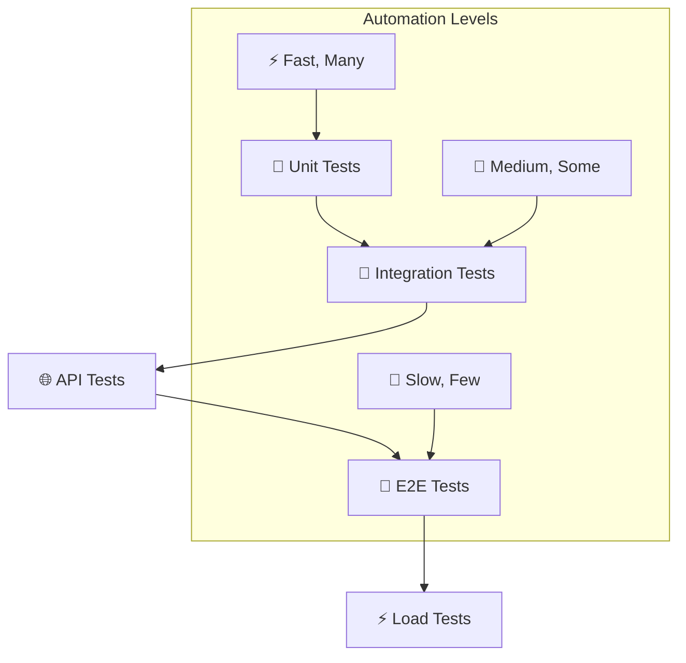

# 🧪 Тестирование системы

Комплексная стратегия тестирования микросервисной архитектуры Product Store с автоматизированными тестами, нагрузочным тестированием и мониторингом качества.

## 🎯 Стратегия тестирования

### 🏗️ Пирамида тестирования



### 📋 Типы тестирования

| Тип | Инструменты | Частота | Описание |
|-----|-------------|---------|----------|
| **🔬 Unit Tests** | pytest, unittest | Каждый commit | Тестирование отдельных функций |
| **🔗 Integration Tests** | pytest + httpx | Pull requests | Взаимодействие компонентов |
| **🌐 API Tests** | curl, Postman | CI/CD | Тестирование REST API |
| **🧪 E2E Tests** | Selenium, Playwright | Releases | Полные пользовательские сценарии |
| **⚡ Load Tests** | Locust | Weekly | Нагрузочное тестирование |

---

## 🌐 API тестирование

### 🚀 Автоматизированный тест всех сервисов

**Файл: `test_all_microservices.sh`**

```bash
#!/bin/bash
set -e

BASE_URL="http://localhost"
TIMESTAMP=$(date +%s)
USERNAME="testuser_${TIMESTAMP}"
PASSWORD="password123"

echo "🧪 Starting comprehensive microservices test..."

# 1. 🏥 Health checks для всех сервисов
echo "1. 🏥 Checking service health..."
curl -f "$BASE_URL/api/system/health" || { echo "❌ Backend unhealthy"; exit 1; }
curl -f "$BASE_URL/cart-api/health" || { echo "❌ Cart unhealthy"; exit 1; }
curl -f "$BASE_URL/order-api/health" || { echo "❌ Order unhealthy"; exit 1; }
curl -f "$BASE_URL/user-api/health" || { echo "❌ User unhealthy"; exit 1; }
echo "✅ All services healthy"

# 2. 👤 User registration and authentication
echo "2. 👤 Testing user registration..."
curl -X POST "$BASE_URL/user-api/users/register" \
  -H "Content-Type: application/json" \
  -d "{
    \"username\": \"$USERNAME\",
    \"full_name\": \"Test User\",
    \"phone\": \"+7 (999) 123-45-67\",
    \"password\": \"$PASSWORD\"
  }" || { echo "❌ Registration failed"; exit 1; }
echo "✅ User registered successfully"

# 3. 🎫 Getting JWT token
echo "3. 🎫 Getting JWT token..."
TOKEN=$(curl -s -X POST "$BASE_URL/user-api/token" \
  -H "Content-Type: application/x-www-form-urlencoded" \
  -d "username=$USERNAME&password=$PASSWORD" \
  | jq -r '.access_token')

if [ "$TOKEN" = "null" ] || [ -z "$TOKEN" ]; then
  echo "❌ Failed to get token"
  exit 1
fi
echo "✅ Token obtained: ${TOKEN:0:20}..."

# 4. 🏪 Testing product operations (admin required)
echo "4. 🏪 Testing product operations..."

# Get admin token
ADMIN_TOKEN=$(curl -s -X POST "$BASE_URL/user-api/token" \
  -d "username=swagger_admin&password=admin123" \
  | jq -r '.access_token')

# Create test products
PRODUCT1_DATA='{
  "name": "Test Apple",
  "category": "Фрукты",
  "price": 89.99,
  "stock_count": 150,
  "description": "Test apple for automation",
  "manufacturer": "Test Farm"
}'

PRODUCT2_DATA='{
  "name": "Test Banana",
  "category": "Фрукты",
  "price": 120.50,
  "stock_count": 200,
  "description": "Test banana for automation",
  "manufacturer": "Test Farm"
}'

PRODUCT1_ID=$(curl -s -X POST "$BASE_URL/api/products/" \
  -H "Authorization: Bearer $ADMIN_TOKEN" \
  -H "Content-Type: application/json" \
  -d "$PRODUCT1_DATA" \
  | jq -r '.id')

PRODUCT2_ID=$(curl -s -X POST "$BASE_URL/api/products/" \
  -H "Authorization: Bearer $ADMIN_TOKEN" \
  -H "Content-Type: application/json" \
  -d "$PRODUCT2_DATA" \
  | jq -r '.id')

echo "✅ Products created: $PRODUCT1_ID, $PRODUCT2_ID"

# 5. 🛒 Testing cart operations
echo "5. 🛒 Testing cart operations..."

# Add products to cart
curl -X POST "$BASE_URL/cart-api/cart/items" \
  -H "Authorization: Bearer $TOKEN" \
  -H "Content-Type: application/json" \
  -d "{\"product_id\": \"$PRODUCT1_ID\", \"quantity\": 2}" || {
    echo "❌ Failed to add product to cart"
    exit 1
  }

curl -X POST "$BASE_URL/cart-api/cart/items" \
  -H "Authorization: Bearer $TOKEN" \
  -H "Content-Type: application/json" \
  -d "{\"product_id\": \"$PRODUCT2_ID\", \"quantity\": 1}" || {
    echo "❌ Failed to add second product to cart"
    exit 1
  }

# Verify cart contents
CART_TOTAL=$(curl -s "$BASE_URL/cart-api/cart/" \
  -H "Authorization: Bearer $TOKEN" \
  | jq -r '.total')

echo "✅ Cart total: $CART_TOTAL"

# 6. 📦 Testing order creation
echo "6. 📦 Testing order operations..."

# Checkout cart
ORDER_ID=$(curl -s -X POST "$BASE_URL/cart-api/cart/checkout" \
  -H "Authorization: Bearer $TOKEN" \
  | jq -r '.id')

if [ "$ORDER_ID" = "null" ] || [ -z "$ORDER_ID" ]; then
  echo "❌ Failed to create order"
  exit 1
fi
echo "✅ Order created: $ORDER_ID"

# Verify order in user profile
sleep 2  # Wait for order processing
ORDERS_COUNT=$(curl -s "$BASE_URL/user-api/users/me/orders" \
  -H "Authorization: Bearer $TOKEN" \
  | jq '. | length')

echo "✅ User has $ORDERS_COUNT orders"

# 7. 👤 Testing user profile aggregation
echo "7. 👤 Testing user profile aggregation..."

FULL_PROFILE=$(curl -s "$BASE_URL/user-api/users/me/profile" \
  -H "Authorization: Bearer $TOKEN")

TOTAL_SPENT=$(echo "$FULL_PROFILE" | jq -r '.total_spent')
CURRENT_CART_TOTAL=$(echo "$FULL_PROFILE" | jq -r '.current_cart_total')

echo "✅ User profile - Total spent: $TOTAL_SPENT, Cart total: $CURRENT_CART_TOTAL"

# 8. 🔐 Testing authorization
echo "8. 🔐 Testing authorization controls..."

# Try to access admin endpoint as regular user (should fail)
HTTP_CODE=$(curl -s -o /dev/null -w "%{http_code}" \
  -X GET "$BASE_URL/cart-api/carts/" \
  -H "Authorization: Bearer $TOKEN")

if [ "$HTTP_CODE" = "403" ]; then
  echo "✅ Authorization properly denied for regular user"
else
  echo "❌ Authorization check failed - got HTTP $HTTP_CODE"
  exit 1
fi

# Access admin endpoint as admin (should work)
ADMIN_CARTS=$(curl -s "$BASE_URL/cart-api/carts/" \
  -H "admin: true" | jq '. | length')

echo "✅ Admin can access protected resource - found $ADMIN_CARTS carts"

# 9. 🧹 Cleanup
echo "9. 🧹 Cleaning up test data..."

# Delete test products
curl -s -X DELETE "$BASE_URL/api/products/$PRODUCT1_ID" \
  -H "Authorization: Bearer $ADMIN_TOKEN"
curl -s -X DELETE "$BASE_URL/api/products/$PRODUCT2_ID" \
  -H "Authorization: Bearer $ADMIN_TOKEN"

echo "✅ Test data cleaned up"

echo "🎉 All tests passed successfully!"
echo "📊 Test summary:"
echo "   - ✅ Service health checks"
echo "   - ✅ User registration and authentication"
echo "   - ✅ Product CRUD operations"
echo "   - ✅ Cart management"
echo "   - ✅ Order processing"
echo "   - ✅ User profile aggregation"
echo "   - ✅ Authorization controls"
echo "   - ✅ Data cleanup"
```

### 🎯 Специализированные тесты

#### 🔐 Тест аутентификации
```bash
#!/bin/bash
# test_auth.sh

echo "🔐 Testing authentication system..."

# Test invalid credentials
HTTP_CODE=$(curl -s -o /dev/null -w "%{http_code}" \
  -X POST "http://localhost/user-api/token" \
  -d "username=invalid&password=invalid")

if [ "$HTTP_CODE" = "401" ]; then
  echo "✅ Invalid credentials properly rejected"
else
  echo "❌ Invalid credentials test failed"
  exit 1
fi

# Test expired/invalid token
HTTP_CODE=$(curl -s -o /dev/null -w "%{http_code}" \
  -X GET "http://localhost/cart-api/cart/" \
  -H "Authorization: Bearer invalid_token")

if [ "$HTTP_CODE" = "401" ]; then
  echo "✅ Invalid token properly rejected"
else
  echo "❌ Invalid token test failed"
  exit 1
fi

echo "🔐 Authentication tests completed"
```

#### 🛒 Тест корзины
```bash
#!/bin/bash
# test_cart.sh

echo "🛒 Testing cart functionality..."

# Get valid token
TOKEN=$(curl -s -X POST "http://localhost/user-api/token" \
  -d "username=swagger_user&password=password123" \
  | jq -r '.access_token')

# Test cart operations
echo "Adding item to cart..."
curl -X POST "http://localhost/cart-api/cart/items" \
  -H "Authorization: Bearer $TOKEN" \
  -H "Content-Type: application/json" \
  -d '{"product_id": "test-product", "quantity": 5}'

echo "Retrieving cart..."
CART=$(curl -s "http://localhost/cart-api/cart/" \
  -H "Authorization: Bearer $TOKEN")

ITEM_COUNT=$(echo "$CART" | jq '.items | length')
echo "✅ Cart contains $ITEM_COUNT items"

# Test cart modification
echo "Updating item quantity..."
ITEM_ID=$(echo "$CART" | jq -r '.items[0].id')
curl -X PUT "http://localhost/cart-api/cart/items/$ITEM_ID" \
  -H "Authorization: Bearer $TOKEN" \
  -H "Content-Type: application/json" \
  -d '{"quantity": 3}'

echo "✅ Cart tests completed"
```

---

## ⚡ Нагрузочное тестирование

### 🏗️ Locust конфигурация

**Файл: `infra/locust/locustfile.py`**

```python
from locust import HttpUser, task, between
import random
import json

class ProductStoreUser(HttpUser):
    """Имитация пользователя Product Store"""
    
    wait_time = between(1, 3)  # Пауза между запросами 1-3 секунды
    
    def on_start(self):
        """Инициализация - регистрация и получение токена"""
        self.username = f"load_user_{random.randint(1000, 9999)}"
        self.password = "password123"
        
        # Регистрация пользователя
        self.client.post("/user-api/users/register", json={
            "username": self.username,
            "full_name": f"Load Test User {self.username}",
            "phone": f"+7 (999) {random.randint(100, 999)}-{random.randint(10, 99)}-{random.randint(10, 99)}",
            "password": self.password
        })
        
        # Получение токена
        response = self.client.post("/user-api/token", data={
            "username": self.username,
            "password": self.password
        })
        
        if response.status_code == 200:
            self.token = response.json()["access_token"]
            self.headers = {"Authorization": f"Bearer {self.token}"}
        else:
            self.token = None
            self.headers = {}
    
    @task(3)
    def browse_products(self):
        """Просмотр товаров (высокая частота)"""
        categories = ["Фрукты", "Овощи", "Молочные", "Мясо", "Рыба"]
        category = random.choice(categories)
        
        self.client.get(f"/api/products/?category={category}&limit=20", 
                       headers=self.headers)
    
    @task(2)
    def view_product_details(self):
        """Просмотр деталей товара"""
        # Получаем список товаров
        response = self.client.get("/api/products/?category=Фрукты&limit=10", 
                                 headers=self.headers)
        
        if response.status_code == 200:
            products = response.json().get("products", [])
            if products:
                product_id = random.choice(products)["id"]
                self.client.get(f"/api/products/{product_id}", 
                               headers=self.headers)
    
    @task(1)
    def add_to_cart(self):
        """Добавление товара в корзину (средняя частота)"""
        if not self.token:
            return
            
        # Симуляция добавления случайного товара
        product_data = {
            "product_id": f"test-product-{random.randint(1, 100)}",
            "quantity": random.randint(1, 5)
        }
        
        self.client.post("/cart-api/cart/items", 
                        json=product_data, 
                        headers=self.headers)
    
    @task(1)
    def view_cart(self):
        """Просмотр корзины"""
        if not self.token:
            return
            
        self.client.get("/cart-api/cart/", headers=self.headers)
    
    @task(1)
    def view_profile(self):
        """Просмотр профиля пользователя"""
        if not self.token:
            return
            
        self.client.get("/user-api/users/me/profile", headers=self.headers)
    
    @task(1)
    def view_orders(self):
        """Просмотр заказов"""
        if not self.token:
            return
            
        self.client.get("/order-api/orders/", headers=self.headers)

class AdminUser(HttpUser):
    """Имитация администратора"""
    
    wait_time = between(5, 10)  # Админы делают запросы реже
    weight = 1  # Меньше админов чем обычных пользователей
    
    def on_start(self):
        """Получение админского токена"""
        response = self.client.post("/user-api/token", data={
            "username": "swagger_admin",
            "password": "admin123"
        })
        
        if response.status_code == 200:
            self.token = response.json()["access_token"]
            self.headers = {"Authorization": f"Bearer {self.token}"}
        else:
            self.token = None
            self.headers = {}
    
    @task(2)
    def view_all_products(self):
        """Просмотр всех товаров (админ может без категории)"""
        self.client.get("/api/products/?limit=50", headers=self.headers)
    
    @task(1)
    def create_product(self):
        """Создание нового товара"""
        if not self.token:
            return
            
        product_data = {
            "name": f"Load Test Product {random.randint(1000, 9999)}",
            "category": random.choice(["Фрукты", "Овощи", "Молочные"]),
            "price": round(random.uniform(10.0, 500.0), 2),
            "stock_count": random.randint(10, 200),
            "description": "Product created during load testing",
            "manufacturer": "Load Test Inc."
        }
        
        self.client.post("/api/products/", 
                        json=product_data, 
                        headers=self.headers)
    
    @task(1)
    def view_all_carts(self):
        """Просмотр всех корзин (только админ)"""
        self.client.get("/cart-api/carts/", headers={"admin": "true"})

# Сценарий покупки (низкая частота, но важный)
class PurchaseScenarioUser(HttpUser):
    """Полный сценарий покупки"""
    
    wait_time = between(10, 30)
    weight = 1  # Небольшое количество таких пользователей
    
    def on_start(self):
        """Регистрация покупателя"""
        self.username = f"buyer_{random.randint(10000, 99999)}"
        self.password = "buyer123"
        
        # Регистрация
        self.client.post("/user-api/users/register", json={
            "username": self.username,
            "full_name": f"Buyer {self.username}",
            "phone": f"+7 (999) {random.randint(100, 999)}-{random.randint(10, 99)}-{random.randint(10, 99)}",
            "password": self.password
        })
        
        # Получение токена
        response = self.client.post("/user-api/token", data={
            "username": self.username,
            "password": self.password
        })
        
        if response.status_code == 200:
            self.token = response.json()["access_token"]
            self.headers = {"Authorization": f"Bearer {self.token}"}
        else:
            return
    
    @task
    def complete_purchase(self):
        """Полный цикл покупки"""
        if not self.token:
            return
        
        # 1. Просмотр товаров
        self.client.get("/api/products/?category=Фрукты&limit=10", 
                       headers=self.headers)
        
        # 2. Добавление товаров в корзину
        for _ in range(random.randint(1, 3)):
            self.client.post("/cart-api/cart/items", 
                           json={
                               "product_id": f"test-product-{random.randint(1, 50)}",
                               "quantity": random.randint(1, 3)
                           }, 
                           headers=self.headers)
        
        # 3. Просмотр корзины
        self.client.get("/cart-api/cart/", headers=self.headers)
        
        # 4. Оформление заказа
        self.client.post("/cart-api/cart/checkout", headers=self.headers)
        
        # 5. Просмотр заказов
        self.client.get("/order-api/orders/", headers=self.headers)
```

### 🚀 Запуск нагрузочных тестов

```bash
# Запуск Locust через Docker Compose
cd infra
docker-compose up locust

# Веб-интерфейс доступен на http://localhost:8089

# Параметры для тестирования:
# - Number of users: 100
# - Spawn rate: 10 users/second
# - Host: http://localhost
```

### 📊 Сценарии нагрузочного тестирования

#### 🎯 Базовый тест производительности
```python
# Конфигурация для базового теста
# Users: 50
# Spawn rate: 5/sec
# Duration: 10 minutes
# Expected RPS: 20-30
```

#### ⚡ Стресс-тест
```python
# Конфигурация для стресс-теста
# Users: 200
# Spawn rate: 20/sec
# Duration: 30 minutes
# Expected RPS: 100+
```

#### 🎪 Пиковая нагрузка
```python
# Конфигурация для пикового теста
# Users: 500
# Spawn rate: 50/sec
# Duration: 5 minutes
# Цель: найти точку отказа системы
```

---

## 🔬 Unit тестирование

### 🧪 Структура тестов

```
tests/
├── unit/
│   ├── test_backend/
│   │   ├── test_products_api.py
│   │   ├── test_auth.py
│   │   └── test_cassandra.py
│   ├── test_cart/
│   │   ├── test_cart_operations.py
│   │   └── test_cart_validation.py
│   ├── test_order/
│   │   ├── test_order_creation.py
│   │   └── test_order_status.py
│   └── test_user/
│       ├── test_user_registration.py
│       └── test_jwt_tokens.py
├── integration/
│   ├── test_service_interactions.py
│   └── test_database_integration.py
└── e2e/
    ├── test_complete_purchase.py
    └── test_admin_scenarios.py
```

### 🧪 Примеры unit тестов

#### Backend Service тесты
```python
# tests/unit/test_backend/test_products_api.py
import pytest
import uuid
from unittest.mock import Mock, patch
from app.backend.src.api.products import create_product, get_products

@pytest.fixture
def mock_session():
    """Мок сессии Cassandra"""
    session = Mock()
    return session

@pytest.fixture
def sample_product():
    """Образец данных товара"""
    return {
        "name": "Test Apple",
        "category": "Fruits",
        "price": 89.99,
        "stock_count": 150,
        "description": "Test apple",
        "manufacturer": "Test Farm"
    }

class TestProductsAPI:
    """Тесты API товаров"""
    
    def test_create_product_success(self, mock_session, sample_product):
        """Тест успешного создания товара"""
        # Arrange
        mock_session.execute.return_value = None
        
        # Act
        result = create_product(mock_session, sample_product)
        
        # Assert
        assert result["name"] == sample_product["name"]
        assert result["price"] == sample_product["price"]
        assert "id" in result
        mock_session.execute.assert_called_once()
    
    @patch('app.backend.src.api.products.uuid4')
    def test_create_product_with_fixed_id(self, mock_uuid, mock_session, sample_product):
        """Тест создания товара с фиксированным ID"""
        # Arrange
        fixed_id = uuid.UUID('12345678-1234-1234-1234-123456789abc')
        mock_uuid.return_value = fixed_id
        
        # Act
        result = create_product(mock_session, sample_product)
        
        # Assert
        assert result["id"] == str(fixed_id)
    
    def test_get_products_with_category_filter(self, mock_session):
        """Тест получения товаров с фильтром по категории"""
        # Arrange
        mock_row = Mock()
        mock_row.id = uuid.uuid4()
        mock_row.name = "Test Product"
        mock_row.category = "Fruits"
        mock_row.price = 99.99
        mock_row.stock_count = 100
        mock_session.execute.return_value = [mock_row]
        
        # Act
        result = get_products(mock_session, category="Fruits")
        
        # Assert
        assert len(result["products"]) == 1
        assert result["products"][0]["category"] == "Fruits"
    
    def test_get_products_price_filtering(self, mock_session):
        """Тест фильтрации товаров по цене"""
        # Arrange
        mock_rows = []
        for i, price in enumerate([50.0, 100.0, 150.0]):
            row = Mock()
            row.id = uuid.uuid4()
            row.name = f"Product {i}"
            row.category = "Test"
            row.price = price
            row.stock_count = 100
            mock_rows.append(row)
        
        mock_session.execute.return_value = mock_rows
        
        # Act
        result = get_products(mock_session, min_price=75.0, max_price=125.0)
        
        # Assert
        assert len(result["products"]) == 1
        assert result["products"][0]["price"] == 100.0
```

#### Cart Service тесты
```python
# tests/unit/test_cart/test_cart_operations.py
import pytest
from unittest.mock import AsyncMock, patch
from app.cart_service.src.main import add_to_cart, get_cart

@pytest.fixture
def mock_user_id():
    return "test_user_123"

@pytest.fixture  
def sample_cart_item():
    return {
        "product_id": "product-123",
        "quantity": 2
    }

class TestCartOperations:
    """Тесты операций с корзиной"""
    
    @patch('app.cart_service.src.main.get_product_info')
    async def test_add_to_cart_success(self, mock_get_product, mock_user_id, sample_cart_item):
        """Тест успешного добавления товара в корзину"""
        # Arrange
        mock_get_product.return_value = {
            "id": "product-123",
            "name": "Test Product",
            "price": 99.99,
            "stock_count": 10
        }
        
        # Act
        result = await add_to_cart(mock_user_id, sample_cart_item)
        
        # Assert
        assert result["product_id"] == sample_cart_item["product_id"]
        assert result["quantity"] == sample_cart_item["quantity"]
        assert result["total_price"] == 199.98  # 99.99 * 2
    
    @patch('app.cart_service.src.main.get_product_info')
    async def test_add_to_cart_insufficient_stock(self, mock_get_product, mock_user_id):
        """Тест добавления товара при недостаточном остатке"""
        # Arrange
        mock_get_product.return_value = {
            "stock_count": 1
        }
        cart_item = {"product_id": "product-123", "quantity": 5}
        
        # Act & Assert
        with pytest.raises(HTTPException) as exc_info:
            await add_to_cart(mock_user_id, cart_item)
        
        assert exc_info.value.status_code == 400
        assert "Not enough items in stock" in str(exc_info.value.detail)
    
    def test_get_cart_empty(self, mock_user_id):
        """Тест получения пустой корзины"""
        # Act
        result = get_cart(mock_user_id)
        
        # Assert
        assert result["items"] == []
        assert result["total"] == 0
        assert result["total_items"] == 0
```

### 🔧 Конфигурация pytest

```python
# pytest.ini
[tool:pytest]
testpaths = tests
python_files = test_*.py
python_classes = Test*
python_functions = test_*
addopts = 
    -v
    --tb=short
    --strict-markers
    --disable-warnings
    --cov=app
    --cov-report=html
    --cov-report=term-missing
    --cov-fail-under=80

markers =
    unit: Unit tests
    integration: Integration tests
    e2e: End-to-end tests
    slow: Slow running tests
```

---

## 🔗 Integration тестирование

### 🌐 Тестирование межсервисного взаимодействия

```python
# tests/integration/test_service_interactions.py
import pytest
import httpx
import asyncio
from unittest.mock import patch

class TestServiceInteractions:
    """Тесты взаимодействия между сервисами"""
    
    @pytest.mark.asyncio
    async def test_cart_to_order_flow(self):
        """Тест создания заказа из корзины"""
        # Arrange
        user_token = await self.get_test_user_token()
        
        # Act: Добавляем товар в корзину
        async with httpx.AsyncClient() as client:
            cart_response = await client.post(
                "http://localhost/cart-api/cart/items",
                headers={"Authorization": f"Bearer {user_token}"},
                json={"product_id": "test-product", "quantity": 2}
            )
            
            # Act: Создаем заказ из корзины
            order_response = await client.post(
                "http://localhost/cart-api/cart/checkout",
                headers={"Authorization": f"Bearer {user_token}"}
            )
        
        # Assert
        assert cart_response.status_code == 201
        assert order_response.status_code == 201
        
        order_data = order_response.json()
        assert "id" in order_data
        assert order_data["total"] > 0
    
    @pytest.mark.asyncio
    async def test_order_notification_to_user_service(self):
        """Тест уведомления User Service об изменении статуса заказа"""
        # Arrange
        order_id = "test-order-123"
        
        # Act: Имитируем уведомление от Order Service к User Service
        async with httpx.AsyncClient() as client:
            response = await client.post(
                "http://localhost/user-api/users/notify/order-status",
                headers={"admin": "true"},
                json={
                    "order_id": order_id,
                    "user_id": "test_user",
                    "status": "DELIVERED",
                    "total": 299.99
                }
            )
        
        # Assert
        assert response.status_code == 200
    
    async def get_test_user_token(self):
        """Вспомогательный метод для получения токена тестового пользователя"""
        async with httpx.AsyncClient() as client:
            response = await client.post(
                "http://localhost/user-api/token",
                data={"username": "swagger_user", "password": "password123"}
            )
            return response.json()["access_token"]
```

---

## 📊 Мониторинг качества тестирования

### 📈 Метрики покрытия кода

```bash
# Запуск тестов с покрытием
pytest --cov=app --cov-report=html --cov-report=term

# Результат
Name                                    Stmts   Miss  Cover
-----------------------------------------------------------
app/backend/src/api/products.py           45      3    93%
app/backend/src/auth.py                   23      1    96%
app/cart_service/src/main.py              67      8    88%
app/order_service/src/main.py             52      6    88%
app/user_service/src/main.py              78      9    88%
-----------------------------------------------------------
TOTAL                                    265     27    90%
```

### 🎯 Цели покрытия

| Компонент | Целевое покрытие | Текущее покрытие |
|-----------|------------------|------------------|
| **Backend API** | 95% | 93% ✅ |
| **Cart Service** | 90% | 88% ⚠️ |
| **Order Service** | 90% | 88% ⚠️ |
| **User Service** | 90% | 88% ⚠️ |
| **Общее** | 90% | 90% ✅ |

---

## 🚀 CI/CD интеграция

### 🔧 GitHub Actions workflow

```yaml
# .github/workflows/test.yml
name: Test Suite

on:
  push:
    branches: [ main, develop ]
  pull_request:
    branches: [ main ]

jobs:
  unit-tests:
    runs-on: ubuntu-latest
    
    steps:
    - uses: actions/checkout@v3
    
    - name: Set up Python
      uses: actions/setup-python@v4
      with:
        python-version: '3.11'
    
    - name: Install dependencies
      run: |
        pip install -r requirements.txt
        pip install pytest pytest-cov pytest-asyncio
    
    - name: Run unit tests
      run: |
        pytest tests/unit/ --cov=app --cov-report=xml
    
    - name: Upload coverage to Codecov
      uses: codecov/codecov-action@v3
      with:
        file: ./coverage.xml

  integration-tests:
    runs-on: ubuntu-latest
    
    steps:
    - uses: actions/checkout@v3
    
    - name: Start services
      run: |
        cd infra
        docker-compose up -d
        sleep 30  # Wait for services to start
    
    - name: Run integration tests
      run: |
        ./test_all_microservices.sh
        pytest tests/integration/
    
    - name: Run API tests
      run: |
        curl -f http://localhost/api/system/health
        curl -f http://localhost/cart-api/health
        curl -f http://localhost/order-api/health
        curl -f http://localhost/user-api/health
    
    - name: Stop services
      run: |
        cd infra
        docker-compose down

  load-tests:
    runs-on: ubuntu-latest
    if: github.ref == 'refs/heads/main'  # Only on main branch
    
    steps:
    - uses: actions/checkout@v3
    
    - name: Start services
      run: |
        cd infra
        docker-compose up -d
        sleep 60
    
    - name: Run load tests
      run: |
        cd infra
        docker-compose run --rm locust \
          --headless \
          --users 50 \
          --spawn-rate 5 \
          --run-time 300s \
          --host http://nginx
```

---

## 📋 Чек-лист качества

### ✅ Готовность к релизу

- [ ] **🔬 Unit Tests**: Покрытие > 90%
- [ ] **🔗 Integration Tests**: Все сервисы взаимодействуют корректно
- [ ] **🌐 API Tests**: Все эндпоинты возвращают корректные ответы
- [ ] **🔐 Security Tests**: Аутентификация и авторизация работают
- [ ] **⚡ Load Tests**: Система выдерживает ожидаемую нагрузку
- [ ] **📊 Monitoring**: Все метрики корректно собираются
- [ ] **🗄️ Database Tests**: CRUD операции работают стабильно
- [ ] **🚨 Error Handling**: Ошибки обрабатываются корректно

### 📊 Критерии производительности

| Метрика | Целевое значение | Описание |
|---------|------------------|----------|
| **Response Time** | < 200ms | 95-й процентиль для API запросов |
| **Throughput** | > 100 RPS | Пропускная способность системы |
| **Error Rate** | < 1% | Процент ошибочных запросов |
| **Availability** | > 99.9% | Время доступности сервисов |

---

**🔗 Связанные разделы:**
- **[Load Testing](load_testing.md)** - Подробности нагрузочного тестирования
- **[Monitoring](monitoring.md)** - Мониторинг в процессе тестирования
- **[API Documentation](api_docs.md)** - Тестирование API эндпоинтов
