# 🧪 Тестирование системы

Комплексная стратегия тестирования микросервисной архитектуры Product Store, включающая unit-тесты, интеграционные тесты, нагрузочное тестирование и мониторинг качества.

## 🏗️ Архитектура тестирования

```mermaid
graph TB
    subgraph "🧪 Testing Layers"
        UNIT[🔬 Unit Tests<br/>PyTest + Coverage]
        INTEGRATION[🔗 Integration Tests<br/>Service-to-Service]
        CONTRACT[📋 Contract Tests<br/>API Specifications]
        E2E[🎭 End-to-End Tests<br/>Full User Flows]
    end
    
    subgraph "📊 Quality Gates"
        COVERAGE[📈 Code Coverage<br/>80%+ Threshold]
        LINT[🔍 Code Quality<br/>Flake8 + Black]
        SECURITY[🔒 Security Scans<br/>Bandit + Safety]
        PERFORMANCE[⚡ Performance<br/>Response Time SLA]
    end
    
    subgraph "🚀 Automated Testing"
        CI[🔄 CI Pipeline<br/>GitHub Actions]
        STAGING[🎯 Staging Tests<br/>Pre-production]
        PROD[🛡️ Production Tests<br/>Health Checks]
    end
    
    UNIT --> COVERAGE
    INTEGRATION --> CONTRACT
    CONTRACT --> E2E
    E2E --> CI
    CI --> STAGING
    STAGING --> PROD
    
    COVERAGE --> LINT
    LINT --> SECURITY
    SECURITY --> PERFORMANCE
```


    E2E --> PERFORMANCE
    
    COVERAGE --> CI
    LINT --> CI
    SECURITY --> CI
    
    CI --> STAGING
    STAGING --> PROD
    
    classDef testBox fill:#e3f2fd,stroke:#1976d2,stroke-width:2px
    classDef qualityBox fill:#e8f5e8,stroke:#388e3c,stroke-width:2px
    classDef autoBox fill:#fff3e0,stroke:#f57c00,stroke-width:2px
    
    class UNIT,INTEGRATION,CONTRACT,E2E testBox
    class COVERAGE,LINT,SECURITY,PERFORMANCE qualityBox
    class CI,STAGING,PROD autoBox
```

---

## 🔬 Unit Tests (PyTest)

### 📁 Структура тестов

```
app/
├── backend/
│   ├── src/
│   │   └── api/
│   │       ├── products.py
│   │       └── system.py
│   └── tests/
│       ├── conftest.py
│       ├── test_products_api.py
│       ├── test_system_api.py
│       └── test_cassandra_service.py
├── cart-service/
│   ├── src/
│   │   └── main.py
│   └── tests/
│       ├── conftest.py
│       ├── test_cart_operations.py
│       └── test_checkout_flow.py
├── order-service/
│   └── tests/
│       ├── test_order_lifecycle.py
│       └── test_background_tasks.py
└── user-service/
    └── tests/
        ├── test_authentication.py
        └── test_user_management.py
```

### ⚙️ PyTest Configuration

```python
# conftest.py - общие фикстуры для всех сервисов
import pytest
import asyncio
from fastapi.testclient import TestClient
from unittest.mock import AsyncMock, MagicMock

@pytest.fixture(scope="session")
def event_loop():
    """Create an instance of the default event loop for the test session."""
    loop = asyncio.get_event_loop_policy().new_event_loop()
    yield loop
    loop.close()

@pytest.fixture
def mock_cassandra_session():
    """Mock Cassandra session for database operations"""
    session = AsyncMock()
    session.execute = AsyncMock()
    return session

@pytest.fixture
def mock_http_client():
    """Mock HTTP client for inter-service communication"""
    client = AsyncMock()
    client.get = AsyncMock()
    client.post = AsyncMock()
    client.put = AsyncMock()
    client.delete = AsyncMock()
    return client

@pytest.fixture
def test_product():
    """Sample product data for testing"""
    return {
        "id": "test-product-1",
        "name": "Test Product",
        "description": "Test Description",
        "price": 99.99,
        "category": "Electronics",
        "stock": 10
    }

@pytest.fixture
def test_user():
    """Sample user data for testing"""
    return {
        "id": "test-user-1",
        "username": "testuser",
        "email": "test@example.com",
        "role": "user"
    }
```

### 🧪 Backend Service Tests

```python
# tests/test_products_api.py
import pytest
from fastapi.testclient import TestClient
from unittest.mock import AsyncMock, patch
from app.backend.src.main import app

client = TestClient(app)

class TestProductsAPI:
    
    @patch('app.backend.src.services.cassandra.get_session')
    def test_get_products_success(self, mock_get_session, mock_cassandra_session, test_product):
        """Test successful product retrieval"""
        # Arrange
        mock_get_session.return_value = mock_cassandra_session
        mock_cassandra_session.execute.return_value = [test_product]
        
        # Act
        response = client.get("/api/products")
        
        # Assert
        assert response.status_code == 200
        data = response.json()
        assert len(data) == 1
        assert data[0]["name"] == "Test Product"
        mock_cassandra_session.execute.assert_called_once()
    
    @patch('app.backend.src.services.cassandra.get_session')
    def test_get_products_by_category(self, mock_get_session, mock_cassandra_session):
        """Test product filtering by category"""
        # Arrange
        mock_get_session.return_value = mock_cassandra_session
        electronics_products = [
            {"id": "1", "name": "Phone", "category": "Electronics"},
            {"id": "2", "name": "Laptop", "category": "Electronics"}
        ]
        mock_cassandra_session.execute.return_value = electronics_products
        
        # Act
        response = client.get("/api/products?category=Electronics")
        
        # Assert
        assert response.status_code == 200
        data = response.json()
        assert len(data) == 2
        assert all(product["category"] == "Electronics" for product in data)
    
    @patch('app.backend.src.services.cassandra.get_session')
    def test_create_product_admin_only(self, mock_get_session, mock_cassandra_session):
        """Test product creation requires admin role"""
        # Arrange
        mock_get_session.return_value = mock_cassandra_session
        
        product_data = {
            "name": "New Product",
            "description": "New Description",
            "price": 199.99,
            "category": "Electronics",
            "stock": 5
        }
        
        # Act - without authentication
        response = client.post("/api/products", json=product_data)
        
        # Assert
        assert response.status_code == 401  # Unauthorized
    
    def test_get_product_not_found(self):
        """Test handling of non-existent product"""
        # Act
        response = client.get("/api/products/non-existent-id")
        
        # Assert
        assert response.status_code == 404
        assert "Product not found" in response.json()["detail"]
```

### 🛒 Cart Service Tests

```python
# tests/test_cart_operations.py
import pytest
from fastapi.testclient import TestClient
from unittest.mock import AsyncMock, patch
from app.cart_service.src.main import app

client = TestClient(app)

class TestCartOperations:
    
    def test_add_item_to_cart(self, test_product):
        """Test adding item to cart"""
        user_id = "test-user-1"
        
        # Mock product validation
        with patch('aiohttp.ClientSession.get') as mock_get:
            mock_response = AsyncMock()
            mock_response.status = 200
            mock_response.json.return_value = test_product
            mock_get.return_value.__aenter__.return_value = mock_response
            
            # Act
            response = client.post(f"/cart-api/cart/{user_id}/add", json={
                "product_id": test_product["id"],
                "quantity": 2
            })
            
            # Assert
            assert response.status_code == 200
            data = response.json()
            assert data["message"] == "Item added to cart"
    
    def test_add_item_insufficient_stock(self, test_product):
        """Test adding item with insufficient stock"""
        user_id = "test-user-1"
        
        # Arrange - product with low stock
        low_stock_product = test_product.copy()
        low_stock_product["stock"] = 1
        
        with patch('aiohttp.ClientSession.get') as mock_get:
            mock_response = AsyncMock()
            mock_response.status = 200
            mock_response.json.return_value = low_stock_product
            mock_get.return_value.__aenter__.return_value = mock_response
            
            # Act - try to add more than available
            response = client.post(f"/cart-api/cart/{user_id}/add", json={
                "product_id": test_product["id"],
                "quantity": 5  # More than available stock
            })
            
            # Assert
            assert response.status_code == 400
            assert "Insufficient stock" in response.json()["detail"]
    
    def test_checkout_success(self):
        """Test successful cart checkout"""
        user_id = "test-user-1"
        
        # First add item to cart
        with patch('aiohttp.ClientSession.get') as mock_get:
            mock_response = AsyncMock()
            mock_response.status = 200
            mock_response.json.return_value = {"id": "product-1", "stock": 10}
            mock_get.return_value.__aenter__.return_value = mock_response
            
            client.post(f"/cart-api/cart/{user_id}/add", json={
                "product_id": "product-1",
                "quantity": 1
            })
        
        # Mock order service response
        with patch('aiohttp.ClientSession.post') as mock_post:
            mock_order_response = AsyncMock()
            mock_order_response.status = 201
            mock_order_response.json.return_value = {
                "id": "order-123",
                "status": "CREATED",
                "total": 99.99
            }
            mock_post.return_value.__aenter__.return_value = mock_order_response
            
            # Act
            response = client.post(f"/cart-api/cart/{user_id}/checkout")
            
            # Assert
            assert response.status_code == 201
            data = response.json()
            assert data["id"] == "order-123"
            assert data["status"] == "CREATED"
```

### 👤 User Service Tests

```python
# tests/test_authentication.py
import pytest
from fastapi.testclient import TestClient
from unittest.mock import patch
from app.user_service.src.main import app

client = TestClient(app)

class TestAuthentication:
    
    def test_user_registration_success(self):
        """Test successful user registration"""
        user_data = {
            "username": "newuser",
            "email": "newuser@example.com",
            "password": "securepass123"
        }
        
        # Act
        response = client.post("/user-api/register", json=user_data)
        
        # Assert
        assert response.status_code == 201
        data = response.json()
        assert data["username"] == "newuser"
        assert data["email"] == "newuser@example.com"
        assert "password" not in data  # Password should not be returned
        assert "id" in data
    
    def test_user_registration_duplicate_username(self):
        """Test registration with existing username"""
        user_data = {
            "username": "existinguser",
            "email": "existing@example.com",
            "password": "pass123"
        }
        
        # Register user first time
        response1 = client.post("/user-api/register", json=user_data)
        assert response1.status_code == 201
        
        # Try to register again with same username
        response2 = client.post("/user-api/register", json=user_data)
        
        # Assert
        assert response2.status_code == 400
        assert "Username already exists" in response2.json()["detail"]
    
    def test_login_success(self):
        """Test successful login"""
        # First register a user
        client.post("/user-api/register", json={
            "username": "loginuser",
            "email": "login@example.com",
            "password": "loginpass123"
        })
        
        # Act - login
        response = client.post("/user-api/login", json={
            "username": "loginuser",
            "password": "loginpass123"
        })
        
        # Assert
        assert response.status_code == 200
        data = response.json()
        assert "access_token" in data
        assert data["token_type"] == "bearer"
    
    def test_login_invalid_credentials(self):
        """Test login with wrong password"""
        # Act
        response = client.post("/user-api/login", json={
            "username": "nonexistent",
            "password": "wrongpass"
        })
        
        # Assert
        assert response.status_code == 401
        assert "Invalid credentials" in response.json()["detail"]
```

---

## 🔗 Integration Tests

### 🌐 Service-to-Service Communication

```python
# tests/test_integration.py
import pytest
import asyncio
import aiohttp
from unittest.mock import patch

class TestServiceIntegration:
    
    @pytest.mark.asyncio
    async def test_cart_to_backend_communication(self):
        """Test cart service calling backend for product validation"""
        
        # Arrange - mock backend response
        product_data = {
            "id": "product-123",
            "name": "Test Product",
            "price": 99.99,
            "stock": 10
        }
        
        # Act - simulate cart service calling backend
        async with aiohttp.ClientSession() as session:
            # Mock the backend call
            with patch.object(session, 'get') as mock_get:
                mock_response = AsyncMock()
                mock_response.status = 200
                mock_response.json.return_value = product_data
                mock_get.return_value.__aenter__.return_value = mock_response
                
                # Simulate cart service validation logic
                async with session.get("http://backend:8000/api/products/product-123") as resp:
                    result = await resp.json()
                    
                    # Assert
                    assert resp.status == 200
                    assert result["id"] == "product-123"
                    assert result["stock"] == 10
    
    @pytest.mark.asyncio
    async def test_cart_to_order_service_checkout(self):
        """Test cart service creating order through order service"""
        
        # Arrange
        order_data = {
            "user_id": "user-123",
            "items": [
                {"product_id": "product-1", "quantity": 2, "price": 99.99}
            ],
            "total": 199.98
        }
        
        expected_response = {
            "id": "order-456",
            "status": "CREATED",
            "user_id": "user-123",
            "total": 199.98
        }
        
        # Act
        async with aiohttp.ClientSession() as session:
            with patch.object(session, 'post') as mock_post:
                mock_response = AsyncMock()
                mock_response.status = 201
                mock_response.json.return_value = expected_response
                mock_post.return_value.__aenter__.return_value = mock_response
                
                async with session.post("http://order:8002/order-api/orders", 
                                       json=order_data) as resp:
                    result = await resp.json()
                    
                    # Assert
                    assert resp.status == 201
                    assert result["id"] == "order-456"
                    assert result["status"] == "CREATED"
```

---

## 📋 Contract Tests (API Specifications)

### 🎯 OpenAPI Schema Validation

```python
# tests/test_api_contracts.py
import pytest
from fastapi.testclient import TestClient
from jsonschema import validate, ValidationError
from app.backend.src.main import app

client = TestClient(app)

class TestAPIContracts:
    
    def test_openapi_schema_valid(self):
        """Test that OpenAPI schema is valid"""
        response = client.get("/openapi.json")
        assert response.status_code == 200
        
        schema = response.json()
        assert "openapi" in schema
        assert "paths" in schema
        assert "components" in schema
    
    def test_product_response_schema(self):
        """Test product response matches schema"""
        # Expected schema
        product_schema = {
            "type": "object",
            "required": ["id", "name", "price", "category"],
            "properties": {
                "id": {"type": "string"},
                "name": {"type": "string"},
                "description": {"type": "string"},
                "price": {"type": "number"},
                "category": {"type": "string"},
                "stock": {"type": "integer", "minimum": 0}
            }
        }
        
        # Act - get products and validate schema
        response = client.get("/api/products")
        assert response.status_code == 200
        
        products = response.json()
        for product in products:
            # This should not raise ValidationError
            validate(instance=product, schema=product_schema)
    
    def test_error_response_schema(self):
        """Test error responses follow standard format"""
        error_schema = {
            "type": "object",
            "required": ["detail"],
            "properties": {
                "detail": {"type": "string"}
            }
        }
        
        # Act - trigger 404 error
        response = client.get("/api/products/non-existent")
        assert response.status_code == 404
        
        error_data = response.json()
        validate(instance=error_data, schema=error_schema)
```

---

## 🎭 End-to-End Tests

### 🎬 Complete User Scenarios

```python
# tests/test_e2e_flows.py
import pytest
from fastapi.testclient import TestClient
from app.backend.src.main import app as backend_app
from app.cart_service.src.main import app as cart_app
from app.user_service.src.main import app as user_app

class TestE2EUserFlows:
    
    def setup_method(self):
        """Setup clients for all services"""
        self.backend_client = TestClient(backend_app)
        self.cart_client = TestClient(cart_app)
        self.user_client = TestClient(user_app)
    
    def test_complete_shopping_flow(self):
        """Test complete user journey from registration to order"""
        
        # Step 1: User Registration
        user_data = {
            "username": "shopper1",
            "email": "shopper1@example.com",
            "password": "shoppass123"
        }
        
        register_response = self.user_client.post("/user-api/register", json=user_data)
        assert register_response.status_code == 201
        user = register_response.json()
        user_id = user["id"]
        
        # Step 2: User Login
        login_response = self.user_client.post("/user-api/login", json={
            "username": "shopper1",
            "password": "shoppass123"
        })
        assert login_response.status_code == 200
        token = login_response.json()["access_token"]
        
        # Step 3: Browse Products
        products_response = self.backend_client.get("/api/products")
        assert products_response.status_code == 200
        products = products_response.json()
        assert len(products) > 0
        
        selected_product = products[0]
        
        # Step 4: Add to Cart
        cart_response = self.cart_client.post(
            f"/cart-api/cart/{user_id}/add",
            json={
                "product_id": selected_product["id"],
                "quantity": 1
            }
        )
        assert cart_response.status_code == 200
        
        # Step 5: View Cart
        view_cart_response = self.cart_client.get(f"/cart-api/cart/{user_id}")
        assert view_cart_response.status_code == 200
        cart_data = view_cart_response.json()
        assert len(cart_data["items"]) == 1
        
        # Step 6: Checkout
        checkout_response = self.cart_client.post(f"/cart-api/cart/{user_id}/checkout")
        assert checkout_response.status_code == 201
        order = checkout_response.json()
        assert order["status"] == "CREATED"
        
        # Step 7: Verify Cart is Empty
        empty_cart_response = self.cart_client.get(f"/cart-api/cart/{user_id}")
        assert empty_cart_response.status_code == 200
        empty_cart = empty_cart_response.json()
        assert len(empty_cart["items"]) == 0
```

---

## 📊 Coverage & Quality Gates

### 📈 Coverage Configuration

```ini
# .coveragerc
[run]
source = .
omit = 
    */tests/*
    */venv/*
    */migrations/*
    */__pycache__/*
    */conftest.py

[report]
exclude_lines =
    pragma: no cover
    def __repr__
    raise AssertionError
    raise NotImplementedError
    if __name__ == .__main__.:

precision = 2
show_missing = True
skip_covered = False

[html]
directory = htmlcov
```

### 🔍 Code Quality Tools

```yaml
# .github/workflows/quality.yml
name: Code Quality
on: [push, pull_request]

jobs:
  quality:
    runs-on: ubuntu-latest
    steps:
      - uses: actions/checkout@v3
      
      - name: Set up Python
        uses: actions/setup-python@v4
        with:
          python-version: '3.11'
          
      - name: Install dependencies
        run: |
          pip install pytest pytest-cov pytest-asyncio
          pip install flake8 black bandit safety
          pip install -r requirements.txt
      
      - name: Code formatting check
        run: black --check --diff .
      
      - name: Linting
        run: flake8 . --max-line-length=100 --ignore=E203,W503
      
      - name: Security check
        run: bandit -r . -x */tests/*
      
      - name: Dependency vulnerability check
        run: safety check
      
      - name: Run tests with coverage
        run: |
          pytest --cov=. --cov-report=html --cov-report=term
          
      - name: Coverage threshold check
        run: |
          coverage report --fail-under=80
```

---

## 🚀 CI/CD Pipeline

### 🔄 GitHub Actions Workflow

```yaml
# .github/workflows/test.yml
name: Test Suite
on:
  push:
    branches: [main, develop]
  pull_request:
    branches: [main]

jobs:
  unit-tests:
    runs-on: ubuntu-latest
    strategy:
      matrix:
        service: [backend, cart-service, order-service, user-service]
    
    steps:
      - uses: actions/checkout@v3
      
      - name: Set up Python
        uses: actions/setup-python@v4
        with:
          python-version: '3.11'
      
      - name: Install dependencies
        run: |
          cd app/${{ matrix.service }}
          pip install -r requirements.txt
          pip install pytest pytest-asyncio pytest-cov
      
      - name: Run unit tests
        run: |
          cd app/${{ matrix.service }}
          pytest tests/ -v --cov=src --cov-report=xml
      
      - name: Upload coverage
        uses: codecov/codecov-action@v3
        with:
          file: app/${{ matrix.service }}/coverage.xml
          flags: ${{ matrix.service }}

  integration-tests:
    needs: unit-tests
    runs-on: ubuntu-latest
    
    services:
      cassandra:
        image: cassandra:4.1
        env:
          CASSANDRA_BROADCAST_ADDRESS: cassandra
        ports:
          - 9042:9042
    
    steps:
      - uses: actions/checkout@v3
      
      - name: Set up Python
        uses: actions/setup-python@v4
        with:
          python-version: '3.11'
      
      - name: Install dependencies
        run: |
          pip install -r requirements.txt
          pip install pytest pytest-asyncio
      
      - name: Wait for Cassandra
        run: |
          timeout 300 bash -c 'until nc -z localhost 9042; do sleep 5; done'
      
      - name: Run integration tests
        run: pytest tests/integration/ -v
      
      - name: Run E2E tests
        run: pytest tests/e2e/ -v

  performance-tests:
    needs: integration-tests
    runs-on: ubuntu-latest
    
    steps:
      - uses: actions/checkout@v3
      
      - name: Start services
        run: |
          docker-compose -f infra/docker-compose.yml up -d
          sleep 30  # Wait for services to start
      
      - name: Run Locust performance tests
        run: |
          pip install locust
          locust -f infra/locust/locustfile.py --headless \
                 --users 50 --spawn-rate 5 --run-time 60s \
                 --host http://localhost
      
      - name: Check performance metrics
        run: |
          # Verify response times are within SLA
          python scripts/check_performance_sla.py
```

---

## 🎯 Test Execution Commands

### 📝 Local Development

```bash
# Run all tests for a service
cd app/backend
pytest tests/ -v

# Run with coverage
pytest tests/ --cov=src --cov-report=html

# Run specific test file
pytest tests/test_products_api.py -v

# Run specific test method
pytest tests/test_products_api.py::TestProductsAPI::test_get_products_success -v

# Run tests with markers
pytest -m "not slow" tests/  # Skip slow tests
pytest -m integration tests/  # Only integration tests
```

### 🔄 CI/CD Commands

```bash
# Full test suite
make test

# Quality checks
make lint
make security-check
make format-check

# Coverage report
make coverage

# Performance tests
make perf-test
```

### 🎨 Makefile

```makefile
# Makefile
.PHONY: test lint security-check format-check coverage perf-test

test:
	@echo "Running unit tests..."
	pytest tests/unit/ -v
	@echo "Running integration tests..."
	pytest tests/integration/ -v
	@echo "Running E2E tests..."
	pytest tests/e2e/ -v

lint:
	flake8 . --max-line-length=100 --ignore=E203,W503
	black --check --diff .

security-check:
	bandit -r . -x */tests/*
	safety check

format-check:
	black --check --diff .

coverage:
	pytest tests/ --cov=. --cov-report=html --cov-report=term
	coverage report --fail-under=80

perf-test:
	locust -f infra/locust/locustfile.py --headless \
	       --users 100 --spawn-rate 10 --run-time 120s \
	       --host http://localhost
```

---

## 📚 Best Practices

### ✅ Testing Guidelines

1. **AAA Pattern**: Arrange, Act, Assert
2. **Descriptive Names**: Test method names should describe scenario
3. **Single Responsibility**: One assertion per test when possible
4. **Independent Tests**: Tests should not depend on each other
5. **Mock External Dependencies**: Use mocks for database, HTTP calls
6. **Test Data Factories**: Use fixtures for consistent test data

### 🎯 Quality Metrics

- **Code Coverage**: Minimum 80%
- **Response Time**: API endpoints < 500ms (P95)
- **Error Rate**: < 1% in production
- **Security**: Zero high/critical vulnerabilities
- **Code Quality**: Maintainability Index > 80

### 🚀 Performance Testing

- **Load Testing**: Regular user load simulation
- **Stress Testing**: Beyond normal capacity limits
- **Spike Testing**: Sudden traffic increases
- **Volume Testing**: Large amounts of data
- **Endurance Testing**: Extended periods

Эта комплексная стратегия тестирования обеспечивает высокое качество и надежность микросервисной архитектуры Product Store.
