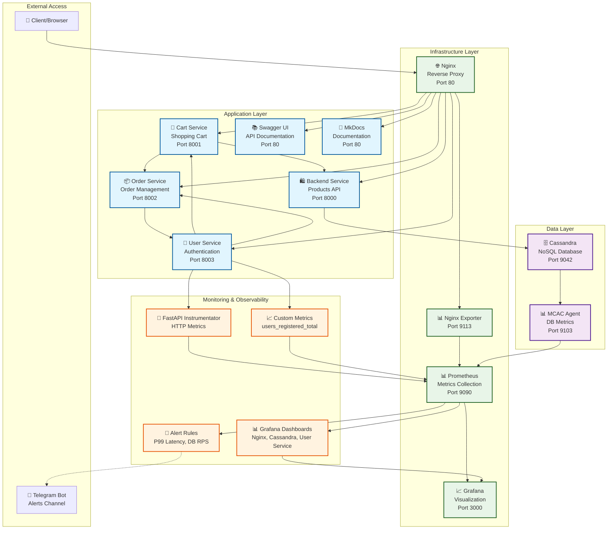

```mermaid
graph TB
    subgraph "External Access"
        CLIENT[👤 Client/Browser]
        TELEGRAM[📱 Telegram Bot<br/>Alerts Channel]
    end

    subgraph "Infrastructure Layer"
        NGINX[🌐 Nginx<br/>Reverse Proxy<br/>Port 80]
        PROM[📊 Prometheus<br/>Metrics Collection<br/>Port 9090]
        GRAFANA[📈 Grafana<br/>Visualization<br/>Port 3000]
        NGINX_EXP[📊 Nginx Exporter<br/>Port 9113]
    end

    subgraph "Application Layer"
        BACKEND[🛍️ Backend Service<br/>Products API<br/>Port 8000]
        CART[🛒 Cart Service<br/>Shopping Cart<br/>Port 8001]
        ORDER[📦 Order Service<br/>Order Management<br/>Port 8002]
        USER[👤 User Service<br/>Authentication<br/>Port 8003]
        SWAGGER[📚 Swagger UI<br/>API Documentation<br/>Port 80]
        DOCS[📖 MkDocs<br/>Documentation<br/>Port 80]
    end

    subgraph "Data Layer"
        CASSANDRA[🗄️ Cassandra<br/>NoSQL Database<br/>Port 9042]
        MCAC[📊 MCAC Agent<br/>DB Metrics<br/>Port 9103]
    end

    subgraph "Monitoring & Observability"
        INSTRUMENTATION[🔧 FastAPI Instrumentator<br/>HTTP Metrics]
        CUSTOM_METRICS[📈 Custom Metrics<br/>users_registered_total]
        DASHBOARDS[📊 Grafana Dashboards<br/>Nginx, Cassandra, User Service]
        ALERTS[🚨 Alert Rules<br/>P99 Latency, DB RPS]
    end

    %% Client connections
    CLIENT --> NGINX
    
    %% Nginx routing
    NGINX --> BACKEND
    NGINX --> CART
    NGINX --> ORDER
    NGINX --> USER
    NGINX --> SWAGGER
    NGINX --> DOCS

    %% Service dependencies
    BACKEND --> CASSANDRA
    CART --> BACKEND
    CART --> ORDER
    ORDER --> USER
    USER --> CART
    USER --> ORDER

    %% Monitoring connections
    NGINX --> NGINX_EXP
    NGINX_EXP --> PROM
    USER --> INSTRUMENTATION
    INSTRUMENTATION --> PROM
    CASSANDRA --> MCAC
    MCAC --> PROM
    PROM --> GRAFANA
    PROM --> ALERTS
    ALERTS -.-> TELEGRAM

    %% Metrics flow
    USER --> CUSTOM_METRICS
    CUSTOM_METRICS --> PROM
    PROM --> DASHBOARDS
    DASHBOARDS --> GRAFANA

    %% Styling
    classDef serviceBox fill:#e1f5fe,stroke:#01579b,stroke-width:2px
    classDef dataBox fill:#f3e5f5,stroke:#4a148c,stroke-width:2px
    classDef infraBox fill:#e8f5e8,stroke:#1b5e20,stroke-width:2px
    classDef monitorBox fill:#fff3e0,stroke:#e65100,stroke-width:2px

    class BACKEND,CART,ORDER,USER,SWAGGER,DOCS serviceBox
    class CASSANDRA,MCAC dataBox
    class NGINX,PROM,GRAFANA,NGINX_EXP infraBox
    class INSTRUMENTATION,CUSTOM_METRICS,DASHBOARDS,ALERTS monitorBox
```
