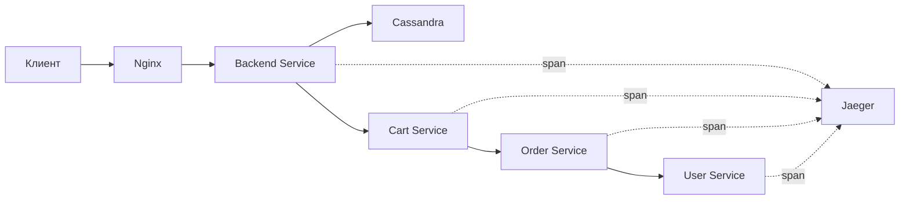

# 🔍 Jaeger Tracing Infrastructure

Конфигурация Jaeger для распределенного трейсинга в Product Store.

## 📋 Обзор

Jaeger — это система для мониторинга и устранения неполадок в микросервисных архитектурах с использованием распределенного трейсинга. В нашей системе Jaeger развернут для отслеживания запросов между всеми микросервисами.

# 🔍 Jaeger Tracing Infrastructure

Конфигурация Jaeger для распределенного трейсинга в Product Store с использованием стандартного образа `jaegertracing/all-in-one`.

## 📋 Обзор

Jaeger — это система для мониторинга и устранения неполадок в микросервисных архитектурах с использованием распределенного трейсинга. В нашей системе используется образ all-in-one для простоты развертывания.

## 🏗️ Компоненты

### Jaeger All-in-One
- **Collector** - принимает span данные от приложений
- **Query** - предоставляет API для поиска и извлечения трейсов
- **UI** - веб-интерфейс для визуализации трейсов
- **Agent** - локальный агент для приема трейсов
- **Storage** - in-memory хранилище для разработки

## 🔧 Конфигурация

### Docker образ
```yaml
image: jaegertracing/all-in-one:1.60
```

### Порты
- **16686** - Jaeger UI (веб-интерфейс)
- **4317** - OpenTelemetry gRPC receiver
- **4318** - OpenTelemetry HTTP receiver
- **14250** - Jaeger gRPC receiver
- **14268** - Jaeger HTTP receiver
- **6831/6832** - Jaeger UDP receivers (legacy)
- **5778** - Configuration service
- **14269** - Admin/health check и Prometheus метрики

### Переменные окружения

```yaml
environment:
  - COLLECTOR_OTLP_ENABLED=true
  - JAEGER_DISABLED=false
  - MEMORY_MAX_TRACES=50000
  - COLLECTOR_ZIPKIN_HOST_PORT=:9411
```

### Переменные для микросервисов

Каждый микросервис настроен со следующими переменными:

```bash
# Jaeger Agent настройки
JAEGER_AGENT_HOST=jaeger
JAEGER_AGENT_PORT=6831

# HTTP endpoints
JAEGER_ENDPOINT=http://jaeger:14268/api/traces
OTEL_EXPORTER_JAEGER_ENDPOINT=http://jaeger:14268/api/traces
OTEL_EXPORTER_OTLP_ENDPOINT=http://jaeger:4318

# Service identification
OTEL_SERVICE_NAME=service-name
OTEL_RESOURCE_ATTRIBUTES=service.name=service-name,service.version=1.0.0
```

## 📊 Мониторинг

### Prometheus метрики
Jaeger экспортирует метрики на порту 14269:
- `jaeger_http_requests_total` - количество HTTP запросов
- `jaeger_spans_received_total` - полученные spans
- `jaeger_spans_saved_total` - сохраненные spans
- `jaeger_query_requests_total` - запросы к Query API

### Grafana дашборд
Создан дашборд для мониторинга Jaeger в Grafana:
- HTTP запросы к Jaeger UI
- Статистика обработки spans
- Производительность Query API
- Размеры ответов

## 🌐 Доступ

### Через Nginx (рекомендуется)
```
http://localhost/jaeger/
```

### Прямой доступ
```
http://localhost:16686
```

## 🚀 Использование

### 1. Запуск системы
```bash
cd infra
docker-compose up -d jaeger
```

### 2. Проверка состояния
```bash
# Health check
curl http://localhost:16686/

# Prometheus метрики
curl http://localhost:14269/metrics
```

### 3. Просмотр трейсов
1. Откройте http://localhost/jaeger/
2. Выберите сервис из списка
3. Нажмите "Find Traces"

## 🔄 Жизненный цикл трейса



## 📝 Следующие шаги

Данная конфигурация готова для интеграции с кодом микросервисов:

1. **Добавление OpenTelemetry** в requirements.txt
2. **Инструментация FastAPI** приложений
3. **Создание custom spans** для бизнес-логики
4. **Настройка sampling** для production

## 🔧 Преимущества all-in-one образа

- **Простота развертывания** - один контейнер со всеми компонентами
- **Готовая конфигурация** - не требует дополнительных настроек
- **Встроенная поддержка OpenTelemetry** - готов к приему OTLP трейсов
- **In-memory storage** - идеально для разработки и тестирования
- **Автоматические метрики** - экспорт в Prometheus из коробки

## 🔧 Интеграция с системой

Jaeger интегрирован в общую инфраструктуру Product Store:

- **Docker Compose** - автоматический запуск вместе с остальными сервисами
- **Nginx Proxy** - доступ через единую точку входа
- **Prometheus** - сбор метрик Jaeger
- **Grafana** - дашборд для мониторинга трейсинга
- **Health Checks** - контроль состояния
